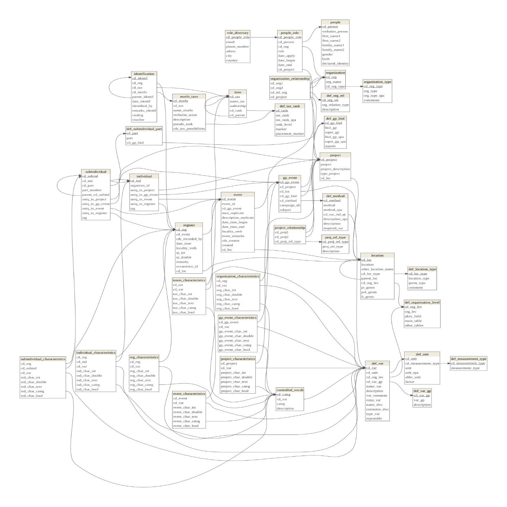

# Arquitectura de la base de datos
Marius Bottin

El objetivo de este documento es presentar la base de datos y su
arquitectura, explicar las razones de las opciones que se eligieron para
su creación, así como las ventajas y desventajas específicos de esa
arquitectura.

# Estructura general de la base de datos

Aquí se presenta la estructura de la base de datos gracias a una
diagrama de entidad-relaciones.

``` r
par(mar=rep(0,4))
require(RPostgres)
```

    Loading required package: RPostgres

``` r
require(dm)
```

    Loading required package: dm


    Attaching package: 'dm'

    The following object is masked from 'package:stats':

        filter

``` r
require(DiagrammeRsvg)
```

    Loading required package: DiagrammeRsvg

``` r
require(rsvg)
```

    Loading required package: rsvg

    Linking to librsvg 2.58.5

``` r
require(png)
```

    Loading required package: png

``` r
require(RPostgres)
biol<-dbConnect(Postgres(),"iavh_biol")

tables_biol<- data.frame(
  table_name = dbGetQuery(biol,"SELECT table_name FROM information_schema.tables WHERE table_schema='main'")$table_name
)

dm_object <- dm_from_con(biol,schema=c("main"), table_names = tables_biol$table_name, learn_keys = T)
A<-dm_object %>%
  dm_draw(view_type = "all")
#A
t_file<-tempfile(fileext = ".png")
DiagrammeRsvg::export_svg(A) %>% charToRaw %>% rsvg_png(file = t_file)
plot(0, xaxt = 'n', yaxt = 'n', bty = 'n', pch = '', ylab = '', xlab = '',xlim=c(0,1),ylim=c(0,1))
png <- readPNG(t_file)
rasterImage(png,0,0,1,1)
```



Como lo pueden ver, es una estructura compleja, con muchas relaciones
entre las tablas (que permiten guardar la integridad estructural de los
datos). Ahora bien, una parte de esas tablas soló sirve para controlar y
definir las posibilidades en otras tablas (las tablas en rojo en la
figura)
