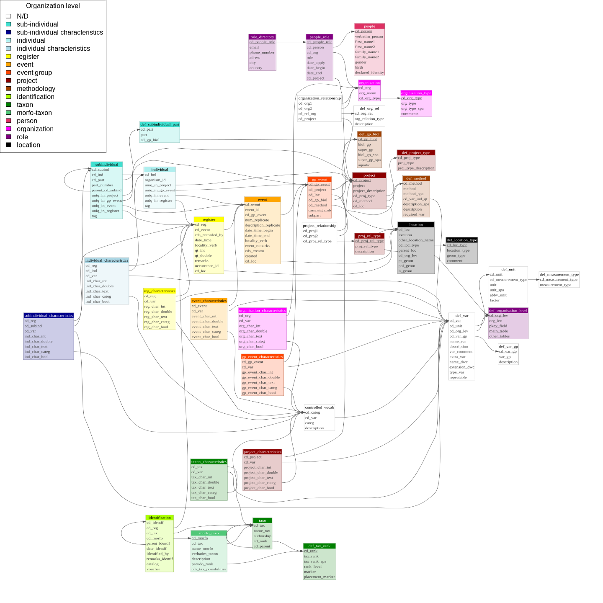
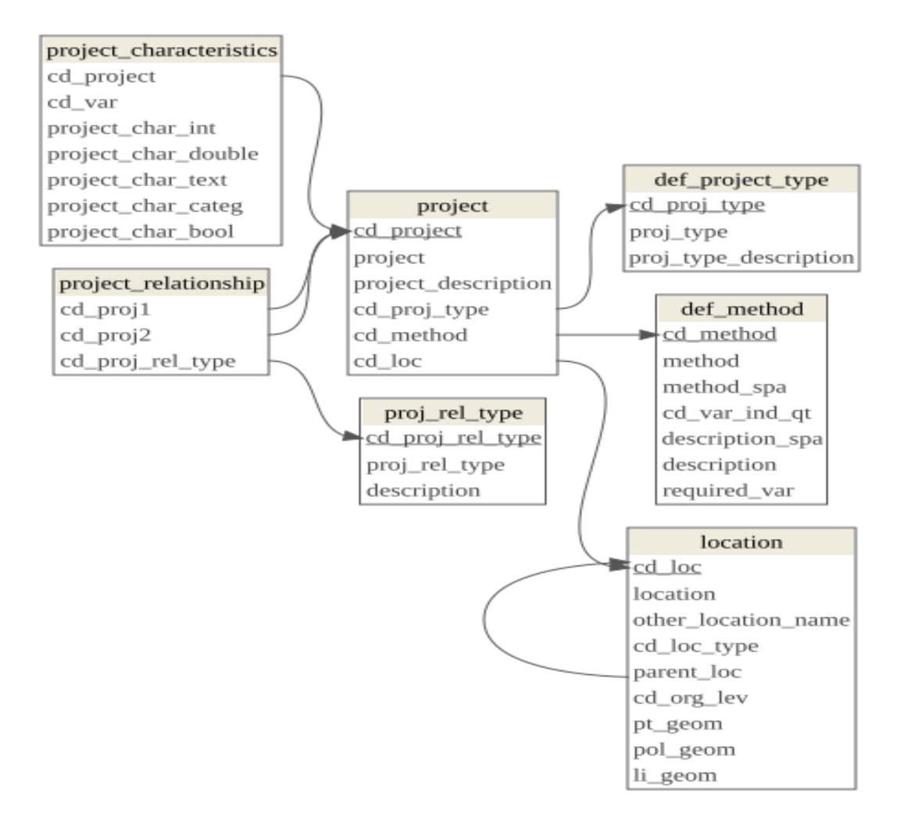
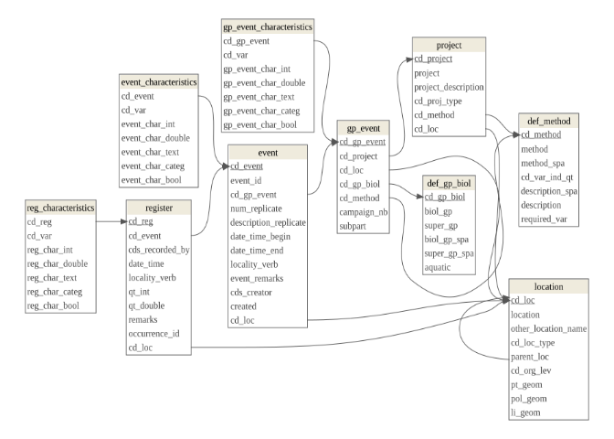
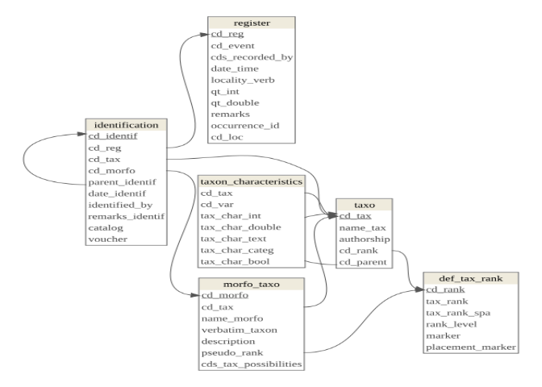

# Arquitectura de la base de datos
Marius Bottin

El objetivo de este documento es presentar la base de datos y su
arquitectura, explicar las razones de las opciones que se eligieron para
su creación, así como las ventajas y desventajas específicos de esa
arquitectura.

# Estructura general de la base de datos

Aquí se presenta la estructura de la base de datos gracias a una
diagrama de entidad-relaciones.

``` r
par(mar=rep(0,4))
require(RPostgres)
```

    Loading required package: RPostgres

``` r
require(dm)
```

    Loading required package: dm


    Attaching package: 'dm'

    The following object is masked from 'package:stats':

        filter

``` r
require(DiagrammeRsvg)
```

    Loading required package: DiagrammeRsvg

``` r
require(rsvg)
```

    Loading required package: rsvg

    Linking to librsvg 2.58.5

``` r
require(png)
```

    Loading required package: png

``` r
require(RPostgres)
biol<-dbConnect(Postgres(),"iavh_biol")

tables_biol<- data.frame(
  table_name = dbGetQuery(biol,"SELECT table_name FROM information_schema.tables WHERE table_schema='main'")$table_name
)

dm_object <- dm_from_con(biol,schema=c("main"), table_names = tables_biol$table_name, learn_keys = T)
A<-dm_object %>%
  dm_draw(view_type = "all")
#A
t_file<-tempfile(fileext = ".png")
DiagrammeRsvg::export_svg(A) %>% charToRaw %>% rsvg_png(file = t_file)
plot(0, xaxt = 'n', yaxt = 'n', bty = 'n', pch = '', ylab = '', xlab = '',xlim=c(0,1),ylim=c(0,1))
png <- readPNG(t_file)
rasterImage(png,0,0,1,1)
```

<div id="fig-general-struct">


Figura 1: Estructura general de la base de datos relacional para datos
biologicos.

</div>

Como lo pueden ver, es una estructura compleja, con muchas relaciones
entre las tablas (que permiten guardar la integridad estructural de los
datos). Ahora bien, una parte de esas tablas soló sirve para controlar y
definir las posibilidades en otras tablas (las tablas en rojo en
<a href="#fig-accesory" class="quarto-xref">Figura 2</a>):

- tablas de vocabulario controlado con una lista cerrada de
  posibilidades en otra tabla
- definiciones de tipos de relaciones entre objetos de una tabla
- definiciones de tipos de objetos en una tabla

``` r
par(mar=rep(0,4))
tables_biol$def_accesory = rep(F,nrow(tables_biol))
tables_biol$def_accesory [tables_biol$table_name %in% c("controlled_vocab","def_gp_biol","def_location_type","def_measurement_type","def_method","def_org_rel","def_organisation_level","def_subindividual_part","def_tax_rank","def_unit","def_var","def_var_gp","organization_type","proj_rel_type","project_relationship","def_project_type")] <- T
A<-dm_object %>%
  dm_set_colors("red"=all_of(tables_biol$table_name[tables_biol$def_accesory]))%>%
  dm_draw(view_type = "all")
t_file<-tempfile(fileext = ".png")
DiagrammeRsvg::export_svg(A) %>% charToRaw %>% rsvg_png(file = t_file)
plot(0, xaxt = 'n', yaxt = 'n', bty = 'n', pch = '', ylab = '', xlab = '',xlim=c(0,1),ylim=c(0,1))
png <- readPNG(t_file)
rasterImage(png,0,0,1,1)
```

<div id="fig-accesory">


Figura 2: Tablas de controles y definiciones en la estructura de la base
de datos relacional biologica (son las tablas en rojo).

</div>

# Principios de estructuración de la base de datos

Con el objetivo de estructurar la base de datos y evitar las
confusiones, un trabajo de definición de los niveles de organización de
las entidades sirvió de base a la preparación de la arquitectura de los
datos:

- **registro**: es la anotación de un registro de un individuo o un
  grupo de individuos de una especie
- **evento**: se trata de el nivel más bajo de agregación de las
  observaciones de registros: una operación de recolección en un
  transecto o un cuadrante por ejemplo
- **grupo de eventos**: se trata de una campaña de recolección o
  observación utilizando un método particular, por ejemplo la aplicación
  de 15 cuadrantes en un sitio siguiendo una metodología de recolección
  de Coleopteros en el suelo
- **proyecto**: un proyecto puede contener varios grupos de eventos, o
  incluso varios proyectos. Utilizamos un sistema para diferenciar los
  tipos de proyectos y las relaciones entre proyectos (proyectos de
  financiación, de recolección de datos, de integración de varios juegos
  de datos etc.). Anotar: una parcela permanente siempre está definida
  como un proyecto.
- **metodología**: descripción de una metodología de recolección de
  datos biológicos, puede estar referenciada desde un proyecto, o un
  grupo de eventos. Anotar una consideración importante: para que 2
  eventos estén en un mismo grupo de eventos, tienen que referenciar la
  misma metodología! Anotar también que podemos anotar otras referencias
  a aspectos metodologicos como variables que se definen a otros niveles
  de organización.
- **individuo**: es un individuo anotado, etiquetado. Anotar: no se
  puede considerar que es un nivel de organización incluído en un
  registro porque un individuo puede estar presente en varios registros
  en el tiempo (en el caso de las parcelas permanentes de vegetación)
- **caracteristicas individuales**: es la medición de una característica
  de un individuo, incluída en un registro
- **subindividuo**: es la parte de un individuo. Está incluido en un
  individuo, pero puede estar incluido en otro subindividuo. Es
  particularmente útil en el caso de las parcelas permanentes de
  vegetación, por la definición de “ramets” que son “troncos” de tamaño
  superior a un limite definido en la metodología. Un individuo puede
  tener varios ramets, y el número de ramets por individuo puede variar
  en el tiempo. Sin embargo, el concepto de subindividuo puede servir en
  todos los casos de ecología funcional cuando se hagan mediciones de
  órganos de los individuos y se siguen en el tiempo.
- **catacteristicas subindividuales**: contenido en un registro y un
  subindividuo, es una operación de medición.
- **taxon**: es una entidad teórica de agrupamiento de individuos
  biológicos, que sigue una norma biológica de clasificación taxonómica
- **morfo-taxon** es también una entidad de agrupamiento de individuos
  biológicos, pero por la incertidumbre en los procesos de
  determinación, no se sabe exactamente su valor de certidumbre en las
  normas de clasificación taxonómica. Anotar que los morfotaxón están
  contenido en el taxón de rango superior por el cual hay una
  certidumbre de definición taxonómica
- **determinación** Es la operación que permite la relación entre un
  registro y un taxón (y potencialmente un morfotaxón). Sin embargo, la
  definición como un nivel de organización acá nos permite añadir una
  fecha en su definición. Así que nos permite seguir los procesos
  iterativos de mejora en la determinación taxonomica de los individuos
  y registros. Anotar: una determinación puede tener una “determinación
  madre”: nos permite manejar los casos en que se anota en el campo un
  nombre para todos los individuos que pertenecen a la misma entidad
  taxonómica, y un analisis permite definir después la determinación de
  todos los registros o individuos que fueron referenciado bajo este
  nombre.
- **persona**: Una persona, sin referencia a su rol en una organización
- **organización**: Una organización social, privada, publica o
  comunitaria
- **rol**: Es la entidad que permite asociar una persona y una
  organización. Anotar que las características como el correo
  electrónico o la dirección referencian un rol, no una persona. El rol,
  puede estar incluido también en proyecto
- **localización**: este nivel de organización permite centralizar todos
  los datos espaciales en los procesos de colecta de datos biológicos.
  Anotar que se pueden referenciar objetos espaciales diferentes para
  proyectos, grupos de eventos, eventos y registros. En este caso, la
  jerarquía de localización está también definida en la tabla de
  localización por la referencia a una localización “madre”.

Para cada uno de esos niveles de organización de los datos se crean:

1.  al menos una tabla con la definición de una llave primaria única
2.  casi siempre una tabla suplementaria que permite registrar variables
    que describen la entidad de este nivel de organización

Este sistema nos permite definir bien a que nivel se reporta cada una de
las variables que se almacenan en la base de datos. Además permite
definir de manera precisa y robusta la reglas de integridad de datos en
la base de datos.

``` r
dbReadTable(biol,Id("main","def_organisation_level"))
```

| cd_org_lev | org_lev | pkey_field | main_table | other_tables |
|---:|:---|:---|:---|:---|
| 1 | sub-individual | cd_subind | sub_individual | NA |
| 2 | sub-individual characteristics | cd_subind_char | subindividual_characteristics | NA |
| 3 | individual | cd_ind | individual | NA |
| 4 | individual characteristics | cd_ind_char | individual_characteristics | NA |
| 5 | register | cd_reg | register | NA |
| 6 | event | cd_event | event | NA |
| 7 | event group | cd_gp_event | gp_event | NA |
| 8 | project | cd_project | project | NA |
| 9 | methodology | cd_method | def_method | NA |
| 10 | identification | cd_ident | identification | NA |
| 11 | taxon | cd_tax | taxo | NA |
| 12 | morfo-taxon | cd_morfo | morfo_taxo | NA |
| 13 | person | cd_person | people | NA |
| 14 | organization | cd_org | organization | NA |
| 15 | role | cd_people_role | people_role | NA |

Podemos entonces representar los niveles de organización desde el
diagrama de entidades-relaciones
(<a href="#fig-org-lev" class="quarto-xref">Figura 3</a>)

``` r
par(mar=rep(0,4))
tables_biol$org_lev = rep(NA,nrow(tables_biol))
tables_biol$org_lev [tables_biol$table_name %in% c("def_subindividual_part","subindividual")] <- "sub-individual"
tables_biol$org_lev [tables_biol$table_name %in% c("subindividual_characteristics")] <- "sub-individual characteristics"
tables_biol$org_lev [tables_biol$table_name %in% c("individual")] <- "individual"
tables_biol$org_lev [tables_biol$table_name %in% c("individual_characteristics")] <- "individual characteristics"
tables_biol$org_lev [tables_biol$table_name %in% c("register","reg_characteristics")] <- "register"
tables_biol$org_lev [tables_biol$table_name %in% c("event","event_characteristics")] <- "event"
tables_biol$org_lev [tables_biol$table_name %in% c("gp_event","gp_event_characteristics")] <- "event group"
tables_biol$org_lev [tables_biol$table_name %in% c("project","proj_rel_type","project_characteristics","def_project_type")] <- "project"
tables_biol$org_lev [tables_biol$table_name %in% c("def_gp_biol","def_method")] <- "methodology"
tables_biol$org_lev [tables_biol$table_name %in% c("identification")] <- "identification"
tables_biol$org_lev [tables_biol$table_name %in% c("def_tax_rank","taxo","taxon_characteristics")] <- "taxon"
tables_biol$org_lev [tables_biol$table_name %in% c("morfo_taxo")] <- "morfo-taxon"
tables_biol$org_lev [tables_biol$table_name %in% c("people")] <- "person"
tables_biol$org_lev [tables_biol$table_name %in% c("organization_type","organization","organization_characteristics")] <- "organization"
tables_biol$org_lev [tables_biol$table_name %in% c("def_location_type","location")] <- "location"
tables_biol$org_lev [tables_biol$table_name %in% c("role_directory","people_role","def_organisation_level")] <- "role"
tables_biol$org_lev [tables_biol$table_name %in% c("organization_relationship","project_relationship","def_measurement_type","def_measurement_type","def_unit","def_var","def_var_gp","controlled_vocab","def_org_rel","def_organization_level")] <- "Other"
A<-dm_object %>%
  dm_set_colors("white"=all_of(tables_biol$table_name[tables_biol$org_lev=="Other"]))%>%
  dm_set_colors("turquoise"=all_of(tables_biol$table_name[tables_biol$org_lev=="sub-individual"]))%>%
  dm_set_colors("darkblue"=all_of(tables_biol$table_name[tables_biol$org_lev=="sub-individual characteristics"]))%>%
  dm_set_colors("paleturquoise"=all_of(tables_biol$table_name[tables_biol$org_lev=="individual"]))%>%
  dm_set_colors("lightblue"=all_of(tables_biol$table_name[tables_biol$org_lev=="individual characteristics"]))%>%
  dm_set_colors("yellow"=all_of(tables_biol$table_name[tables_biol$org_lev=="register"]))%>%
  dm_set_colors("orange"=all_of(tables_biol$table_name[tables_biol$org_lev=="event"]))%>%
  dm_set_colors("#FF4500"=all_of(tables_biol$table_name[tables_biol$org_lev=="event group"]))%>%
  dm_set_colors("darkred"=all_of(tables_biol$table_name[tables_biol$org_lev=="project"]))%>%
  dm_set_colors("#a04000"=all_of(tables_biol$table_name[tables_biol$org_lev=="methodology"]))%>%
  dm_set_colors("#AAFF00"=all_of(tables_biol$table_name[tables_biol$org_lev=="identification"]))%>%
  dm_set_colors("#008000"=all_of(tables_biol$table_name[tables_biol$org_lev=="taxon"]))%>%
  dm_set_colors("#50C878"=all_of(tables_biol$table_name[tables_biol$org_lev=="morfo-taxon"]))%>%
  dm_set_colors("#DE3163"=all_of(tables_biol$table_name[tables_biol$org_lev=="person"]))%>%
  dm_set_colors("#FF00FF"=all_of(tables_biol$table_name[tables_biol$org_lev=="organization"]))%>%
  dm_set_colors("#800080"=all_of(tables_biol$table_name[tables_biol$org_lev=="role"]))%>%
  dm_set_colors("black"=all_of(tables_biol$table_name[tables_biol$org_lev=="location"]))%>%
  dm_draw(view_type = "all")
t_file<-tempfile(fileext = ".png")
DiagrammeRsvg::export_svg(A) %>% charToRaw %>% rsvg_png(file = t_file)
plot(0, xaxt = 'n', yaxt = 'n', bty = 'n', pch = '', ylab = '', xlab = '',xlim=c(0,1),ylim=c(0,1))
png <- readPNG(t_file)
rasterImage(png,0,0,1,1)
legend("topleft",fill=c("white","turquoise","darkblue","paleturquoise","lightblue","yellow","orange","#FF4500","darkred","#a04000","#AAFF00","#008000","#50C878","#DE3163","#FF00FF","#800080","black"),legend=c("N/D","sub-individual","sub-individual characteristics","individual","individual characteristics","register","event","event group","project","methodology","identification","taxon","morfo-taxon","person","organization","role","location"),title="Organization level")
```

<div id="fig-org-lev">



Figura 3: Niveles de organización.

</div>

# Descripción de la tematicas

## Definición de la variables

En la base de datos existe un proceso de creación de las variables a
través de una tabla de variables que se puede referenciar en todas las
tablas suplementarias de todo los niveles de organización (ver
<a href="#fig-variables-supp" class="quarto-xref">Figura 4</a>).

Para crear una variable, se puede añadir un objeto (una fila) en la
tabla `def_var`. Al momento de hacer esta operación se tiene que anotar
aquel nivel de organización en que se mide la variable (por ejemplo a
nivel de evento). Tambien se tiene que anotar el tipo de valor que va a
tener esta variable (numérico, entero, texto, categorías, lógico). Si la
variable es numérica, se puede especificar la unidad de medición y el
tipo de medición utilizado. Si la variable es categorial, se tienen que
definir en la tabla `controlled_vocab` las categorías posibles que puede
tomar. Se pueden también especificar el nombre de la variable y la
extensión de DarwinCore que corresponden a esta variable.

Así, la tabla suplementaria que corresponde al nivel de organización de
la variable puede acceptar los valores en la columna que corresponde al
tipo de variable definido. Con este sistema, si varias variables se
pueden traducir una en la otra gracias a una operación de conversión
simple (multiplicación o división), se hará a traves de los factores en
la tabla de unidad.

``` r
par(mar=rep(0,4))
dm_obj_var <- dm_from_con(biol,schema=c("main"), table_names = c("def_var_gp","def_organisation_level","def_var","def_unit","def_measurement_type","event_characteristics","controlled_vocab"), learn_keys = T)
A<-dm_obj_var %>%
  dm_draw(view_type = "all")
t_file<-tempfile(fileext = ".png")
DiagrammeRsvg::export_svg(A) %>% charToRaw %>% rsvg_png(file = t_file)
plot(0, xaxt = 'n', yaxt = 'n', bty = 'n', pch = '', ylab = '', xlab = '',xlim=c(0,1),ylim=c(0,1))
png <- readPNG(t_file)
rasterImage(png,0,0,1,1)
```

<div id="fig-variables-supp">


Figura 4: Sistema de creación, referenciación y uso de variables.

</div>

## Project

Los proyectos son un aspecto esencial de la estructura de la base de
datos. Una tabla central permite definir el tipo de proyecto (ver
<a href="#tbl-proj-type" class="quarto-xref">Tabla 1</a>), la
metodología asociada al proyecto y su localización, gracias a valores
controlados en tablas de definiciones.

También existe una tabla de definición de relaciones entre proyectos
(ver <a href="#tbl-proj-rel" class="quarto-xref">Tabla 2</a>). Esa
estructura con una tabla externa de relaciones entre proyecto nos
permitirá en el futuro definir relaciones complejas. Por ahora, solo
está definida la relación de “ser parte de”. Sin embargo, esa relación
permite manejar la mayoría de los casos concretos, si los proyectos
mismos están definidos a una escala adecuada.

Las parcelas permanentes son un tipo particular de proyecto. De hecho,
una de las dificultades principales de las parcelas permanentes es la
definición de un esfuerzo de muestreo con varias campañas, discontinuas
en el tiempo, y por las cuales definimos características particulares
(como los identificadores de individuos y ramets) que tienen que quedar
entre eventos de muestreo. La solución propuesta acá es utilizar la
figura de proyecto. Una parcela permanente es un proyecto, que puede ser
parte de un proyecto más grande (cuando existan varias parcelas para
estudiar la biodiversidad de una región, por ejemplo), y que puede
contener varios proyectos cuando varios proyectos de financiación son
necesarios para poder mantener un esfuerzo de muestreo a largo plazo.

Por las definiciones de tipos de proyectos y de relaciones entre
proyectos, deberíamos tener un sistema suficiente flexible para poder
enfrentar una diversidad amplia de casos.

``` r
par(mar=rep(0,4))
dm_obj_proj <- dm_from_con(biol,schema=c("main"), table_names = c("project","location","project_characteristics","project_relationship","proj_rel_type","def_method","def_project_type"), learn_keys = T)
A<-dm_obj_proj %>%
  dm_draw(view_type = "all")
t_file<-tempfile(fileext = ".png")
DiagrammeRsvg::export_svg(A) %>% charToRaw %>% rsvg_png(file = t_file)
plot(0, xaxt = 'n', yaxt = 'n', bty = 'n', pch = '', ylab = '', xlab = '',xlim=c(0,1),ylim=c(0,1))
png <- readPNG(t_file)
rasterImage(png,0,0,1,1)
```

<div id="fig-project">



Figura 5: Manejo y definición de los proyectos en la base de datos
relacional

</div>

``` r
dbReadTable(biol,Id(schema="main",table="def_project_type"))
```

<div id="tbl-proj-type">

Tabla 1: Tipos de proyectos en la base de datos relacionales

<div class="cell-output-display">

| cd_proj_type | proj_type | proj_type_description |
|---:|:---|:---|
| 1 | institutional project | Project with a reference ID corresponding to an institutional project. This kind of project usually contains various projects here |
| 2 | collection field campaign | Project organized around a field campaign, usually included in a larger project with an institutional ID |
| 3 | permanent plot | Project mostly useful to be able to filter a permanent plot, note that this kind of project should include various gp_event corresponding to various campaign on the same site |
| 4 | data project | Meta-project with the objective of integrating data from various projects |

</div>

</div>

``` r
dbReadTable(biol,Id(schema="main",table="proj_rel_type"))
```

<div id="tbl-proj-rel">

Tabla 2: Tabla de definición de los tipos de relaciones entre proyectos

<div class="cell-output-display">

| cd_proj_rel_type | proj_rel_type | description            |
|-----------------:|:--------------|:-----------------------|
|                1 | part_of       | Proj1 is part of proj2 |

</div>

</div>

## Del registro al grupo de evento: un modelo jerarquico

A través de la nociones de grupos de eventos, eventos y registros,
tenemos una estructura jerárquica de los datos que permite reflejar la
naturaleza jerárquica de los muestreos biológicos.
<a href="#fig-hierarchy" class="quarto-xref">Figura 6</a> muestra las
tablas que permiten manejar esta jerarquía y sus relaciones.
Metodologías y grupos biológicos están definidos a la escala del grupo
de eventos, y todos los niveles jerárquicos pueden tener un información
espacial. Para cada uno de esos niveles, podemos añadir variables que se
definen en la base de datos, gracias al sistema descrito en la
**?@fig-var-supp**.

``` r
par(mar=rep(0,4))
dm_obj_proj <- dm_from_con(biol,schema=c("main"), table_names = c("gp_event","event","register","gp_event_characteristics","event_characteristics","def_method","def_gp_biol","project","reg_characteristics","location"), learn_keys = T)
A<-dm_obj_proj %>%
  dm_draw(view_type = "all")
t_file<-tempfile(fileext = ".png")
DiagrammeRsvg::export_svg(A) %>% charToRaw %>% rsvg_png(file = t_file)
plot(0, xaxt = 'n', yaxt = 'n', bty = 'n', pch = '', ylab = '', xlab = '',xlim=c(0,1),ylim=c(0,1))
png <- readPNG(t_file)
rasterImage(png,0,0,1,1)
```

<div id="fig-hierarchy">



Figura 6: Hierarchical tables allowing to describe the sampling
structure of biological data

</div>

## Manejo de la taxonomía

En la base de datos, la taxonomía “clásica” (nombres y definición de los
taxones y sus relaciones) está definida gracias a una tabla principale
que contiene los nombres de taxones, sus niveles taxonomicos y las
relaciones de inclusión en rangos superiores de la clasificación. Esa
estructura simple permite asegurar que todas las bases de datos
funcionan con un sistema taxonómico coherente (una especie no puede
pertenecer a 2 generos diferentes, por ejemplo). Sin embargo, en los
casos concretos de muestreos biológicos, muchos casos necesitan una
flexibilidad de definición de las entidades taxonómicas. En la base de
datos, manejamos esa flexibilidad a traves de una tabla de
morfo-taxones, que llama a la tabla taxonomica. También instauramos una
tabla de determinación que hace la relación entre registros y el sistema
taxonomico. De esa manera, podemos asociar una determinación a una fecha
particular, con la idea que la ultima determinación es la más
importante, pero que puede ser importante tener un acceso al historial
del trabajo de determinación.

``` r
par(mar=rep(0,4))
dm_obj_proj <- dm_from_con(biol,schema=c("main"), table_names = c("identification","taxo","morfo_taxo","def_tax_rank","taxon_characteristics","register"), learn_keys = T)
A<-dm_obj_proj %>%
  dm_draw(view_type = "all")
t_file<-tempfile(fileext = ".png")
DiagrammeRsvg::export_svg(A) %>% charToRaw %>% rsvg_png(file = t_file)
plot(0, xaxt = 'n', yaxt = 'n', bty = 'n', pch = '', ylab = '', xlab = '',xlim=c(0,1),ylim=c(0,1))
png <- readPNG(t_file)
rasterImage(png,0,0,1,1)
```

<div id="fig-taxo">



Figura 7: Sistema de manejo taxonomico

</div>

## Mediciones sobre los individuos o partes de los individuos

En muchos casos de monitoreo e investigación, es importante poder medir
y seguir las características de los individuos, o incluso de partes de
los individuos (en el caso de las parcelas de vegetación: los “ramets”).
La definición de los individuos y sub-induviduos no es trivial en una
base de datos organizada alrededor de la descripción jerárquica de las
campañas de muestreo: ¡la realidad física de un individuo biológico sale
de esa jerarquía! Por esa razón, lo que hicimos es crear unas tablas de
definición de individuos y subindividuos (ver
<a href="#fig-ind-subind" class="quarto-xref">Figura 8</a>). Las
relaciones de esas tablas con la jerarquía del muestreo es una
definición de la validez de sus identificadores: los identificadores
tienen que ser únicos a escala de proyecto, grupo de eventos, eventos o
registros, pero no es una relación directamente jerárquica. A lado de
esas tablas de definición de los individuos, subindividuos y sus
identificadores, existen tablas que están incluidas de manera más clara
en la jerarquía del muestreo: las tablas de descripción de las
características de los individuos y subindividuos referencian
directamente un registro que corresponde a aquellos eventos de muestreos
en los cuales se hicieron las mediciones de caracteristicas
individuales.

``` r
par(mar=rep(0,4))
dm_obj_proj <- dm_from_con(biol,schema=c("main"), table_names = c("individual","subindividual","register","individual_characteristics","subindividual_characteristics","project","gp_event","event","def_subindividual_part"), learn_keys = T)
A<-dm_obj_proj %>%
  dm_draw(view_type = "all")
t_file<-tempfile(fileext = ".png")
DiagrammeRsvg::export_svg(A) %>% charToRaw %>% rsvg_png(file = t_file)
plot(0, xaxt = 'n', yaxt = 'n', bty = 'n', pch = '', ylab = '', xlab = '',xlim=c(0,1),ylim=c(0,1))
png <- readPNG(t_file)
rasterImage(png,0,0,1,1)
```

<div id="fig-ind-subind">


Figura 8: Individuos, subindividuos y sus caracteristicas

</div>

## Manejo de los datos sobre las personas y organizaciones

Aunque no sean el centro de los datos biológicos, es importante poder
sistematizar sus codificaciones de una manera compatibles con los
futuros datos socio-ecológicos que se podrían integrar en bases de datos
más completas sobre los datos de biodiversidad. Lo que hicimos
(<a href="#fig-pers-org" class="quarto-xref">Figura 9</a>) es crear una
tabla principal de organizaciones y una tabla principal de personas, las
relaciones entre personas y instituciones pasan en el caso de los datos
biológicos por una tabla de roles que las personas tienen en esas
instituciones. Las características como los contactos, correos y
direcciones están afectadas al rol, no a la persona, lo que nos permite
tener varios contactos con la misma persona, según el contexto. Las
organizaciones pueden tambien tener relaciones que se especifican en una
tabla externa. Eso por ejemplo nos permitirá especificar un centro de
actividades o una parte de una organización y la organización madre. En
el caso de redes de organización es relativamente fácil poner una
organización nueva para la red y especificar que en el marco de un
proyecto de asociación, varias organizaciones hacen parte de esta red.

``` r
par(mar=rep(0,4))
dm_obj_proj <- dm_from_con(biol,schema=c("main"), table_names = c("people","people_role","role_directory","organization","organization_relationship","def_org_rel","organization_type","project","organization_characteristics"), learn_keys = T)
A<-dm_obj_proj %>%
  dm_draw(view_type = "all")
t_file<-tempfile(fileext = ".png")
DiagrammeRsvg::export_svg(A) %>% charToRaw %>% rsvg_png(file = t_file)
plot(0, xaxt = 'n', yaxt = 'n', bty = 'n', pch = '', ylab = '', xlab = '',xlim=c(0,1),ylim=c(0,1))
png <- readPNG(t_file)
rasterImage(png,0,0,1,1)
```

<div id="fig-pers-org">


Figura 9: Manejo de los datos sobre personas y instituciones

</div>

``` r
dbReadTable(biol,Id(schema="main",table="organization_type"))
```

| cd_org_type | org_type | org_type_spa | comments |
|---:|:---|:---|:---|
| 1 | public institution | institución publica | NA |
| 2 | private institution | institución privada | NA |
| 3 | non-governemental organization | organización no gubernamental | NA |
| 4 | fundation | fundación | NA |
| 5 | social organization | organización social | NA |
| 6 | professional union | gremio | NA |
| 7 | communication media | medio de comunicación | NA |
| 8 | non-profit organization | organización sin Ánimo de lucro | NA |
| 9 | indigeneous reservation | resguardo indigena | NA |
| 10 | Person | persona independiente | NA |
| 11 | Association | asociación | NA |
| 12 | network | red de actores | NA |

Tabla `organization_type` de definición de los tipos de organizaciones

``` r
dbReadTable(biol,Id(schema="main",table="def_org_rel"))
```

| cd_org_rel | org_relation_type | description |
|---:|:---|:---|
| 1 | Institutional part of | Organization 1 is an institutional part of organization 2 |
| 2 | Part of | Organization 1 is part of organization 2, but there is no institutional dependency |

Tabla `def_org_rel` de definición de los tipos de relaciones entre
organizaciones
