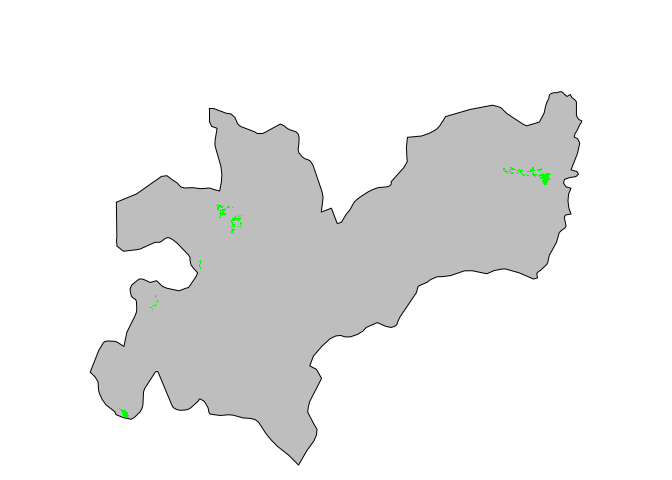

# Importación de datos ambientales en la base de datos
Marius Bottin

El equipo del Centro de Estudios Socio-ecológicos y Cambio Global que
trabaja en el instituto Humboldt ha almacenado datos ambientales de
varias fuentes que permiten analizar los datos de monitoreo de parcelas
permanentes. En este documento, vamos a explorar la posibilidad de
incorporar esos datos en la base de datos. Sabiendo que esos datos no
están sistematizados como lo son los datos de monitoreo, se van a
almacenar en “schema” particulares de la base de datos. Los schemas
permiten separar varias tablas, en una base de datos PostgreSQL, según
una estructura que corresponde a “carpetas” distinctas.

## Carga de las librerías

``` r
require(RPostgres) # interacción con bases de datos PostgreSQL
```

    Loading required package: RPostgres

``` r
require(sf) # manejo de datos espaciales y interacción con la extensión postgis
```

    Loading required package: sf

    Linking to GEOS 3.13.0, GDAL 3.9.3, PROJ 9.4.1; sf_use_s2() is TRUE

    WARNING: different compile-time and runtime versions for GEOS found:

    Linked against: 3.13.0-CAPI-1.19.0 compiled against: 3.12.1-CAPI-1.18.1

    It is probably a good idea to reinstall sf (and maybe lwgeom too)

``` r
require(rnaturalearth) # para extraer el mapa de Colombia
```

    Loading required package: rnaturalearth

    Support for Spatial objects (`sp`) will be deprecated in {rnaturalearth} and will be removed in a future release of the package. Please use `sf` objects with {rnaturalearth}. For example: `ne_download(returnclass = 'sf')`

## Conexion a la base de datos

``` r
dpp <- dbConnect(Postgres(),dbname="dev_permplot")
```

## Creación del schema

Primero, miramos si el “schema” `env` existe en la base de datos, si no
existe lo creamos:

``` r
(envExists<- "env" %in% dbGetQuery(dpp,"SELECT schema_name FROM information_schema.schemata")$schema_name)
```

    [1] TRUE

``` r
if(!envExists)
{
  dbExecute(dpp,"CREATE SCHEMA env")
}
```

## Capa de bosques secos

Un dato importante para el análisis de los bosques secos de Colombia es
la distribución espacial y geográfica de esos ecosistemas en Colombia.
Por ahora, vamos a tomar el ejemplo de la distribución de esos bosques
en el departamento de Caldas.

### Carga en R

Para unificar los sistemas de proyección, vamos a utilizar el sistema de
proyección con el SRID 4686 (MAGNAS-SIRGAS).

``` r
def_srid<-st_crs(4686)
```

Descargamos el archivo shapefiles, y los comandos siguientes van a
permitir cargar esos datos en R:

``` r
BST_Caldas<-st_read(dsn="../../data_google/3.CapasCoberturas/",layer="Bosque_Seco_Tropical_1")
```

    Reading layer `Bosque_Seco_Tropical_1' from data source 
      `/home/marius/Travail/traitementDonnees/2024_parcelas_permanentes/data_google/3.CapasCoberturas' 
      using driver `ESRI Shapefile'
    Simple feature collection with 21 features and 8 fields
    Geometry type: MULTIPOLYGON
    Dimension:     XY
    Bounding box:  xmin: 803262.3 ymin: 1036288 xmax: 929484.5 ymax: 1121693
    Projected CRS: Bogota 1975 / Colombia Bogota zone

``` r
BST_Caldas<-st_transform(BST_Caldas,def_srid)
```

### Representación de los bosques secos de Caldas

Para poder representar esos datos sobre un mapa del departamento de
caldas, vamos a utilizar el paquete rnaturalearth

``` r
departamentos<-ne_states(country="Colombia",returnclass = "sf")
departamentos<-st_transform(departamentos,def_srid)
```

``` r
par(mar=c(0,0,4,0))
plot(st_geometry(departamentos)[which(departamentos$name=="Caldas")],reset=F,col="grey")
plot(st_geometry(BST_Caldas),add=T,col="green",border=NA)
```



### Tabla de atributos

``` r
tab_BST_Caldas<-st_set_geometry(BST_Caldas,NULL)
head(tab_BST_Caldas)
```

| OBJECTID | COBERTURA | CODIGO | AREA | Ha | Shape_Leng | Shape_Le_1 | Shape_Area |
|---:|:---|:---|---:|---:|---:|---:|---:|
| 1726 | BOSQUE SECO TROPICAL | BST | 4225820 | 354.46500 | 15972.321 | 14234.283 | 3544652.60 |
| 1798 | BOSQUE SECO TROPICAL | BST | 390599 | 39.06000 | 7267.331 | 7267.334 | 390599.66 |
| 1800 | BOSQUE SECO TROPICAL | BST | 496891 | 49.68920 | 6453.549 | 6453.552 | 496891.91 |
| 1807 | BOSQUE SECO TROPICAL | BST | 1010230 | 1.81888 | 13250.823 | 2149.473 | 18188.76 |
| 1808 | BOSQUE SECO TROPICAL | BST | 825312 | 82.53130 | 8117.811 | 8117.815 | 825312.75 |
| 1810 | BOSQUE SECO TROPICAL | BST | 1331830 | 133.18300 | 22185.402 | 22185.413 | 1331834.02 |

En esta tabla lo unico que nos interesa es tener un identificador y las
geometrias, los demás atributos se pueden extrapolar de la geometría
misma.

### Exportación a la base de datos

``` r
BST_Caldas <- BST_Caldas["OBJECTID"]
colnames(BST_Caldas)<-tolower(colnames(BST_Caldas))
BST_Caldas<-st_set_geometry(BST_Caldas,"the_geom")
st_write(BST_Caldas,dsn=dpp,layer=dbQuoteIdentifier(dpp,Id(schema="env",table="bst_caldas")),delete_layer = T)
```

    Note: method with signature 'DBIObject#sf' chosen for function 'dbDataType',
     target signature 'PqConnection#sf'.
     "PqConnection#ANY" would also be valid

Utilizamos el objectid como llave primaria de la tabla

``` r
dbExecute(dpp,paste0("ALTER TABLE ",dbQuoteIdentifier(dpp,Id(schema="env",table="bst_caldas")), " ADD PRIMARY KEY (objectid)"))
```

    [1] 0

Forzamos el tipo de geometría para la tabla para que sea referenciado de
manera limpia en el catalogo de la base de datos:

``` r
dbExecute(dpp, paste0("ALTER TABLE ",dbQuoteIdentifier(dpp,Id(schema="env",table="bst_caldas"))," ALTER COLUMN the_geom type geometry(MULTIPOLYGON,4686) USING ST_Force2D(the_geom)"))
```

    [1] 0

## Desconexión de la base de datos

``` r
dbDisconnect(dpp)
```
