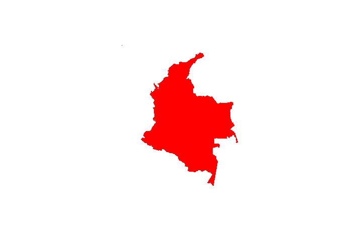
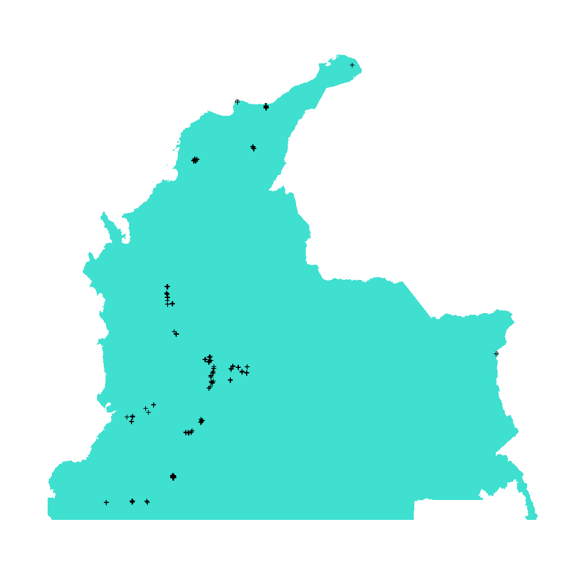

# Ejemplo de incorporación de datos a la base de datos: Red BST-Col
Marius Bottin

El equipo de investigación del Centro de Estudios Socio-ecológicos y
Cambio Global utiliza un formato interno de R (formato RDS) para
almacenar los datos de parcelas permanentes según un esquema de bases de
datos relacionales. Si bien el lenguaje R no permite directamente
imponer reglas de relaciones entre tablas, la lógica interna es la misma
que en una base de datos en SQL, con llaves primarias y foráneas.

En este documento, vamos a mostrar como se pueden incorporar los datos
de la red BST-Col en la base de datos SQL. Haciendo este ejercicio de
incorporación, van a aparecer preguntas y dudas sobre los datos.

## Crear y incializar la base de datos

``` r
require(RPostgres)
```

    Loading required package: RPostgres

``` r
dbname <- "pp_bst_col"
source("../db_creation/reinitializeDB.R")
```

    Warning in eval(ei, envir): database pp_bst_col will be reinitialized, if this
    is not what you want, please do something, fast!

## Leer el archivo

En la carpeta compartida, hay varios archivos RDS:

``` r
dirRDS<-"../../data_google/4.rdsProyectos/"
dir(dirRDS)
```

    [1] "dataCerrejon.rds"      "dataDry4.rds"          "dataIFN-Orinoquia.rds"
    [4] "dataQuimbo.rds"        "dataRedBSTCol.rds"     "dataTDF.rds"          
    [7] "gadm36_COL_1_sp.rds"  

Vamos a enforcarnos acá en los datos de la red de Bosques Secos
Tropicales de Colombia (BST-Col).

``` r
rdsBST<-readRDS("../../data_google/4.rdsProyectos/dataRedBSTCol.rds")
rdsTDF<-readRDS("../../data_google/4.rdsProyectos/dataTDF.rds")
```

## Manejar proyectos y localizaciones de proyectos

En la base de datos biologicas, para razones explicadas
[acá](%22./dataArchitecture.md%22), cada una de las parcelas permanentes
debe estar entrada como un proyecto.

``` r
names(rdsBST)
```

    [1] "metadata" "taxonomy" "censuses" "dates"    "members" 

``` r
metadata_tot<-Reduce(rbind,rdsBST$metadata)
head(metadata_tot,n = 5)
```

|  | registerDate | latitude_dec | longitude_dec | altitude_m | area_ha | areaType | plotType | shapeType | length_m | width_m | subplotArea_ha | region | ecosystem | locationName | locationType | state | country | province | terrainType | substrateGeology | generalSlope_deg | forestComposition | forestStatus | forestAge_yrs | nearestAnthropogenicEdge_m | fragmentSize_ha | comments |
|:---|:---|---:|---:|---:|---:|:---|:---|:---|---:|---:|---:|:---|:---|:---|:---|:---|:---|:---|:---|:---|:---|:---|:---|:---|---:|---:|:---|
| AltoSanJorgeInicial | 2020-01-10 | 11.16783 | -73.43339 | 119 | 0.1 | Projected horizontal surface | Permanent | rectangle | 50 | 20 | 0.01 | Caribbean | tropical dry forests | Hamlet Alto de San Jorge |  | Guajira | Colombia | Dibulla | Lowland |  |  | Mixed forest | Early |  | NA | NA | All data and sources associated are available for consulting and potential uses in analysis and publications. But, as normativity of Red BST-Col, in all cases Principle Researchers should contacted for correct use-credits of the information |
| AltoSanJorgeT1P1 | 2020-01-08 | 11.17416 | -73.43469 | 152 | 0.1 | Projected horizontal surface | Permanent | rectangle | 50 | 20 | 0.01 | Caribbean | tropical dry forests | Private land |  | La Guajira | Colombia | Alto San Jorge | Lowland |  |  | Mixed forest | Secondary forests |  | NA | NA | All data and sources associated are available for consulting and potential uses in analysis and publications. But, as normativity of Red BST-Col, in all cases Principle Researchers should contacted for correct use-credits of the information |
| AltoSanJorgeT1P2 | 2020-01-08 | 11.16858 | -73.43082 | 106 | 0.1 | Projected horizontal surface | Permanent | rectangle | 50 | 20 | 0.01 | Caribbean | tropical dry forests | Private land |  | La Guajira | Colombia | Alto San Jorge | Lowland |  |  | Mixed forest | Secondary forests |  | NA | NA | All data and sources associated are available for consulting and potential uses in analysis and publications. But, as normativity of Red BST-Col, in all cases Principle Researchers should contacted for correct use-credits of the information |
| AltoSanJorgeT1P3 | 2020-01-08 | 11.16772 | -73.44295 | 153 | 0.1 | Projected horizontal surface | Permanent | rectangle | 50 | 20 | 0.01 | Caribbean | tropical dry forests | Private land |  | La Guajira | Colombia | Alto San Jorge | Lowland |  |  | Mixed forest | Secondary forests |  | NA | NA | All data and sources associated are available for consulting and potential uses in analysis and publications. But, as normativity of Red BST-Col, in all cases Principle Researchers should contacted for correct use-credits of the information |
| ArmeroInicial | 2020-09-01 | 5.05000 | -74.81700 | 240 | 0.1 | Projected horizontal surface | Permanent | rectangle | 50 | 20 | 0.01 | Magdalena river valley | tropical dry forests | Private Natural Reserve Jabiru |  | Tolima | Colombia | Armero | Lowland |  | 10-20 degree slope (moderately sloping) | Mixed forest | Early | 5.0-10.0 | NA | NA | All data and sources associated are available for consulting and potential uses in analysis and publications. But, as normativity of Red BST-Col, in all cases Principle Researchers should contacted for correct use-credits of the information |

Antes de poder incorporar los proyectos, en caso de que esos tengan una
metodología particular, se debe incorporar la metodología y las
variables que permiten incorporar un codigo de metodología.

``` r
dbpp<-dbConnect(Postgres(),dbname=dbname)
```

``` sql
INSERT INTO main.def_unit(cd_measurement_type, unit, unit_spa, abbv_unit, factor)
VALUES(
(SELECT cd_measurement_type FROM main.def_measurement_type WHERE measurement_type='number'), 'Number of individuals', 'Número de individuos', 'ind.', 1);
```

``` sql
INSERT INTO main.def_var(
 cd_unit,
 cd_org_lev,
 cd_var_gp,
 extra_var,
 repeatable,
 var_comment,
 type_var,
 name_dwc,
 extension_dwc,
 name_var,
 description
)
VALUES
  ((SELECT cd_unit FROM main.def_unit WHERE unit='Number of individuals'),
  (SELECT cd_org_lev FROM main.def_organisation_level WHERE org_lev='register'),
  NULL,
  false,
  false,
  'Note that even though this variable can contain true/false value (when there is never more than one individual by register), they are systematized as 0/1',
  'integer',
  'individualCount',
  'occurrence',
  'qt_int',
  'Number of indiduals of a species in a register'
  );
```

``` sql
INSERT INTO main.def_method(
 method,
 method_spa,
 cd_var_ind_qt,
 description_spa,
 description,
 required_var,
 cd_org_lev
)
VALUES(
 'Permanent plot 1 (to be defined)',
 'Parcelas permanentes 1 (por definir)',
 (SELECT cd_var FROM main.def_var WHERE name_var='qt_int' AND cd_org_lev = (SELECT cd_org_lev FROM main.def_organisation_level WHERE org_lev='register')),
 'descripción metodo por definir',
 'todo: describe the method',
 NULL,
 (SELECT cd_org_lev FROM main.def_organisation_level WHERE org_lev='register')
);
```

Con las metodologías definidas (no realmente, más bien con los campos
obligatorios llenos), podemos definir las localidades que corresponden a
las parcelas.

``` r
require(sf)
```

    Loading required package: sf

    Linking to GEOS 3.13.0, GDAL 3.9.3, PROJ 9.4.1; sf_use_s2() is TRUE

``` r
dbLocCol<-dbConnect(Postgres(),dbname='dev_geogref')
colombia<-st_read(dbLocCol,"dissolved_colombia")
dbDisconnect(dbLocCol)
plot(st_geometry(colombia), border=NA, col="red")
```



``` r
spatPoints<-st_as_sf(metadata_tot,coords=c("longitude_dec","latitude_dec")) %>%
  st_set_crs(4326) %>% st_transform(st_crs(colombia))
plot(st_geometry(spatPoints),reset=F)
plot(st_geometry(colombia),add=T,border=F,col='turquoise')
plot(st_geometry(spatPoints),add=T,pch='+')
```



``` r
schemas<-dbGetQuery(dbpp, "SELECT schema_name FROM information_schema.schemata")$schema_name
if(!"tmp" %in% schemas){dbExecute(dbpp, "CREATE SCHEMA tmp")}
```

    [1] 0

``` r
spatPoints$namepp<-rownames(spatPoints)
st_write(obj=spatPoints, dsn=dbpp, layer=Id(schema="tmp",table="spatial_metadata"),delete_layer=T)
```

    Note: method with signature 'DBIObject#sf' chosen for function 'dbDataType',
     target signature 'PqConnection#sf'.
     "PqConnection#ANY" would also be valid

### Localizaciones

``` sql
SELECT namepp, geometry
FROM tmp.spatial_metadata
LIMIT 10
```

| namepp              | geometry                                           |
|:--------------------|:---------------------------------------------------|
| AltoSanJorgeInicial | 01010000204E120000FC3FC1A4BC5B52C0BC0E0F40EE552640 |
| AltoSanJorgeT1P1    | 01010000204E1200007D7901F6D15B52C0F08AE07F2B592640 |
| AltoSanJorgeT1P2    | 01010000204E1200009D9D0C8E925B52C0F584251E50562640 |
| AltoSanJorgeT1P3    | 01010000204E120000D8F0F44A595C52C02EC55565DF552640 |
| ArmeroInicial       | 01010000204E1200003F355EBA49B452C03333333333331440 |
| ArmeroIntermedio    | 01010000204E1200006891ED7C3FB552C04E62105839341440 |
| ArmeroTardio        | 01010000204E120000068195438BB452C03D0AD7A3703D1440 |
| ArmeroTemprano      | 01010000204E120000A245B6F3FDB452C0A8C64B3789411440 |
| AtuncelaT2P1        | 01010000204E120000338AE596562B53C05E30B8E68EFE0D40 |
| AtuncelaT2P2        | 01010000204E120000A4880CAB782B53C0FF78AF5A99F00D40 |

Displaying records 1 - 10

``` r
dbExecute(dbpp,
          "INSERT INTO main.location(location,cd_loc_type,cd_org_lev,pt_geom)
          SELECT namepp, cd_loc_type, cd_org_lev, ST_Transform(geometry,(SELECT srid FROM geometry_columns WHERE f_geometry_column = 'pt_geom' AND f_table_name = 'location'))
          FROM tmp.spatial_metadata
          CROSS JOIN (SELECT cd_loc_type FROM main.def_location_type WHERE location_type='Site point') a
          CROSS JOIN (SELECT cd_org_lev FROM main.def_organisation_level WHERE org_lev='project') b
          ")
```

    [1] 287

### Proyectos: parcelas permanentes simples

``` r
dbExecute(dbpp,
          "INSERT INTO main.project(project, project_description,cd_proj_type,cd_method,cd_loc)
          SELECT namepp,NULL,cd_proj_type,cd_method,cd_loc
          FROM tmp.spatial_metadata sm
          CROSS JOIN (SELECT cd_proj_type FROM main.def_project_type WHERE proj_type='permanent plot') a
          CROSS JOIN (SELECT cd_method FROM main.def_method WHERE method='Permanent plot 1 (to be defined)') b
          LEFT JOIN main.location ON sm.namepp=location
          ")
```

    [1] 287

### Trabajando la estructura de los proyectos

``` sql
WITH a AS(
SELECT namepp,
  CASE
    WHEN namepp ~ '((Inicial)|(Intermedio)|(Tardio)|(Temprano))$' THEN 'fase'
    WHEN namepp ~ 'T[0-9]{1,3}P[0-9]{1,3}$' THEN 'TP'
    WHEN namepp ~ 'R[0-9]{1,3}T[0-9]{1,3}$' THEN 'RT'
    WHEN namepp ~ 'P[0-9]{1,3}[A-Z]?$' THEN 'P'
    WHEN namepp ~ '[0-9]{1,3}$' THEN 'number'
  END type_name,
  CASE
    WHEN namepp ~ '((Inicial)|(Intermedio)|(Tardio)|(Temprano))$' THEN REGEXP_REPLACE(namepp,'((Inicial)|(Intermedio)|(Tardio)|(Temprano))$','')
    WHEN namepp ~ 'T[0-9]{1,3}P[0-9]{1,3}$' THEN REGEXP_REPLACE(namepp,'T[0-9]{1,3}P[0-9]{1,3}$' ,'')
    WHEN namepp ~ 'R[0-9]{1,3}T[0-9]{1,3}$' THEN REGEXP_REPLACE(namepp, 'R[0-9]{1,3}T[0-9]{1,3}$','')
    WHEN namepp ~ 'P[0-9]{1,3}[A-Z]?$' THEN REGEXP_REPLACE(namepp, 'P[0-9]{1,3}[A-Z]?$' ,'')
    WHEN namepp ~ '[0-9]{1,3}$' THEN REGEXP_REPLACE(namepp, '[0-9]{1,3}$','')
  END gp_parcelas,
  CASE
    WHEN namepp ~ '((Inicial)|(Intermedio)|(Tardio)|(Temprano))$' THEN REGEXP_REPLACE(namepp,'(.*)((Inicial)|(Intermedio)|(Tardio)|(Temprano))$','\2')
    WHEN namepp ~ 'T[0-9]{1,3}P[0-9]{1,3}$' THEN REGEXP_REPLACE(namepp,'(.+)(T[0-9]{1,3}P[0-9]{1,3})$','\2')
    WHEN namepp ~ 'R[0-9]{1,3}T[0-9]{1,3}$' THEN REGEXP_REPLACE(namepp,'(.+)(R[0-9]{1,3}T[0-9]{1,3})$','\2')
    WHEN namepp ~ 'P[0-9]{1,3}[A-Z]?$' THEN REGEXP_REPLACE(namepp,'(.+)(P[0-9]{1,3}[A-Z]?)$','\2')
    WHEN namepp ~ '[0-9]*$' THEN REGEXP_REPLACE(namepp,'([A-Za-z]+)([0-9]*)$','\2')
  END parcela
FROM tmp.spatial_metadata
)
SELECT gp_parcelas, COUNT(DISTINCT namepp),ARRAY_AGG(parcela)
FROM a
GROUP BY gp_parcelas
```

| gp_parcelas    | count | array_agg                            |
|:---------------|------:|:-------------------------------------|
| AltoSanJorge   |     4 | {Inicial,T1P1,T1P2,T1P3}             |
| Armero         |     4 | {Inicial,Intermedio,Tardio,Temprano} |
| Atuncela       |     6 | {T2P1,T2P2,T2P3,T3P1,T3P2,T3P3}      |
| BelloHorizonte |     1 | {Inicial}                            |
| Beltran        |     2 | {P10,P4}                             |
| Brasilar       |     4 | {Inicial,T2P1,T2P2,T2P3}             |
| Buritica       |     2 | {R3T10,R3T9}                         |
| Callejon       |     3 | {T3P3,T3P2,T3P1}                     |
| Cambao         |     2 | {P15,P18}                            |
| Canoas         |     6 | {27,28,23,24,25,26}                  |

Displaying records 1 - 10

``` r
dbExecute(dbpp,"
WITH a AS( -- looking from plot groups from the names of the plots
SELECT namepp,
  CASE
    WHEN namepp ~ '((Inicial)|(Intermedio)|(Tardio)|(Temprano))$' THEN 'fase'
    WHEN namepp ~ 'T[0-9]{1,3}P[0-9]{1,3}$' THEN 'TP'
    WHEN namepp ~ 'R[0-9]{1,3}T[0-9]{1,3}$' THEN 'RT'
    WHEN namepp ~ 'P[0-9]{1,3}[A-Z]?$' THEN 'P'
    WHEN namepp ~ '[0-9]{1,3}$' THEN 'number'
  END type_name,
  CASE
    WHEN namepp ~ '((Inicial)|(Intermedio)|(Tardio)|(Temprano))$' THEN REGEXP_REPLACE(namepp,'((Inicial)|(Intermedio)|(Tardio)|(Temprano))$','')
    WHEN namepp ~ 'T[0-9]{1,3}P[0-9]{1,3}$' THEN REGEXP_REPLACE(namepp,'T[0-9]{1,3}P[0-9]{1,3}$' ,'')
    WHEN namepp ~ 'R[0-9]{1,3}T[0-9]{1,3}$' THEN REGEXP_REPLACE(namepp, 'R[0-9]{1,3}T[0-9]{1,3}$','')
    WHEN namepp ~ 'P[0-9]{1,3}[A-Z]?$' THEN REGEXP_REPLACE(namepp, 'P[0-9]{1,3}[A-Z]?$' ,'')
    WHEN namepp ~ '[0-9]{1,3}$' THEN REGEXP_REPLACE(namepp, '[0-9]{1,3}$','')
  END gp_parcelas,
  CASE
    WHEN namepp ~ '((Inicial)|(Intermedio)|(Tardio)|(Temprano))$' THEN REGEXP_REPLACE(namepp,'(.*)((Inicial)|(Intermedio)|(Tardio)|(Temprano))$','\2')
    WHEN namepp ~ 'T[0-9]{1,3}P[0-9]{1,3}$' THEN REGEXP_REPLACE(namepp,'(.+)(T[0-9]{1,3}P[0-9]{1,3})$','\2')
    WHEN namepp ~ 'R[0-9]{1,3}T[0-9]{1,3}$' THEN REGEXP_REPLACE(namepp,'(.+)(R[0-9]{1,3}T[0-9]{1,3})$','\2')
    WHEN namepp ~ 'P[0-9]{1,3}[A-Z]?$' THEN REGEXP_REPLACE(namepp,'(.+)(P[0-9]{1,3}[A-Z]?)$','\2')
    WHEN namepp ~ '[0-9]*$' THEN REGEXP_REPLACE(namepp,'([A-Za-z]+)([0-9]*)$','\2')
  END parcela
FROM tmp.spatial_metadata
),a2 AS( -- after extracting the groups, look whether some plots have the same name than a group
SELECT namepp,
  CASE
    WHEN namepp IN (SELECT DISTINCT gp_parcelas FROM a) THEN 'plot=gp'
    ELSE type_name
  END type_name,
  CASE
    WHEN namepp IN (SELECT DISTINCT gp_parcelas FROM a) THEN namepp
    ELSE gp_parcelas
  END gp_parcelas,
  CASE
    WHEN namepp IN (SELECT DISTINCT gp_parcelas FROM a) THEN 'main'
    ELSE parcela
  END parcela
FROM a
),b AS( -- creating a convex hull for the plot groups and preparing the location and project variables
SELECT gp_parcelas,'Plot group: '|| gp_parcelas AS project,  'Plot group including '|| COUNT(DISTINCT namepp) || ' plots' project_description, cd_proj_type, NULL::int as cd_method, cd_loc_type,
ST_ConvexHull(ST_Collect(ST_Transform(geometry,(SELECT srid FROM geometry_columns WHERE f_geometry_column = 'pol_geom' AND f_table_name = 'location')))) ch_geom
FROM a2
LEFT JOIN tmp.spatial_metadata USING (namepp)
CROSS JOIN (SELECT cd_proj_type FROM main.def_project_type WHERE proj_type='permanent plot set') c
CROSS JOIN (SELECT cd_loc_type FROM main.def_location_type WHERE location_type='Plot group') d
WHERE gp_parcelas IS NOT NULL AND gp_parcelas <> ''
GROUP BY gp_parcelas,cd_proj_type,cd_loc_type
HAVING COUNT(DISTINCT namepp) > 2
UNION
SELECT gp_parcelas,'Plot group: '|| gp_parcelas AS project,  'Plot group including '|| COUNT(DISTINCT namepp) || ' plots' project_description, cd_proj_type, NULL::int as cd_method, cd_loc_type,
ST_Buffer(ST_ConvexHull(ST_Collect(ST_Transform(geometry,(SELECT srid FROM geometry_columns WHERE f_geometry_column = 'pol_geom' AND f_table_name = 'location')))),2) ch_geom -- we put a 2m buffer to pass from a line to a polygon when there are only 2 points
FROM a2
LEFT JOIN tmp.spatial_metadata USING (namepp)
CROSS JOIN (SELECT cd_proj_type FROM main.def_project_type WHERE proj_type='permanent plot set') c
CROSS JOIN (SELECT cd_loc_type FROM main.def_location_type WHERE location_type='Plot group') d
WHERE gp_parcelas IS NOT NULL AND gp_parcelas <> ''
GROUP BY gp_parcelas,cd_proj_type,cd_loc_type
HAVING COUNT(DISTINCT namepp) = 2
), e AS( -- inserting the locations
INSERT INTO main.location(location, cd_loc_type, cd_org_lev, pol_geom)
SELECT gp_parcelas|| ' (multiple plots)',cd_loc_type,cd_org_lev,ch_geom
FROM b
CROSS JOIN (SELECT cd_org_lev FROM main.def_organisation_level WHERE org_lev='project') d
RETURNING cd_loc, location
), f AS( --inserting the projects
INSERT INTO main.project(project, project_description, cd_proj_type, cd_method, cd_loc)
SELECT project, project_description, cd_proj_type, cd_method, cd_loc
FROM b
LEFT JOIN e ON b.gp_parcelas=REPLACE(e.location,' (multiple plots)','')
RETURNING cd_project, project, REGEXP_REPLACE(project,'Plot group: ','') AS gp_parcelas
),g AS( -- creating a temporary table for describing relationship between project, and between locations 
SELECT a2.gp_parcelas,l.cd_loc cd_loc_children, e.cd_loc cd_loc_parent,p.cd_project cd_proj_child, f.cd_project cd_proj_parent
FROM a2
LEFT JOIN e ON a2.gp_parcelas=REPLACE(e.location,' (multiple plots)','')
LEFT JOIN main.location l ON a2.namepp=l.location
LEFT JOIN f ON a2.gp_parcelas=REPLACE(f.project,'Plot group: ','')
LEFT JOIN main.project p ON a2.namepp=p.project
WHERE 
  a2.gp_parcelas IS NOT NULL AND a2.gp_parcelas <> '' AND
  (e.cd_loc IS NOT NULL OR f.cd_project IS NOT NULL)
), h AS( -- inserting relationships between projects 
INSERT INTO main.project_relationship
SELECT cd_proj_child,cd_proj_parent,cd_proj_rel_type
FROM g
CROSS JOIN (SELECT cd_proj_rel_type FROM main.proj_rel_type WHERE proj_rel_type='part_of') i
WHERE cd_proj_parent IS NOT NULL
RETURNING *
)
-- adding parent location from the plot coordinates (points) to the convex hulls
UPDATE main.location 
SET parent_loc=cd_loc_parent
FROM g
WHERE cd_loc_children=cd_loc
")
```

    [1] 265

### Manejar los grupos de eventos

#### localización

En el caso de las parcelas permanentes, la localización de los grupos de
eventos corresponde a la localización de las parcelas

#### metodología

Estaría bien tener una metodología diferente según los tipos de campañas
(diferenciar el census0 de los recensos). Tambien nos tocaría definir la
escala de descripción de la metodología. Es posible que tengamos
diferentes metodologías a la escala de evento que puedan dar una
metodología compuesta a la escala del grupo de evento

``` r
dbExecute(dbpp,"INSERT INTO main.def_method(method, method_spa, description_spa, description, parent_method, cd_org_lev)
          VALUES
            ('pp1_census0','pp1_census0','Establecimiento de una parcela permanente de tipo 1: estructura','Type 1 permanent plot first implementation: structure',(SELECT cd_method FROM main.def_method WHERE method='Permanent plot 1 (to be defined)'),(SELECT cd_org_lev FROM main.def_organisation_level WHERE org_lev='event group')),
            ('pp1_censusn','pp1_censusn','Monitoreo/recenso de una parcela permanente de tipo 1: dinamica, crecimiento, mortalidad, reclutamiento','Type 1 permanent plot monitoring/recensus: dynamic, growth, mortality, recruitment',(SELECT cd_method FROM main.def_method WHERE method='Permanent plot 1 (to be defined)'),(SELECT cd_org_lev FROM main.def_organisation_level WHERE org_lev='event group'));
          ")
```

    [1] 2

#### dates gp events

``` r
datesBST<-data.frame(
  ppid=rep(names(rdsBST$dates), sapply(rdsBST$dates,nrow)),
  Reduce(rbind,rdsBST$dates)
)
dbWriteTable(dbpp,name = Id(schema='tmp',table='dates_census'),value=datesBST, overwrite=T)
dbExecute(dbpp,"INSERT INTO main.gp_event(cd_project, cd_loc, cd_gp_biol,cd_method,date_begin,date_end,campaign_nb)
          SELECT cd_project, cd_loc, 'arbo',
          CASE
            WHEN \"measuringType\"='census0' THEN (SELECT cd_method FROM main.def_method WHERE method='pp1_census0')
            ELSE (SELECT cd_method FROM main.def_method WHERE method='pp1_censusn')
          END,
          \"eventDate\",\"eventDate\",
          CASE
            WHEN \"measuringType\"='census0' THEN 1
            ELSE REPLACE(\"measuringType\",'census','')::int + 1
          END
          FROM tmp.dates_census dc
          LEFT JOIN main.project p ON dc.ppid=p.project
          ")
```

    [1] 352

### Manejo de los eventos

``` r
BSTcensuses0<-data.frame(
  ppid=rep(names(rdsBST$censuses$census0),sapply(rdsBST$censuses$census0,nrow)),
  Reduce(rbind,rdsBST$censuses$census0)
)
subplotNb <- tapply(BSTcensuses0$subplot,BSTcensuses0$ppid, function(x)
  {if (all(is.na(x))){return(1)}else{return(max(x,na.rm = T))}})
table(subplotNb)
```

    subplotNb
      1   5   6   8   9  10  25 100 
     98  27   1   2   2 106   3  10 

``` r
weirdNbsubplot<-names(subplotNb)[! subplotNb %in% c(1, 5, 10, 25, 100)]
Reduce(rbind,rdsBST$metadata[weirdNbsubplot])
```

|  | registerDate | latitude_dec | longitude_dec | altitude_m | area_ha | areaType | plotType | shapeType | length_m | width_m | subplotArea_ha | region | ecosystem | locationName | locationType | state | country | province | terrainType | substrateGeology | generalSlope_deg | forestComposition | forestStatus | forestAge_yrs | nearestAnthropogenicEdge_m | fragmentSize_ha | comments |
|:---|:---|---:|---:|---:|---:|:---|:---|:---|---:|---:|---:|:---|:---|:---|:---|:---|:---|:---|:---|:---|:---|:---|:---|:---|---:|---:|:---|
| HondaTardio | 2020-01-08 | 5.176600 | -74.79600 | 299 | 0.1 | Projected horizontal surface | Permanent | rectangle | 50 | 20 | 0.01 | Magdalena river valley | tropical dry forests | Cattle Ranch El Tambor |  | Tolima | Colombia | Honda | Lowland |  | 5-10 degree slope (slightly sloping) | Mixed forest | Old-growth |  | NA | NA | All data and sources associated are available for consulting and potential uses in analysis and publications. But, as normativity of Red BST-Col, in all cases Principle Researchers should contacted for correct use-credits of the information |
| RosarioTemprano | 2020-01-10 | 1.705694 | -76.32939 | 610 | 0.1 | Projected horizontal surface | Permanent | rectangle | 50 | 20 | 0.01 | Patia river valley | tropical dry forests | Hamlet Rio grande |  | Narino | Colombia | Rosario | Lowland |  |  | Mixed forest | Secundary forest |  | NA | NA | All data and sources associated are available for consulting and potential uses in analysis and publications. But, as normativity of Red BST-Col, in all cases Principle Researchers should contacted for correct use-credits of the information |
| SabanalargaInicial | 2020-01-09 | 6.863300 | -75.83538 | 564 | 0.1 | Projected horizontal surface | Permanent | rectangle | 50 | 20 | 0.01 | Cauca river valley | tropical dry forests | Hamlet Llanos de Niquia |  | Antioquia | Colombia | Sabanalarga | Lowland |  |  | Mixed forest | Early | 0.0-2.0 | NA | NA | All data and sources associated are available for consulting and potential uses in analysis and publications. But, as normativity of Red BST-Col, in all cases Principle Researchers should contacted for correct use-credits of the information |
| SanFelipeTemprano | 2020-01-09 | 5.114000 | -74.91000 | 400 | 0.1 | Projected horizontal surface | Permanent | rectangle | 50 | 20 | 0.01 | Magdalena river valley | tropical dry forests | Cattle Ranch San Felipe |  | Tolima | Colombia | Falan | Lowland |  | 10-20 degree slope (moderately sloping) | Mixed forest | Secundary Forest | 5.0-10.0 | NA | NA | All data and sources associated are available for consulting and potential uses in analysis and publications. But, as normativity of Red BST-Col, in all cases Principle Researchers should contacted for correct use-credits of the information |
| TaminangoInicial | 2020-01-10 | 1.672833 | -76.68264 | 645 | 0.1 | Projected horizontal surface | Permanent | rectangle | 50 | 20 | 0.01 | Patia river valley | tropical dry forests | Hamlet Algodonal |  | Narino | Colombia | Taminango | Lowland |  |  | Mixed forest | Early |  | NA | NA | All data and sources associated are available for consulting and potential uses in analysis and publications. But, as normativity of Red BST-Col, in all cases Principle Researchers should contacted for correct use-credits of the information |

``` r
subplotNb[weirdNbsubplot]
```

           HondaTardio    RosarioTemprano SabanalargaInicial  SanFelipeTemprano 
                     6                  9                  8                  9 
      TaminangoInicial 
                     8 

``` r
spatPoints[spatPoints$area_ha==0.01,]
```

|  | registerDate | altitude_m | area_ha | areaType | plotType | shapeType | length_m | width_m | subplotArea_ha | region | ecosystem | locationName | locationType | state | country | province | terrainType | substrateGeology | generalSlope_deg | forestComposition | forestStatus | forestAge_yrs | nearestAnthropogenicEdge_m | fragmentSize_ha | comments | geometry | namepp |
|:---|:---|---:|---:|:---|:---|:---|---:|---:|---:|:---|:---|:---|:---|:---|:---|:---|:---|:---|:---|:---|:---|:---|---:|---:|:---|:---|:---|
| BuriticaR3T10 | 2020-03-06 | 381 | 0.01 | Projected horizontal surface | temporal | rectangle | 50 | 2 | NA | Cauca river valley | tropical dry forests | Vereda El Tunal, Sector de el puente de la Garrucha | Private land | Antioquia | Colombia | Buritica | Lowland |  |  | Mixed forest |  |  | NA | NA | En abanico fluvial de la desembocadura de la quebrada Níquia al río Cauca | POINT (-75.84425 6.872194) | BuriticaR3T10 |
| BuriticaR3T9 | 2020-03-06 | 381 | 0.01 | Projected horizontal surface | temporal | rectangle | 50 | 2 | NA | Cauca river valley | tropical dry forests | Vereda El Tunal, Sector de el puente de la Garrucha | Private land | Antioquia | Colombia | Buritica | Lowland |  |  | Mixed forest |  |  | NA | NA | En abanico fluvial de la desembocadura de la quebrada Níquia al río Cauca | POINT (-75.84425 6.872194) | BuriticaR3T9 |
| SabanalargaR3T1 | 2020-03-06 | 643 | 0.01 | Projected horizontal surface | temporal | rectangle | 50 | 2 | NA | Cauca river valley | tropical dry forests | Níquia y San Pedro | Private land | Antioquia | Colombia | Sabanalarga | Lowland |  |  | Mixed forest |  |  | NA | NA | En el camino de herradura que lleva del casco urbano del pueblo al puente de La Garrucha. En la confluencia entre la quebradas Níquia y San Pedro | POINT (-75.82236 6.863889) | SabanalargaR3T1 |
| SabanalargaR3T2 | 2020-03-06 | 643 | 0.01 | Projected horizontal surface | temporal | rectangle | 50 | 2 | NA | Cauca river valley | tropical dry forests | Níquia y San Pedro | Private land | Antioquia | Colombia | Sabanalarga | Lowland |  |  | Mixed forest |  |  | NA | NA | En el camino de herradura que lleva del casco urbano del pueblo al puente de La Garrucha. En la confluencia entre la quebradas Níquia y San Pedro | POINT (-75.82236 6.863889) | SabanalargaR3T2 |
| SabanalargaR3T3 | 2020-03-06 | 569 | 0.01 | Projected horizontal surface | temporal | rectangle | 50 | 2 | NA | Cauca river valley | tropical dry forests | Sector de El Playon | Private land | Antioquia | Colombia | Sabanalarga | Lowland |  |  | Mixed forest |  |  | NA | NA | En el camino de herradura que lleva del casco urbano del pueblo al puente de La Garrucha. Cauce estacional de la quebrada Níquia | POINT (-75.82825 6.862694) | SabanalargaR3T3 |
| SabanalargaR3T4 | 2020-03-06 | 569 | 0.01 | Projected horizontal surface | temporal | rectangle | 50 | 2 | NA | Cauca river valley | tropical dry forests | Sector de El Playon | Private land | Antioquia | Colombia | Sabanalarga | Lowland |  |  | Mixed forest |  |  | NA | NA | En el camino de herradura que lleva del casco urbano del pueblo al puente de La Garrucha. Cauce estacional de la quebrada Níquia | POINT (-75.82825 6.862694) | SabanalargaR3T4 |
| SabanalargaR3T5 | 2020-03-06 | 500 | 0.01 | Projected horizontal surface | temporal | rectangle | 50 | 2 | NA | Cauca river valley | tropical dry forests | Sector de la Circacia, La Garrucha y Cauca | Private land | Antioquia | Colombia | Sabanalarga | Lowland |  |  | Mixed forest |  |  | NA | NA | En el camino de herradura que lleva del casco urbano del pueblo al puente de La Garrucha. 1.5 km aproximadamente antes de llegar al río Cauca | POINT (-75.83394 6.863722) | SabanalargaR3T5 |
| SabanalargaR3T6 | 2020-03-06 | 500 | 0.01 | Projected horizontal surface | temporal | rectangle | 50 | 2 | NA | Cauca river valley | tropical dry forests | Sector de la Circacia, La Garrucha y Cauca | Private land | Antioquia | Colombia | Sabanalarga | Lowland |  |  | Mixed forest |  |  | NA | NA | En el camino de herradura que lleva del casco urbano del pueblo al puente de La Garrucha. 1.5 km aproximadamente antes de llegar al río Cauca | POINT (-75.83394 6.863722) | SabanalargaR3T6 |
| SabanalargaR3T7 | 2020-03-06 | 440 | 0.01 | Projected horizontal surface | temporal | rectangle | 50 | 2 | NA | Cauca river valley | tropical dry forests | Vereda El Tunal, Sector de El Algarraobo | Private land | Antioquia | Colombia | Sabanalarga | Lowland |  |  | Mixed forest |  |  | NA | NA | En el camino de herradura que lleva del casco urbano del pueblo al puente de La Garrucha. 1 km antes de llegar al río Cauca | POINT (-75.83742 6.867833) | SabanalargaR3T7 |
| SabanalargaR3T8 | 2020-03-06 | 440 | 0.01 | Projected horizontal surface | temporal | rectangle | 50 | 2 | NA | Cauca river valley | tropical dry forests | Vereda El Tunal, Sector de El Algarraobo | Private land | Antioquia | Colombia | Sabanalarga | Lowland |  |  | Mixed forest |  |  | NA | NA | En el camino de herradura que lleva del casco urbano del pueblo al puente de La Garrucha. 1 km antes de llegar al río Cauca | POINT (-75.83742 6.867833) | SabanalargaR3T8 |
| SanJeronimoR1T1 | 2020-03-06 | 1025 | 0.01 | Projected horizontal surface | temporal | rectangle | 50 | 2 | NA | Cauca river valley | tropical dry forests | Vereda el Guayabo | Private land | Antioquia | Colombia | San Jeronimo | Lowland |  |  | Mixed forest |  |  | NA | NA | 200 m antes de llegar al puente sobre la quebrada El Guayabo, sobre la margen derecha | POINT (-75.703 6.45675) | SanJeronimoR1T1 |
| SanJeronimoR1T10 | 2020-03-06 | 852 | 0.01 | Projected horizontal surface | temporal | rectangle | 50 | 2 | NA | Cauca river valley | tropical dry forests | Vereda el Guayabo | Private land | Antioquia | Colombia | San Jeronimo | Lowland |  |  | Mixed forest |  |  | NA | NA | Margen derecha, aguas abajo, de la quebrada Utuena. Arriba de la finca “Lo Mio”. Charcos la Tazita | POINT (-75.70961 6.454139) | SanJeronimoR1T10 |
| SanJeronimoR1T2 | 2020-03-06 | 947 | 0.01 | Projected horizontal surface | temporal | rectangle | 50 | 2 | NA | Cauca river valley | tropical dry forests | Vereda el Guayabo | Private land | Antioquia | Colombia | San Jeronimo | Lowland |  |  | Mixed forest |  |  | NA | NA | Margen izquierda, aguas abajo, vía a la vereda El Guayabo | POINT (-75.7125 6.457389) | SanJeronimoR1T2 |
| SanJeronimoR1T3 | 2020-03-06 | 947 | 0.01 | Projected horizontal surface | temporal | rectangle | 50 | 2 | NA | Cauca river valley | tropical dry forests | Vereda el Guayabo | Private land | Antioquia | Colombia | San Jeronimo | Lowland |  |  | Mixed forest |  |  | NA | NA | Margen izquierda, aguas abajo, vía a la vereda El Guayabo | POINT (-75.7125 6.457389) | SanJeronimoR1T3 |
| SanJeronimoR1T4 | 2020-03-06 | 947 | 0.01 | Projected horizontal surface | temporal | rectangle | 50 | 2 | NA | Cauca river valley | tropical dry forests | Vereda el Guayabo | Private land | Antioquia | Colombia | San Jeronimo | Lowland |  |  | Mixed forest |  |  | NA | NA | Margen izquierda, aguas abajo, vía a la vereda El Guayabo | POINT (-75.7125 6.457389) | SanJeronimoR1T4 |
| SanJeronimoR1T5 | 2020-03-06 | 884 | 0.01 | Projected horizontal surface | temporal | rectangle | 50 | 2 | NA | Cauca river valley | tropical dry forests | Vereda el Guayabo | Private land | Antioquia | Colombia | San Jeronimo | Lowland |  |  | Mixed forest |  |  | NA | NA | Margen izquierda, aguas abajo, vía a la vereda El Guayabo | POINT (-75.71286 6.455917) | SanJeronimoR1T5 |
| SanJeronimoR1T6 | 2020-03-06 | 884 | 0.01 | Projected horizontal surface | temporal | rectangle | 50 | 2 | NA | Cauca river valley | tropical dry forests | Vereda el Guayabo | Private land | Antioquia | Colombia | San Jeronimo | Lowland |  |  | Mixed forest |  |  | NA | NA | Margen izquierda, aguas abajo, de la quebrada Utuena. Arriba de la finca “Lo Mio” | POINT (-75.70808 6.454806) | SanJeronimoR1T6 |
| SanJeronimoR1T7 | 2020-03-06 | 855 | 0.01 | Projected horizontal surface | temporal | rectangle | 50 | 2 | NA | Cauca river valley | tropical dry forests | Vereda el Guayabo | Private land | Antioquia | Colombia | San Jeronimo | Lowland |  |  | Mixed forest |  |  | NA | NA | Margen izquierda, aguas abajo, de la quebrada Utuena. Arriba de la finca “Lo Mio” | POINT (-75.70808 6.454806) | SanJeronimoR1T7 |
| SanJeronimoR1T8 | 2020-03-06 | 861 | 0.01 | Projected horizontal surface | temporal | rectangle | 50 | 2 | NA | Cauca river valley | tropical dry forests | Vereda el Guayabo | Private land | Antioquia | Colombia | San Jeronimo | Lowland |  |  | Mixed forest |  |  | NA | NA | Margen derecha, aguas abajo, de la quebrada Utuena. Arriba de la finca “Lo Mio”. Charcos la Tazita | POINT (-75.70894 6.454583) | SanJeronimoR1T8 |
| SanJeronimoR1T9 | 2020-03-06 | 852 | 0.01 | Projected horizontal surface | temporal | rectangle | 50 | 2 | NA | Cauca river valley | tropical dry forests | Vereda el Guayabo | Private land | Antioquia | Colombia | San Jeronimo | Lowland |  |  | Mixed forest |  |  | NA | NA | Margen derecha, aguas abajo, de la quebrada Utuena. Arriba de la finca “Lo Mio”. Charcos la Tazita | POINT (-75.70961 6.454139) | SanJeronimoR1T9 |
| SantaFedeAntioquiaR2T1 | 2020-03-06 | 617 | 0.01 | Projected horizontal surface | temporal | rectangle | 50 | 2 | NA | Cauca river valley | tropical dry forests | Vereda El Tunal | Private land | Antioquia | Colombia | Santa Fe de Antioquia | Lowland |  |  | Mixed forest |  |  | NA | NA | Quebrada La Marisacala; vía que conduce al caserío El Tunal. Predios de las familias Vargas y Sepúlveda | POINT (-75.82956 6.609583) | SantaFedeAntioquiaR2T1 |
| SantaFedeAntioquiaR2T10 | 2020-03-06 | 608 | 0.01 | Projected horizontal surface | temporal | rectangle | 50 | 2 | NA | Cauca river valley | tropical dry forests | Vereda El Tunal | Private land | Antioquia | Colombia | Santa Fe de Antioquia | Lowland |  |  | Mixed forest |  |  | NA | NA | Quebrada La Marisacala; vía que conduce al caserío El Tunal. Predios de las familias Vargas y Sepúlveda | POINT (-75.82692 6.608917) | SantaFedeAntioquiaR2T10 |
| SantaFedeAntioquiaR2T2 | 2020-03-06 | 617 | 0.01 | Projected horizontal surface | temporal | rectangle | 50 | 2 | NA | Cauca river valley | tropical dry forests | Vereda El Tunal | Private land | Antioquia | Colombia | Santa Fe de Antioquia | Lowland |  |  | Mixed forest |  |  | NA | NA | Quebrada La Marisacala; vía que conduce al caserío El Tunal. Predios de las familias Vargas y Sepúlveda | POINT (-75.82956 6.609583) | SantaFedeAntioquiaR2T2 |
| SantaFedeAntioquiaR2T3 | 2020-03-06 | 593 | 0.01 | Projected horizontal surface | temporal | rectangle | 50 | 2 | NA | Cauca river valley | tropical dry forests | Vereda El Tunal | Private land | Antioquia | Colombia | Santa Fe de Antioquia | Lowland |  |  | Mixed forest |  |  | NA | NA | Quebrada La Marisacala; vía que conduce al caserío El Tunal. Predios de las familias Vargas y Sepúlveda | POINT (-75.82858 6.609917) | SantaFedeAntioquiaR2T3 |
| SantaFedeAntioquiaR2T4 | 2020-03-06 | 590 | 0.01 | Projected horizontal surface | temporal | rectangle | 50 | 2 | NA | Cauca river valley | tropical dry forests | Vereda El Tunal | Private land | Antioquia | Colombia | Santa Fe de Antioquia | Lowland |  |  | Mixed forest |  |  | NA | NA | Quebrada La Marisacala; vía que conduce al caserío El Tunal. Predios de las familias Vargas y Sepúlveda | POINT (-75.82869 6.609881) | SantaFedeAntioquiaR2T4 |
| SantaFedeAntioquiaR2T5 | 2020-03-06 | 590 | 0.01 | Projected horizontal surface | temporal | rectangle | 50 | 2 | NA | Cauca river valley | tropical dry forests | Vereda El Tunal | Private land | Antioquia | Colombia | Santa Fe de Antioquia | Lowland |  |  | Mixed forest |  |  | NA | NA | Quebrada La Marisacala; vía que conduce al caserío El Tunal. Predios de las familias Vargas y Sepúlveda | POINT (-75.82869 6.609881) | SantaFedeAntioquiaR2T5 |
| SantaFedeAntioquiaR2T6 | 2020-03-06 | 590 | 0.01 | Projected horizontal surface | temporal | rectangle | 50 | 2 | NA | Cauca river valley | tropical dry forests | Vereda El Tunal | Private land | Antioquia | Colombia | Santa Fe de Antioquia | Lowland |  |  | Mixed forest |  |  | NA | NA | Quebrada La Marisacala; vía que conduce al caserío El Tunal. Predios de las familias Vargas y Sepúlveda | POINT (-75.82869 6.609881) | SantaFedeAntioquiaR2T6 |
| SantaFedeAntioquiaR2T7 | 2020-03-06 | 591 | 0.01 | Projected horizontal surface | temporal | rectangle | 50 | 2 | NA | Cauca river valley | tropical dry forests | Vereda El Tunal | Private land | Antioquia | Colombia | Santa Fe de Antioquia | Lowland |  |  | Mixed forest |  |  | NA | NA | Quebrada La Marisacala; vía que conduce al caserío El Tunal. Predios de las familias Vargas y Sepúlveda | POINT (-75.82625 6.443639) | SantaFedeAntioquiaR2T7 |
| SantaFedeAntioquiaR2T8 | 2020-03-06 | 591 | 0.01 | Projected horizontal surface | temporal | rectangle | 50 | 2 | NA | Cauca river valley | tropical dry forests | Vereda El Tunal | Private land | Antioquia | Colombia | Santa Fe de Antioquia | Lowland |  |  | Mixed forest |  |  | NA | NA | Quebrada La Marisacala; vía que conduce al caserío El Tunal. Predios de las familias Vargas y Sepúlveda | POINT (-75.82625 6.443639) | SantaFedeAntioquiaR2T8 |
| SantaFedeAntioquiaR2T9 | 2020-03-06 | 608 | 0.01 | Projected horizontal surface | temporal | rectangle | 50 | 2 | NA | Cauca river valley | tropical dry forests | Vereda El Tunal | Private land | Antioquia | Colombia | Santa Fe de Antioquia | Lowland |  |  | Mixed forest |  |  | NA | NA | Quebrada La Marisacala; vía que conduce al caserío El Tunal. Predios de las familias Vargas y Sepúlveda | POINT (-75.82692 6.608917) | SantaFedeAntioquiaR2T9 |
| ValparaisoR4T1 | 2020-03-06 | 821 | 0.01 | Projected horizontal surface | temporal | rectangle | 50 | 2 | NA | Cauca river valley | tropical dry forests | Vereda El Tunal | Private land | Antioquia | Colombia | Valparaiso | Lowland |  |  | Mixed forest |  |  | NA | NA | Bosques al interior de la Finca Montenegro | POINT (-75.61147 5.725944) | ValparaisoR4T1 |
| ValparaisoR4T10 | 2020-03-06 | 768 | 0.01 | Projected horizontal surface | temporal | rectangle | 50 | 2 | NA | Cauca river valley | tropical dry forests | Vereda El Tunal | Private land | Antioquia | Colombia | Valparaiso | Lowland |  |  | Mixed forest |  |  | NA | NA | Bosques al interior de la Finca Montenegro | POINT (-75.61506 5.730556) | ValparaisoR4T10 |
| ValparaisoR4T2 | 2020-03-06 | 821 | 0.01 | Projected horizontal surface | temporal | rectangle | 50 | 2 | NA | Cauca river valley | tropical dry forests | Vereda El Tunal | Private land | Antioquia | Colombia | Valparaiso | Lowland |  |  | Mixed forest |  |  | NA | NA | Bosques al interior de la Finca Montenegro | POINT (-75.61147 5.725944) | ValparaisoR4T2 |
| ValparaisoR4T3 | 2020-03-06 | 821 | 0.01 | Projected horizontal surface | temporal | rectangle | 50 | 2 | NA | Cauca river valley | tropical dry forests | Vereda El Tunal | Private land | Antioquia | Colombia | Valparaiso | Lowland |  |  | Mixed forest |  |  | NA | NA | Bosques al interior de la Finca Montenegro | POINT (-75.61147 5.725944) | ValparaisoR4T3 |
| ValparaisoR4T4 | 2020-03-06 | 831 | 0.01 | Projected horizontal surface | temporal | rectangle | 50 | 2 | NA | Cauca river valley | tropical dry forests | Vereda El Tunal | Private land | Antioquia | Colombia | Valparaiso | Lowland |  |  | Mixed forest |  |  | NA | NA | Bosques al interior de la Finca Montenegro | POINT (-75.61228 5.726444) | ValparaisoR4T4 |
| ValparaisoR4T5 | 2020-03-06 | 789 | 0.01 | Projected horizontal surface | temporal | rectangle | 50 | 2 | NA | Cauca river valley | tropical dry forests | Vereda El Tunal | Private land | Antioquia | Colombia | Valparaiso | Lowland |  |  | Mixed forest |  |  | NA | NA | Bosques al interior de la Finca Montenegro | POINT (-75.61328 5.729) | ValparaisoR4T5 |
| ValparaisoR4T6 | 2020-03-06 | 789 | 0.01 | Projected horizontal surface | temporal | rectangle | 50 | 2 | NA | Cauca river valley | tropical dry forests | Vereda El Tunal | Private land | Antioquia | Colombia | Valparaiso | Lowland |  |  | Mixed forest |  |  | NA | NA | Bosques al interior de la Finca Montenegro | POINT (-75.61328 5.729) | ValparaisoR4T6 |
| ValparaisoR4T7 | 2020-03-06 | 771 | 0.01 | Projected horizontal surface | temporal | rectangle | 50 | 2 | NA | Cauca river valley | tropical dry forests | Vereda El Tunal | Private land | Antioquia | Colombia | Valparaiso | Lowland |  |  | Mixed forest |  |  | NA | NA | Bosques al interior de la Finca Montenegro | POINT (-75.61411 5.73) | ValparaisoR4T7 |
| ValparaisoR4T8 | 2020-03-06 | 771 | 0.01 | Projected horizontal surface | temporal | rectangle | 50 | 2 | NA | Cauca river valley | tropical dry forests | Vereda El Tunal | Private land | Antioquia | Colombia | Valparaiso | Lowland |  |  | Mixed forest |  |  | NA | NA | Bosques al interior de la Finca Montenegro | POINT (-75.61411 5.73) | ValparaisoR4T8 |
| ValparaisoR4T9 | 2020-03-06 | 768 | 0.01 | Projected horizontal surface | temporal | rectangle | 50 | 2 | NA | Cauca river valley | tropical dry forests | Vereda El Tunal | Private land | Antioquia | Colombia | Valparaiso | Lowland |  |  | Mixed forest |  |  | NA | NA | Bosques al interior de la Finca Montenegro | POINT (-75.61506 5.730556) | ValparaisoR4T9 |

``` r
BSTcensuses0$comments<-iconv(BSTcensuses0$comments,from='MAC',to='UTF-8')
dbWriteTable(dbpp,Id(schema='tmp',table='censuses0'),BSTcensuses0,overwrite=T)
```

``` sql
WITH a AS(
SELECT ppid, ARRAY_AGG(DISTINCT subplot) subplots, MAX(subplot) FILTER (WHERE subplot IS NOT NULL) max_subplot_nb
FROM tmp.censuses0 
GROUP BY ppid
)
SELECT area_ha,length_m,width_m,max_subplot_nb,ARRAY_AGG(namepp), count(*)
FROM a
LEFT JOIN tmp.spatial_metadata sm ON namepp=ppid
GROUP BY area_ha,length_m,width_m,max_subplot_nb
ORDER BY area_ha,max_subplot_nb
```

| area_ha | length_m | width_m | max_subplot_nb | array_agg | count |
|---:|---:|---:|---:|:---|---:|
| 0.01 | 50 | 2 | NA | {ValparaisoR4T10,SanJeronimoR1T10,ValparaisoR4T3,ValparaisoR4T2,SantaFedeAntioquiaR2T7,SantaFedeAntioquiaR2T4,ValparaisoR4T1,ValparaisoR4T9,SantaFedeAntioquiaR2T3,SanJeronimoR1T2,SantaFedeAntioquiaR2T2,SantaFedeAntioquiaR2T10,SantaFedeAntioquiaR2T1,SanJeronimoR1T9,SanJeronimoR1T8,SanJeronimoR1T7,SabanalargaR3T1,SabanalargaR3T2,SabanalargaR3T3,SabanalargaR3T4,SabanalargaR3T5,SabanalargaR3T6,SabanalargaR3T7,SabanalargaR3T8,SanJeronimoR1T6,ValparaisoR4T8,BuriticaR3T10,SantaFedeAntioquiaR2T9,SantaFedeAntioquiaR2T8,SantaFedeAntioquiaR2T6,SanJeronimoR1T5,SanJeronimoR1T4,SanJeronimoR1T1,SanJeronimoR1T3,SantaFedeAntioquiaR2T5,ValparaisoR4T7,ValparaisoR4T6,BuriticaR3T9,ValparaisoR4T5,ValparaisoR4T4} | 40 |
| 0.05 | 50 | 10 | 5 | {QuimboSucesionP10B,QuimboSucesionP20,QuimboSucesionP21,QuimboSucesionP22,QuimboSucesionP59,QuimboSucesionP6,QuimboSucesionP23,QuimboSucesionP7,QuimboSucesionP24,QuimboSucesionP25,QuimboSucesionP26,QuimboSucesionP8,QuimboSucesionP9,QuimboSucesionP3,QuimboSucesionP14,QuimboSucesionP15,QuimboSucesionP13,QuimboSucesionP1,QuimboSucesionP12,QuimboSucesionP11,QuimboSucesionP16,QuimboSucesionP4,QuimboSucesionP17,QuimboSucesionP18,QuimboSucesionP19,QuimboSucesionP2,QuimboSucesionP5} | 27 |
| 0.05 | 50 | 10 | NA | {QuimboSucesionP135,QuimboSucesionP137,QuimboSucesionP138,QuimboSucesionP139,QuimboSucesionP140,QuimboSucesionP36,QuimboSucesionP38,QuimboSucesionP39,QuimboSucesionP42,QuimboSucesionP43,QuimboSucesionP44,QuimboSucesionP46,QuimboSucesionP53,QuimboSucesionP54,QuimboSucesionP55,QuimboSucesionP69,QuimboSucesionP70,QuimboSucesionP71,QuimboSucesionP72,QuimboSucesionP96,QuimboSucesionP98,QuimboSucesionP99,QuimboSucesionP131,QuimboSucesionP132,QuimboSucesionP133,QuimboSucesionP134,QuimboSucesionP136,QuimboSucesionP103,QuimboSucesionP104,QuimboSucesionP109,QuimboSucesionP10A,QuimboSucesionP110,QuimboSucesionP111,QuimboSucesionP112,QuimboSucesionP113,QuimboSucesionP114,QuimboSucesionP115,QuimboSucesionP116,QuimboSucesionP117,QuimboSucesionP118,QuimboSucesionP119,QuimboSucesionP120,QuimboSucesionP121,QuimboSucesionP122,QuimboSucesionP123,QuimboSucesionP124,QuimboSucesionP125,QuimboSucesionP126,QuimboSucesionP127,QuimboSucesionP128,QuimboSucesionP129,QuimboSucesionP130} | 52 |
| 0.10 | 50 | 20 | 6 | {HondaTardio} | 1 |
| 0.10 | 50 | 20 | 8 | {TaminangoInicial,SabanalargaInicial} | 2 |
| 0.10 | 50 | 20 | 9 | {SanFelipeTemprano,RosarioTemprano} | 2 |
| 0.10 | 50 | 20 | 10 | {YaviT1P3,AltoSanJorgeT1P1,AltoSanJorgeT1P2,AltoSanJorgeT1P3,ArmeroInicial,ArmeroIntermedio,ArmeroTardio,ArmeroTemprano,AtuncelaT2P1,AtuncelaT2P2,AtuncelaT2P3,AtuncelaT3P1,AtuncelaT3P2,AtuncelaT3P3,BelloHorizonteInicial,BrasilarInicial,BrasilarT2P1,BrasilarT2P2,BrasilarT2P3,CallejonT3P1,CallejonT3P2,CallejonT3P3,CaraySelloInicial,HondaInicial,HondaIntermedio,HondaTemprano,LaAngelinaInicial,LaAngelinaIntermedio,LaAngelinaTardio,LaAngelinaTemprano,LaEspantosaInicial,LaEspantosaT1P1,LaEspantosaT1P2,LaEspantosaT1P3,LimonarT1P1,LimonarT1P2,LimonarT1P3,MercaderesInicial,MercaderesIntermedio,MercaderesTardio,MercaderesTemprano,MiramarT2P1,MiramarT2P2,MiramarT2P3,PenasNegrasT2P3,PinturaInicial,PinturaT3P1,PinturaT3P2,PinturaT3P3,PraderasCamperuchoT2P1,PraderasCamperuchoT2P2,PraderasCamperuchoT2P3,PraderasCamperuchoT2P4,QuebradaPocharcoT2P1,QuebradaPocharcoT2P2,QuebradaYaviT3P1,QuebradaYaviT3P2,QuebradaYaviT3P3,RinconMosquitoT3P2,RinconMosquitoT3P3,RosarioInicial,RosarioIntermedio,RosarioTardio,SabanalargaIntermedio,SabanalargaTardio,SabanalargaTemprano,SanDiegoT2P1,SanDiegoT2P2,SanDiegoT2P3,SanFelipeInicial,SanFelipeIntermedio,SanIsidroT1P1,SanIsidroT1P2,SanIsidroT1P3,SantaFeInicial,SantaFeIntermedio,SantaFeTardio,SantaFeTemprano,TaminangoIntermedio,TaminangoTardio,TaminangoTemprano,TierrasNuevasT1P1,TierrasNuevasT1P2,TierrasNuevasT1P3,YaviT1P1,YaviT1P2,AltoSanJorgeInicial} | 87 |
| 0.10 | 100 | 10 | 10 | {BeltranP10,BeltranP4,JerusalenP7,JerusalenP5,JerusalenP12,JerusalenP1,SanJorgeP2,MalabrigoP8,LaMorada17,ChaguaniP16,MendozaP11,MendozaP3,PaquiloP13,PaquiloP14,ElPorvenirP6,PaquiloP9,CambaoP18,CambaoP15} | 18 |
| 0.10 | 20 | 50 | NA | {Valenzuela,Chimbilaco} | 2 |
| 0.10 | 50 | 20 | NA | {RinconMosquitoT3P1,SanFelipeTardio} | 2 |

Displaying records 1 - 10

``` sql
WITH a AS(
SELECT ppid, ARRAY_AGG(DISTINCT subplot) subplots, MAX(subplot) FILTER (WHERE subplot IS NOT NULL) max_subplot_nb
FROM tmp.censuses0 
GROUP BY ppid
), b AS(
SELECT ppid,  
  CASE
    WHEN max_subplot_nb IS NULL THEN 1
    WHEN area_ha=0.05 THEN 5
    WHEN area_ha=0.1 THEN 10
    WHEN area_ha=0.25 THEN 25
    WHEN area_ha=1 AND max_subplot_nb=10 THEN 10
    WHEN area_ha=1 AND max_subplot_nb=100 THEN 100
  END nb_event,
  max_subplot_nb,  area_ha,length_m,width_m,subplots
FROM a
LEFT JOIN tmp.spatial_metadata sm ON namepp=ppid
), c AS(
SELECT ppid, generate_series(1,nb_event) event_for_id, nb_event
FROM b
)
INSERT INTO main.event(cd_gp_event,event_id,num_replicate,description_replicate,date_begin,time_begin,date_end,time_end)
SELECT cd_gp_event,
  CASE
    WHEN nb_event=1 THEN c.ppid || '_census0_nosubplot'
    ELSE c.ppid || '_census0_subplot' || event_for_id
  END event_id,
  CASE
    WHEN nb_event=1 THEN 1
    ELSE event_for_id
  END num_replicate,
  CASE
    WHEN nb_event=1 THEN NULL
    ELSE 'subplot '||event_for_id||'/'||nb_event
  END description_replicate,
  "eventDate" date_begin, NULL time_begin, "eventDate" date_end, NULL time_end
FROM c
LEFT JOIN main.project p ON p.project=c.ppid
LEFT JOIN main.gp_event ge ON ge.cd_project=p.cd_project
LEFT JOIN main.def_method m ON ge.cd_method=m.cd_method
LEFT JOIN tmp.dates_census dc ON dc.ppid=c.ppid AND dc."measuringType"='census0'
WHERE m.method ~* 'census0'
RETURNING cd_event,event_id
```

| cd_event | event_id                              |
|:---------|:--------------------------------------|
| 1        | AltoSanJorgeInicial_census0_subplot1  |
| 2        | AltoSanJorgeInicial_census0_subplot2  |
| 3        | AltoSanJorgeInicial_census0_subplot3  |
| 4        | AltoSanJorgeInicial_census0_subplot4  |
| 5        | AltoSanJorgeInicial_census0_subplot5  |
| 6        | AltoSanJorgeInicial_census0_subplot6  |
| 7        | AltoSanJorgeInicial_census0_subplot7  |
| 8        | AltoSanJorgeInicial_census0_subplot8  |
| 9        | AltoSanJorgeInicial_census0_subplot9  |
| 10       | AltoSanJorgeInicial_census0_subplot10 |

Displaying records 1 - 10

## Taxonomy

``` r
BSTtaxonomy<-
  data.frame(
    ppid=rep(names(rdsBST$taxonomy),sapply(rdsBST$taxonomy,nrow)),
    Reduce(rbind,rdsBST$taxonomy)
  )
#table(BSTtaxonomy$family,useNA = 'always')
familyUnknown<-BSTtaxonomy$family == '' | BSTtaxonomy$family == 'indet' | BSTtaxonomy$family == 'Indet'
#table(BSTtaxonomy$genus[!familyUnknown])
genusUnknown <- BSTtaxonomy$genus==''
genusMorpho <- BSTtaxonomy$genus %in%c('morf','Morf','morph','Morph','Morpho','Morfo','morpho','morfo','Mopho')
genusCF <- grepl('^ *cf',BSTtaxonomy$genus,perl = T, ignore.case = T)
specepiUnknown <- BSTtaxonomy$specificEpithet==''
specepiCF_AFF <- grepl('^ *cf',BSTtaxonomy$specificEpithet,perl = T, ignore.case = T) | grepl('^ *aff',BSTtaxonomy$specificEpithet,perl = T,ignore.case = T)
specSP<- grepl('^ *sp *([0-9]{1,2})?$',BSTtaxonomy$specificEpithet)
# In this file we do not really have any infraspecific intormation, but we might have to change that in other files
stopifnot(BSTtaxonomy$infraspecificEpithet[!is.na(BSTtaxonomy$infraspecificEpithet)] %in% c("","sp","sp1"))
```

Ahora vamos a limpiar un poco la información taxonomica para pasarla a
resolución de nombres en el backbone de GBIF:

``` r
simpTaxo<-BSTtaxonomy[c("family","genus","specificEpithet")]
# manual correction for families
familyCorrection<-data.frame(
error=c("Acardiaceae", "Polygoceae", "Apocyceae", "Annoceae", "Boragiceae", "Rhamceae","Primuliaceae", "Thymeleaceae", "Pricramniaceae", "Myrsinaceae", "Leguminosae"),
correction=c("Anacardiaceae","Polygonaceae", "Apocynaceae", "Annonaceae", "Boraginaceae", "Rhamnaceae", "Primulaceae", "Thymelaeaceae", "Picramniaceae", "Primulaceae","Fabaceae")
)
m<-match(simpTaxo$family,familyCorrection$error)
simpTaxo$family[!is.na(m)]<-familyCorrection$correction[m[!is.na(m)]]

genusCorrection <- data.frame(
  error=c("Acardium","Cinmomun","Psicotria","Termilia","Anno"),
  correction=c("Anacardium","Cinnamomum","Psychotria","Terminalia","Annona")
)
m<-match(simpTaxo$genus, genusCorrection$error)
simpTaxo$genus[!is.na(m)]<-genusCorrection$correction[m[!is.na(m)]]


simpTaxo$family[familyUnknown]<-NA
simpTaxo$genus[genusUnknown|genusCF|genusMorpho]<-NA
simpTaxo$specificEpithet[specepiUnknown|specepiCF_AFF|specSP]<-NA
unSimpTaxo<-unique(simpTaxo)
```

### Hasta familias

``` r
require(taxize)
```

    Loading required package: taxize

``` r
require(rgbif)
```

    Loading required package: rgbif

``` r
familiesToFind<-na.omit(unique(unSimpTaxo$family))
A<-invisible(get_ids_(na.omit(unique(unSimpTaxo$family)), "gbif"))
```

    ══  db: gbif ═════════════════


    Retrieving data for taxon 'Arecaceae'


    Retrieving data for taxon 'Melastomataceae'


    Retrieving data for taxon 'Bixaceae'


    Retrieving data for taxon 'Salicaceae'


    Retrieving data for taxon 'Urticaceae'


    Retrieving data for taxon 'Boraginaceae'


    Retrieving data for taxon 'Sapindaceae'


    Retrieving data for taxon 'Araliaceae'


    Retrieving data for taxon 'Moraceae'


    Retrieving data for taxon 'Rubiaceae'


    Retrieving data for taxon 'Meliaceae'


    Retrieving data for taxon 'Malvaceae'


    Retrieving data for taxon 'Fabaceae'


    Retrieving data for taxon 'Asteraceae'


    Retrieving data for taxon 'Myrtaceae'


    Retrieving data for taxon 'Phyllanthaceae'


    Retrieving data for taxon 'Solanaceae'


    Retrieving data for taxon 'Anacardiaceae'


    Retrieving data for taxon 'Cannabaceae'


    Retrieving data for taxon 'Annonaceae'


    Retrieving data for taxon 'Euphorbiaceae'


    Retrieving data for taxon 'Bignoniaceae'


    Retrieving data for taxon 'Lamiaceae'


    Retrieving data for taxon 'Aristolochiaceae'


    Retrieving data for taxon 'Cyclanthaceae'


    Retrieving data for taxon 'Violaceae'


    Retrieving data for taxon 'Lauraceae'


    Retrieving data for taxon 'Malpighiaceae'


    Retrieving data for taxon 'Peraceae'


    Retrieving data for taxon 'Piperaceae'


    Retrieving data for taxon 'Elaeocarpaceae'


    Retrieving data for taxon 'Apocynaceae'


    Retrieving data for taxon 'Burseraceae'


    Retrieving data for taxon 'Dilleniaceae'


    Retrieving data for taxon 'Myristicaceae'


    Retrieving data for taxon 'Primulaceae'


    Retrieving data for taxon 'Lacistemataceae'


    Retrieving data for taxon 'Lecythidaceae'


    Retrieving data for taxon 'Nyctaginaceae'


    Retrieving data for taxon 'Simaroubaceae'


    Retrieving data for taxon 'Rutaceae'


    Retrieving data for taxon 'Sapotaceae'


    Retrieving data for taxon 'Combretaceae'


    Retrieving data for taxon 'Connaraceae'


    Retrieving data for taxon 'Picramniaceae'


    Retrieving data for taxon 'Achatocarpaceae'


    Retrieving data for taxon 'Polygonaceae'


    Retrieving data for taxon 'Erythroxylaceae'


    Retrieving data for taxon 'Ulmaceae'


    Retrieving data for taxon 'Achariaceae'


    Retrieving data for taxon 'Rhamnaceae'


    Retrieving data for taxon 'Capparaceae'


    Retrieving data for taxon 'Thymelaeaceae'


    Retrieving data for taxon 'Clusiaceae'


    Retrieving data for taxon 'Adoxaceae'


    Retrieving data for taxon 'Acanthaceae'


    Retrieving data for taxon 'Verbenaceae'


    Retrieving data for taxon 'Phytolaccaceae'


    Retrieving data for taxon 'Caricaceae'


    Retrieving data for taxon 'Celastraceae'


    Retrieving data for taxon 'Convolvulaceae'


    Retrieving data for taxon 'Hernandiaceae'


    Retrieving data for taxon 'Polygalaceae'


    Retrieving data for taxon 'Chrysobalanaceae'


    Retrieving data for taxon 'Cactaceae'


    Retrieving data for taxon 'Ebenaceae'


    Retrieving data for taxon 'Petiveriaceae'


    Retrieving data for taxon 'Zygophyllaceae'


    Retrieving data for taxon 'Vitaceae'


    Retrieving data for taxon 'Stemonuraceae'


    Retrieving data for taxon 'Amaranthaceae'


    Retrieving data for taxon 'Smilacaceae'


    Retrieving data for taxon 'Monimiaceae'


    Retrieving data for taxon 'Ximeniaceae'


    Retrieving data for taxon 'Basellaceae'


    Retrieving data for taxon 'Schoepfiaceae'


    Retrieving data for taxon 'Lythraceae'


    Retrieving data for taxon 'Siparunaceae'


    Retrieving data for taxon 'Loganiaceae'


    Retrieving data for taxon 'Muntingiaceae'


    Retrieving data for taxon 'Trigoniaceae'


    Retrieving data for taxon 'Flacourtiaceae'


    Retrieving data for taxon 'Bromeliaceae'


    Retrieving data for taxon 'Passifloraceae'


    Retrieving data for taxon 'Poaceae'


    Retrieving data for taxon 'Hypericaceae'


    Retrieving data for taxon 'Ochnaceae'


    Retrieving data for taxon 'Menispermaceae'


    Retrieving data for taxon 'Oleaceae'


    Retrieving data for taxon 'Marcgraviaceae'


    Retrieving data for taxon 'Olacaceae'


    Retrieving data for taxon 'Vochysiaceae'


    Retrieving data for taxon 'Proteaceae'

``` r
okFamilies<-sapply(A$gbif,function(tab){
  perfect<-tab$status=='ACCEPTED' & tab$matchtype=='EXACT' & tab$rank == 'family'
  if(any(perfect)){return(tab$usagekey[perfect])}else{return(NA)}
})
stopifnot(!is.na(okFamilies))
higherRanks <- classification(as.gbifid(okFamilies,check=F))
higherRanks<-lapply(higherRanks,function(tab){
  tab$parent_id<-c(NA, tab$id[1:(nrow(tab)-1)])
  return(tab)
  
})
higherRanks_tab <- unique(Reduce(rbind,higherRanks))
#sHR<-lapply(higherRanks_tab$id,function(x)name_usage(key=x))
#sapply(sHR,function(rg)rg$data$authorship)
dbWriteTable(dbpp,higherRanks_tab,name=dbQuoteIdentifier(conn=dbpp,Id(schema='tmp',table='taxo')),value=higherRanks_tab)
stat<-'INSERT INTO main.taxo(name_tax,cd_rank,gbifid)
          SELECT name, cd_rank,id
          FROM tmp.taxo t
          LEFT JOIN main.def_tax_rank dtr ON t."rank"=dtr.tax_rank
          WHERE dtr.cd_rank=\'KG\'
          '
dbExecute(dbpp,stat)
```

    [1] 1

``` r
stat<-'INSERT INTO main.taxo(name_tax,cd_rank,gbifid,cd_parent)
          SELECT name, dtr.cd_rank,id,mt.cd_tax
          FROM tmp.taxo t
          LEFT JOIN main.def_tax_rank dtr ON t."rank"=dtr.tax_rank
          LEFT JOIN main.taxo mt ON t.parent_id=mt.gbifid
          WHERE dtr.cd_rank=\'PHY\'
          '
cat(stat)
```

    INSERT INTO main.taxo(name_tax,cd_rank,gbifid,cd_parent)
              SELECT name, dtr.cd_rank,id,mt.cd_tax
              FROM tmp.taxo t
              LEFT JOIN main.def_tax_rank dtr ON t."rank"=dtr.tax_rank
              LEFT JOIN main.taxo mt ON t.parent_id=mt.gbifid
              WHERE dtr.cd_rank='PHY'
              

``` r
dbExecute(dbpp,stat)
```

    [1] 1

``` r
stat<-'INSERT INTO main.taxo(name_tax,cd_rank,gbifid,cd_parent)
          SELECT name, dtr.cd_rank,id,mt.cd_tax
          FROM tmp.taxo t
          LEFT JOIN main.def_tax_rank dtr ON t."rank"=dtr.tax_rank
          LEFT JOIN main.taxo mt ON t.parent_id=mt.gbifid
          WHERE dtr.cd_rank=\'CL\'
          '
cat(stat)
```

    INSERT INTO main.taxo(name_tax,cd_rank,gbifid,cd_parent)
              SELECT name, dtr.cd_rank,id,mt.cd_tax
              FROM tmp.taxo t
              LEFT JOIN main.def_tax_rank dtr ON t."rank"=dtr.tax_rank
              LEFT JOIN main.taxo mt ON t.parent_id=mt.gbifid
              WHERE dtr.cd_rank='CL'
              

``` r
dbExecute(dbpp,stat)
```

    [1] 2

``` r
stat<-'INSERT INTO main.taxo(name_tax,cd_rank,gbifid,cd_parent)
          SELECT name, dtr.cd_rank,id,mt.cd_tax
          FROM tmp.taxo t
          LEFT JOIN main.def_tax_rank dtr ON t."rank"=dtr.tax_rank
          LEFT JOIN main.taxo mt ON t.parent_id=mt.gbifid
          WHERE dtr.cd_rank=\'OR\'
          '
cat(stat)
```

    INSERT INTO main.taxo(name_tax,cd_rank,gbifid,cd_parent)
              SELECT name, dtr.cd_rank,id,mt.cd_tax
              FROM tmp.taxo t
              LEFT JOIN main.def_tax_rank dtr ON t."rank"=dtr.tax_rank
              LEFT JOIN main.taxo mt ON t.parent_id=mt.gbifid
              WHERE dtr.cd_rank='OR'
              

``` r
dbExecute(dbpp,stat)
```

    [1] 33

``` r
stat<-'INSERT INTO main.taxo(name_tax,cd_rank,gbifid,cd_parent)
          SELECT name, dtr.cd_rank,id,mt.cd_tax
          FROM tmp.taxo t
          LEFT JOIN main.def_tax_rank dtr ON t."rank"=dtr.tax_rank
          LEFT JOIN main.taxo mt ON t.parent_id=mt.gbifid
          WHERE dtr.cd_rank=\'FAM\'
          '
cat(stat)
```

    INSERT INTO main.taxo(name_tax,cd_rank,gbifid,cd_parent)
              SELECT name, dtr.cd_rank,id,mt.cd_tax
              FROM tmp.taxo t
              LEFT JOIN main.def_tax_rank dtr ON t."rank"=dtr.tax_rank
              LEFT JOIN main.taxo mt ON t.parent_id=mt.gbifid
              WHERE dtr.cd_rank='FAM'
              

``` r
dbExecute(dbpp,stat)
```

    [1] 93

``` r
dbExecute(dbpp,"DROP TABLE tmp.taxo")
```

    [1] 0

### Generos

``` r
genusFamily<-tapply(simpTaxo$family[!is.na(simpTaxo$genus)],simpTaxo$genus[!is.na(simpTaxo$genus)],function(x){
  A<-sort(table(x),decreasing = T)
  names(A)[1]
})
gbGenus<-get_gbifid_(names(genusFamily))
```


    Retrieving data for taxon 'Abutilon'


    Retrieving data for taxon 'Acacia'


    Retrieving data for taxon 'Acalypha'


    Retrieving data for taxon 'Acanthocereus'


    Retrieving data for taxon 'Achatocarpus'


    Retrieving data for taxon 'Acidocroton'


    Retrieving data for taxon 'Acrocomia'


    Retrieving data for taxon 'Adenaria'


    Retrieving data for taxon 'Adenocalymma'


    Retrieving data for taxon 'Aegiphila'


    Retrieving data for taxon 'Aiouea'


    Retrieving data for taxon 'Aiphanes'


    Retrieving data for taxon 'Albizia'


    Retrieving data for taxon 'Alibertia'


    Retrieving data for taxon 'Allophylus'


    Retrieving data for taxon 'Alseis'


    Retrieving data for taxon 'Amaioua'


    Retrieving data for taxon 'Amanoa'


    Retrieving data for taxon 'Ampelocera'


    Retrieving data for taxon 'Amphillophium'


    Retrieving data for taxon 'Amphilophium'


    Retrieving data for taxon 'Amyris'


    Retrieving data for taxon 'Anacardium'


    Retrieving data for taxon 'Andira'


    Retrieving data for taxon 'Anemopaegma'


    Retrieving data for taxon 'Annona'


    Retrieving data for taxon 'Anredera'


    Retrieving data for taxon 'Anthodon'


    Retrieving data for taxon 'Apeiba'


    Retrieving data for taxon 'Aphelandra'


    Retrieving data for taxon 'Aptandra'


    Retrieving data for taxon 'Arachnothryx'


    Retrieving data for taxon 'Aralia'


    Retrieving data for taxon 'Ardisia'


    Retrieving data for taxon 'Aristolochia'


    Retrieving data for taxon 'Arrabidaea'


    Retrieving data for taxon 'Asclepias'


    Retrieving data for taxon 'Aspidosperma'


    Retrieving data for taxon 'Astronium'


    Retrieving data for taxon 'Attalea'


    Retrieving data for taxon 'Bactris'


    Retrieving data for taxon 'Banara'


    Retrieving data for taxon 'Banisteriopsis'


    Retrieving data for taxon 'Batocarpus'


    Retrieving data for taxon 'Bauhinia'


    Retrieving data for taxon 'Bellucia'


    Retrieving data for taxon 'Bentamantha'


    Retrieving data for taxon 'Bertiera'


    Retrieving data for taxon 'Bignonia'


    Retrieving data for taxon 'Bignoniaceae'


    Retrieving data for taxon 'Bixa'


    Retrieving data for taxon 'Bonamia'


    Retrieving data for taxon 'Bonellia'


    Retrieving data for taxon 'Bravaisia'


    Retrieving data for taxon 'Bromelia'


    Retrieving data for taxon 'Bronwenia'


    Retrieving data for taxon 'Brosimum'


    Retrieving data for taxon 'Brownea'


    Retrieving data for taxon 'Bulnesia'


    Retrieving data for taxon 'Bunchosia'


    Retrieving data for taxon 'Bursera'


    Retrieving data for taxon 'Byrsonima'


    Retrieving data for taxon 'Caesalpinia'


    Retrieving data for taxon 'Cajanus'


    Retrieving data for taxon 'Calliandra'


    Retrieving data for taxon 'Callicarpa'


    Retrieving data for taxon 'Callichlamys'


    Retrieving data for taxon 'Calopogonium'


    Retrieving data for taxon 'Calycophyllum'


    Retrieving data for taxon 'Calyptranthes'


    Retrieving data for taxon 'Capparidastrum'


    Retrieving data for taxon 'Capparis'


    Retrieving data for taxon 'Carica'


    Retrieving data for taxon 'Carludovica'


    Retrieving data for taxon 'Carpotroche'


    Retrieving data for taxon 'Cascabela'


    Retrieving data for taxon 'Casearia'


    Retrieving data for taxon 'Cassia'


    Retrieving data for taxon 'Castilla'


    Retrieving data for taxon 'Cavanillesia'


    Retrieving data for taxon 'Cecropia'


    Retrieving data for taxon 'Cedrela'


    Retrieving data for taxon 'Ceiba'


    Retrieving data for taxon 'Celtis'


    Retrieving data for taxon 'Centrolobium'


    Retrieving data for taxon 'Cereus'


    Retrieving data for taxon 'Cespedesia'


    Retrieving data for taxon 'Cestrum'


    Retrieving data for taxon 'Chamaedorea'


    Retrieving data for taxon 'Chamissoa'


    Retrieving data for taxon 'Cheiloclinium'


    Retrieving data for taxon 'Chiococca'


    Retrieving data for taxon 'Chionanthus'


    Retrieving data for taxon 'Chloroleucon'


    Retrieving data for taxon 'Chomelia'


    Retrieving data for taxon 'Chromolaena'


    Retrieving data for taxon 'Chrysophyllum'


    Retrieving data for taxon 'Cinchona'


    Retrieving data for taxon 'Cinnamomum'


    Retrieving data for taxon 'Cissus'


    Retrieving data for taxon 'Citharexylum'


    Retrieving data for taxon 'Clarisia'


    Retrieving data for taxon 'Clathrotropis'


    Retrieving data for taxon 'Clavija'


    Retrieving data for taxon 'Clusia'


    Retrieving data for taxon 'Cnidoscolus'


    Retrieving data for taxon 'Cnidosculus'


    Retrieving data for taxon 'Coccoloba'


    Retrieving data for taxon 'Cochlospermum'


    Retrieving data for taxon 'Coffea'


    Retrieving data for taxon 'Combretum'


    Retrieving data for taxon 'Connarus'


    Retrieving data for taxon 'Cordia'


    Retrieving data for taxon 'Cordiera'


    Retrieving data for taxon 'Cosmibuena'


    Retrieving data for taxon 'Coursetia'


    Retrieving data for taxon 'Coussarea'


    Retrieving data for taxon 'Coutarea'


    Retrieving data for taxon 'Crateva'


    Retrieving data for taxon 'Crescentia'


    Retrieving data for taxon 'Critonia'


    Retrieving data for taxon 'Croton'


    Retrieving data for taxon 'Cryosophila'


    Retrieving data for taxon 'Cupania'


    Retrieving data for taxon 'Curatella'


    Retrieving data for taxon 'Cydista'


    Retrieving data for taxon 'Cynometra'


    Retrieving data for taxon 'Cynophalla'


    Retrieving data for taxon 'Cyrtocarpa'


    Retrieving data for taxon 'Dalbergia'


    Retrieving data for taxon 'Daphnopsis'


    Retrieving data for taxon 'Dendropanax'


    Retrieving data for taxon 'Dendropax'


    Retrieving data for taxon 'Desmoncus'


    Retrieving data for taxon 'Dilodendron'


    Retrieving data for taxon 'Dioclea'


    Retrieving data for taxon 'Diospyros'


    Retrieving data for taxon 'Discophora'


    Retrieving data for taxon 'Dolichandra'


    Retrieving data for taxon 'Doliocarpus'


    Retrieving data for taxon 'Duguetia'


    Retrieving data for taxon 'Elaeoluma'


    Retrieving data for taxon 'Endlicheria'


    Retrieving data for taxon 'Enterolobium'


    Retrieving data for taxon 'Erythrina'


    Retrieving data for taxon 'Erythroxylum'


    Retrieving data for taxon 'Eschweilera'


    Retrieving data for taxon 'Esenbeckia'


    Retrieving data for taxon 'Eugenia'


    Retrieving data for taxon 'Euphorbia'


    Retrieving data for taxon 'Faramea'


    Retrieving data for taxon 'Ficus'


    Retrieving data for taxon 'Forsteronia'


    Retrieving data for taxon 'Fridericia'


    Retrieving data for taxon 'Galipea'


    Retrieving data for taxon 'Garcia'


    Retrieving data for taxon 'Garcinia'


    Retrieving data for taxon 'Geissanthus'


    Retrieving data for taxon 'Genipa'


    Retrieving data for taxon 'Gliricidia'


    Retrieving data for taxon 'Gouania'


    Retrieving data for taxon 'Graffenrieda'


    Retrieving data for taxon 'Guadua'


    Retrieving data for taxon 'Guapira'


    Retrieving data for taxon 'Guarea'


    Retrieving data for taxon 'Guatteria'


    Retrieving data for taxon 'Guazuma'


    Retrieving data for taxon 'Guettarda'


    Retrieving data for taxon 'Gustavia'


    Retrieving data for taxon 'Gyrocarpus'


    Retrieving data for taxon 'Hamelia'


    Retrieving data for taxon 'Hampea'


    Retrieving data for taxon 'Handroanthus'


    Retrieving data for taxon 'Hasseltia'


    Retrieving data for taxon 'Heisteria'


    Retrieving data for taxon 'Helianthostylis'


    Retrieving data for taxon 'Helicteres'


    Retrieving data for taxon 'Henriettea'


    Retrieving data for taxon 'Herrania'


    Retrieving data for taxon 'Heteropterys'


    Retrieving data for taxon 'Hieronyma'


    Retrieving data for taxon 'Himatanthus'


    Retrieving data for taxon 'Hippocratea'


    Retrieving data for taxon 'Hiraea'


    Retrieving data for taxon 'Hirtella'


    Retrieving data for taxon 'Homalium'


    Retrieving data for taxon 'Humboldtiella'


    Retrieving data for taxon 'Hura'


    Retrieving data for taxon 'Hybanthus'


    Retrieving data for taxon 'Hymenaea'


    Retrieving data for taxon 'Inga'


    Retrieving data for taxon 'Ipomoea'


    Retrieving data for taxon 'Iresine'


    Retrieving data for taxon 'Isertia'


    Retrieving data for taxon 'Ixora'


    Retrieving data for taxon 'Jacaranda'


    Retrieving data for taxon 'Jatropha'


    Retrieving data for taxon 'Justicia'


    Retrieving data for taxon 'Lacistema'


    Retrieving data for taxon 'Ladenbergia'


    Retrieving data for taxon 'Lantana'


    Retrieving data for taxon 'Lecythis'


    Retrieving data for taxon 'Leguminosae'


    Retrieving data for taxon 'Leonia'


    Retrieving data for taxon 'Lepidaploa'


    Retrieving data for taxon 'Leucaena'


    Retrieving data for taxon 'Licania'


    Retrieving data for taxon 'Licaria'


    Retrieving data for taxon 'Lindackeria'


    Retrieving data for taxon 'Lippia'


    Retrieving data for taxon 'Lonchocarpus'


    Retrieving data for taxon 'Lozania'


    Retrieving data for taxon 'Luehea'


    Retrieving data for taxon 'Luetzelburgia'


    Retrieving data for taxon 'Lundia'


    Retrieving data for taxon 'Lycianthes'


    Retrieving data for taxon 'Lycoseris'


    Retrieving data for taxon 'Mabea'


    Retrieving data for taxon 'Machaerium'


    Retrieving data for taxon 'Maclura'


    Retrieving data for taxon 'Malmea'


    Retrieving data for taxon 'Malpighia'


    Retrieving data for taxon 'Malvaviscus'


    Retrieving data for taxon 'Mandevilla'


    Retrieving data for taxon 'Mangifera'


    Retrieving data for taxon 'Manihot'


    Retrieving data for taxon 'Manilkara'


    Retrieving data for taxon 'Mansoa'


    Retrieving data for taxon 'Maprounea'


    Retrieving data for taxon 'Margaritaria'


    Retrieving data for taxon 'Margaritopsis'


    Retrieving data for taxon 'Maripa'


    Retrieving data for taxon 'Marsdenia'


    Retrieving data for taxon 'Martinella'


    Retrieving data for taxon 'Mascagnia'


    Retrieving data for taxon 'Matayba'


    Retrieving data for taxon 'Mayna'


    Retrieving data for taxon 'Maytenus'


    Retrieving data for taxon 'Melicoccus'


    Retrieving data for taxon 'Memora'


    Retrieving data for taxon 'Mendoncia'


    Retrieving data for taxon 'Miconia'


    Retrieving data for taxon 'Mimosa'


    Retrieving data for taxon 'Mollinedia'


    Retrieving data for taxon 'Morisonia'


    Retrieving data for taxon 'Mucuna'


    Retrieving data for taxon 'Muellera'


    Retrieving data for taxon 'Muntingia'


    Retrieving data for taxon 'Murraya'


    Retrieving data for taxon 'Myrcia'


    Retrieving data for taxon 'Myriocarpa'


    Retrieving data for taxon 'Myrospermum'


    Retrieving data for taxon 'Myrsine'


    Retrieving data for taxon 'Nectandra'


    Retrieving data for taxon 'Neea'


    Retrieving data for taxon 'Ochroma'


    Retrieving data for taxon 'Ocotea'


    Retrieving data for taxon 'Odontocarya'


    Retrieving data for taxon 'Oenocarpus'


    Retrieving data for taxon 'Omphalea'


    Retrieving data for taxon 'Opuntia'


    Retrieving data for taxon 'Oreopanax'


    Retrieving data for taxon 'Ormosia'


    Retrieving data for taxon 'Ouratea'


    Retrieving data for taxon 'Oxandra'


    Retrieving data for taxon 'Pachira'


    Retrieving data for taxon 'Pachyptera'


    Retrieving data for taxon 'Palicourea'


    Retrieving data for taxon 'Parathesis'


    Retrieving data for taxon 'Parinari'


    Retrieving data for taxon 'Parkia'


    Retrieving data for taxon 'Passiflora'


    Retrieving data for taxon 'Paullinia'


    Retrieving data for taxon 'Peltogyne'


    Retrieving data for taxon 'Pera'


    Retrieving data for taxon 'Perebea'


    Retrieving data for taxon 'Pereskia'


    Retrieving data for taxon 'Persea'


    Retrieving data for taxon 'Petiveria'


    Retrieving data for taxon 'Petrea'


    Retrieving data for taxon 'Phanera'


    Retrieving data for taxon 'Phryganocydia'


    Retrieving data for taxon 'Phyllanthus'


    Retrieving data for taxon 'Picramnia'


    Retrieving data for taxon 'Pilocarpus'


    Retrieving data for taxon 'Pilosocereus'


    Retrieving data for taxon 'Piper'


    Retrieving data for taxon 'Piptadenia'


    Retrieving data for taxon 'Piptocoma'


    Retrieving data for taxon 'Pisonia'


    Retrieving data for taxon 'Pithecellobium'


    Retrieving data for taxon 'Pittoniotis'


    Retrieving data for taxon 'Platymiscium'


    Retrieving data for taxon 'Platypodium'


    Retrieving data for taxon 'Plumeria'


    Retrieving data for taxon 'Pogonopus'


    Retrieving data for taxon 'Posoqueria'


    Retrieving data for taxon 'Poulsenia'


    Retrieving data for taxon 'Pouteria'


    Retrieving data for taxon 'Pradosia'


    Retrieving data for taxon 'Prestonia'


    Retrieving data for taxon 'Prionostemma'


    Retrieving data for taxon 'Pristimera'


    Retrieving data for taxon 'Prosopis'


    Retrieving data for taxon 'Protium'


    Retrieving data for taxon 'Pseudobombax'


    Retrieving data for taxon 'Pseudolmedia'


    Retrieving data for taxon 'Pseudomalmea'


    Retrieving data for taxon 'Pseudosamanea'


    Retrieving data for taxon 'Psidium'


    Retrieving data for taxon 'Psychotria'


    Retrieving data for taxon 'Pterocarpus'


    Retrieving data for taxon 'Pterygota'


    Retrieving data for taxon 'Pueraria'


    Retrieving data for taxon 'Quadrella'


    Retrieving data for taxon 'Quararibea'


    Retrieving data for taxon 'Quassia'


    Retrieving data for taxon 'Randia'


    Retrieving data for taxon 'Rauvolfia'


    Retrieving data for taxon 'Rinorea'


    Retrieving data for taxon 'Rochefortia'


    Retrieving data for taxon 'Rollinia'


    Retrieving data for taxon 'Rondeletia'


    Retrieving data for taxon 'Rosenbergiodendron'


    Retrieving data for taxon 'Roseodendron'


    Retrieving data for taxon 'Rourea'


    Retrieving data for taxon 'Rubiaceae'


    Retrieving data for taxon 'Rudgea'


    Retrieving data for taxon 'Ruellia'


    Retrieving data for taxon 'Ruprechtia'


    Retrieving data for taxon 'Rustia'


    Retrieving data for taxon 'Sabal'


    Retrieving data for taxon 'Sageretia'


    Retrieving data for taxon 'Salacia'


    Retrieving data for taxon 'Samanea'


    Retrieving data for taxon 'Sambucus'


    Retrieving data for taxon 'Sapindus'


    Retrieving data for taxon 'Sapium'


    Retrieving data for taxon 'Schaefferia'


    Retrieving data for taxon 'Schefflera'


    Retrieving data for taxon 'Schizolobium'


    Retrieving data for taxon 'Schnella'


    Retrieving data for taxon 'Schoepfia'


    Retrieving data for taxon 'Scyphostelma'


    Retrieving data for taxon 'Securidaca'


    Retrieving data for taxon 'Seguieria'


    Retrieving data for taxon 'Senefeldera'


    Retrieving data for taxon 'Senegalia'


    Retrieving data for taxon 'Senna'


    Retrieving data for taxon 'Serjania'


    Retrieving data for taxon 'Simaba'


    Retrieving data for taxon 'Simira'


    Retrieving data for taxon 'Simiria'


    Retrieving data for taxon 'Siparuna'


    Retrieving data for taxon 'Sloanea'


    Retrieving data for taxon 'Smilax'


    Retrieving data for taxon 'Solanum'


    Retrieving data for taxon 'Sorocea'


    Retrieving data for taxon 'Souroubea'


    Retrieving data for taxon 'Spathelia'


    Retrieving data for taxon 'Spondias'


    Retrieving data for taxon 'Steiractinia'


    Retrieving data for taxon 'Stemmadenia'


    Retrieving data for taxon 'Stenocereus'


    Retrieving data for taxon 'Sterculia'


    Retrieving data for taxon 'Stigmaphyllon'


    Retrieving data for taxon 'Strychnos'


    Retrieving data for taxon 'Stylogyne'


    Retrieving data for taxon 'Styphnolobium'


    Retrieving data for taxon 'Swartzia'


    Retrieving data for taxon 'Syagrus'


    Retrieving data for taxon 'Syzygium'


    Retrieving data for taxon 'Tabebuia'


    Retrieving data for taxon 'Tabernaemontana'


    Retrieving data for taxon 'Tachigali'


    Retrieving data for taxon 'Talisia'


    Retrieving data for taxon 'Tanaecium'


    Retrieving data for taxon 'Tapirira'


    Retrieving data for taxon 'Tecoma'


    Retrieving data for taxon 'Terminalia'


    Retrieving data for taxon 'Tetracera'


    Retrieving data for taxon 'Tetragastris'


    Retrieving data for taxon 'Tetrapterys'


    Retrieving data for taxon 'Theobroma'


    Retrieving data for taxon 'Thevetia'


    Retrieving data for taxon 'Thinouia'


    Retrieving data for taxon 'Toxicodendron'


    Retrieving data for taxon 'Trema'


    Retrieving data for taxon 'Trichanthera'


    Retrieving data for taxon 'Trichilia'


    Retrieving data for taxon 'Trichillia'


    Retrieving data for taxon 'Trichostigma'


    Retrieving data for taxon 'Trigonia'


    Retrieving data for taxon 'Triplaris'


    Retrieving data for taxon 'Trophis'


    Retrieving data for taxon 'Uncaria'


    Retrieving data for taxon 'Unonopsis'


    Retrieving data for taxon 'Urera'


    Retrieving data for taxon 'Vachellia'


    Retrieving data for taxon 'Vasconcellea'


    Retrieving data for taxon 'Verbesina'


    Retrieving data for taxon 'Vernonanthura'


    Retrieving data for taxon 'Vigna'


    Retrieving data for taxon 'Virola'


    Retrieving data for taxon 'Vismia'


    Retrieving data for taxon 'Vitex'


    Retrieving data for taxon 'Vitis'


    Retrieving data for taxon 'Vochysia'


    Retrieving data for taxon 'Ximenia'


    Retrieving data for taxon 'Xylophragma'


    Retrieving data for taxon 'Xylopia'


    Retrieving data for taxon 'Xylosma'


    Retrieving data for taxon 'Zanthoxylum'


    Retrieving data for taxon 'Zapoteca'


    Retrieving data for taxon 'Ziziphus'


    Retrieving data for taxon 'Zygia'


    Retrieving data for taxon 'Zyziphus'

``` r
checkGbGenus<-mapply(function(tab,fam,gen){
  if(!nrow(tab)>0){return(NULL)}
  tabg <- tab [!is.na(tab$rank) & tab$rank=='genus',]
  exact <- (!is.na(tabg$genus) &tabg$genus == gen)
  accepted <- (!is.na(tabg$status) & tabg$status == 'ACCEPTED')
  familyOk <- (!is.na(tabg$family) & tabg$family == fam)
  if(sum(exact&accepted&familyOk)>=1)
  {return(tabg[exact&accepted&familyOk,,drop=F][1,,drop=F])}
  if(nrow(tabg)==0){return(tab)}
  return(tabg)
},gbGenus,genusFamily,names(genusFamily))

resN<-sapply(checkGbGenus,function(x)ifelse(is.null(x),0,nrow(x)))
checkGbGenus[resN==0]
```

    named list()

``` r
checkGbGenus[resN>1]
```

    $Ampelocera
       usagekey            scientificname  rank   status  matchtype canonicalname
    1   7303603       Ampelocera Klotzsch genus ACCEPTED HIGHERRANK    Ampelocera
    17  1108472 Apelocera Chevrolat, 1862 genus  SYNONYM      FUZZY     Apelocera
       confidence  kingdom       phylum      order       family      genus
    1          94  Plantae Tracheophyta    Rosales  Cannabaceae Ampelocera
    17          0 Animalia   Arthropoda Coleoptera Cerambycidae   Euderces
       kingdomkey phylumkey classkey orderkey familykey genuskey         class
    1           6   7707728      220      691      2384  7303603 Magnoliopsida
    17          1        54      216     1470      5602  1147935       Insecta
                                                                                   note
    1                                                                              <NA>
    17 Similarity: name=-5; authorship=0; classification=-2; rank=0; status=0; score=-7
       species specieskey acceptedusagekey
    1     <NA>         NA               NA
    17    <NA>         NA          1147935

    $Aptandra
      usagekey  scientificname  rank   status  matchtype canonicalname confidence
    1  7326472  Aptandra Miers genus ACCEPTED HIGHERRANK      Aptandra         94
    2  2738043 Aphandra Barfod genus ACCEPTED      FUZZY      Aphandra         74
      kingdom       phylum      order       family    genus kingdomkey phylumkey
    1 Plantae Tracheophyta Santalales Aptandraceae Aptandra          6   7707728
    2 Plantae Tracheophyta   Arecales    Arecaceae Aphandra          6   7707728
      classkey orderkey familykey genuskey         class
    1      220      934   4924613  7326472 Magnoliopsida
    2      196      552      7681  2738043    Liliopsida
                                                                                  note
    1                                                                             <NA>
    2 Similarity: name=75; authorship=0; classification=-2; rank=0; status=1; score=74
      acceptedusagekey species specieskey
    1               NA    <NA>         NA
    2               NA    <NA>         NA

    $Arrabidaea
       usagekey    scientificname  rank   status  matchtype acceptedusagekey
    1   3172501    Arrabidaea DC. genus  SYNONYM HIGHERRANK          3233562
    2   7987026 Arrabidaea Steud. genus DOUBTFUL      EXACT               NA
    49  4091766         Arabidaea genus DOUBTFUL      FUZZY               NA
       canonicalname confidence kingdom       phylum    order       family
    1     Arrabidaea         93 Plantae Tracheophyta Lamiales Bignoniaceae
    2     Arrabidaea         90 Plantae Tracheophyta  Rosales   Rhamnaceae
    49     Arabidaea          0 Plantae Tracheophyta Lamiales Bignoniaceae
            genus kingdomkey phylumkey classkey orderkey familykey genuskey
    1  Fridericia          6   7707728      220      408      6655  3233562
    2  Arrabidaea          6   7707728      220      691      2407  7987026
    49  Arabidaea          6   7707728      220      408      6655  4091766
               class
    1  Magnoliopsida
    2  Magnoliopsida
    49 Magnoliopsida
                                                                                     note
    1                                                                                <NA>
    2  Similarity: name=100; authorship=0; classification=-2; rank=0; status=-5; score=93
    49 Similarity: name=-5; authorship=0; classification=-2; rank=0; status=-5; score=-12
       species specieskey
    1     <NA>         NA
    2     <NA>         NA
    49    <NA>         NA

    $Bignoniaceae
      usagekey scientificname   rank   status matchtype canonicalname confidence
    1     6655   Bignoniaceae family ACCEPTED     EXACT  Bignoniaceae         94
    2     6638    Begoniaceae family ACCEPTED     FUZZY   Begoniaceae          0
    3  4009489   Brunoniaceae family  SYNONYM     FUZZY  Brunoniaceae          0
      kingdom       phylum        order       family kingdomkey phylumkey classkey
    1 Plantae Tracheophyta     Lamiales Bignoniaceae          6   7707728      220
    2 Plantae Tracheophyta Cucurbitales  Begoniaceae          6   7707728      220
    3 Plantae Tracheophyta    Asterales Goodeniaceae          6   7707728      220
      orderkey familykey         class
    1      408      6655 Magnoliopsida
    2  7224005      6638 Magnoliopsida
    3      414      3113 Magnoliopsida
                                                                                  note
    1                                                                             <NA>
    2 Similarity: name=-5; authorship=0; classification=-2; rank=0; status=1; score=-6
    3 Similarity: name=-5; authorship=0; classification=-2; rank=0; status=0; score=-7
      acceptedusagekey
    1               NA
    2               NA
    3             3113

    $Cnidosculus
      usagekey                  scientificname  rank   status  matchtype
    1  4271689                Cnidosculus Pohl genus  SYNONYM HIGHERRANK
    2  3073435                Cnidoscolus Pohl genus ACCEPTED      FUZZY
    3  7014446 Cnidoscypus Splettstösser, 1929 genus  SYNONYM      FUZZY
      acceptedusagekey canonicalname confidence  kingdom       phylum        order
    1          3073435   Cnidosculus         94  Plantae Tracheophyta Malpighiales
    2               NA   Cnidoscolus         74  Plantae Tracheophyta Malpighiales
    3          2268058   Cnidoscypus         53 Animalia     Cnidaria Leptothecata
              family        genus kingdomkey phylumkey classkey orderkey familykey
    1  Euphorbiaceae  Cnidoscolus          6   7707728      220     1414      4691
    2  Euphorbiaceae  Cnidoscolus          6   7707728      220     1414      4691
    3 Thyroscyphidae Thyroscyphus          1        43      205      712      7315
      genuskey         class
    1  3073435 Magnoliopsida
    2  3073435 Magnoliopsida
    3  2268058      Hydrozoa
                                                                                  note
    1                                                                             <NA>
    2 Similarity: name=75; authorship=0; classification=-2; rank=0; status=1; score=74
    3 Similarity: name=55; authorship=0; classification=-2; rank=0; status=0; score=53
      species specieskey
    1    <NA>         NA
    2    <NA>         NA
    3    <NA>         NA

    $Cochlospermum
       usagekey               scientificname  rank   status  matchtype
    1   2874864          Cochlospermum Kunth genus ACCEPTED HIGHERRANK
    2   9123835          Cochliospermum Lag. genus  SYNONYM      FUZZY
    3   7721974 Cochliospermum Lagasca, 1817 genus DOUBTFUL      FUZZY
    40  2897071           Coelospermum Blume genus ACCEPTED      FUZZY
    41  5371893            Cyclospermum Lag. genus ACCEPTED      FUZZY
    42  6423677            Ciclospermum Lag. genus  SYNONYM      FUZZY
    43  9128212   Ciclospermum Lagasca, 1821 genus  SYNONYM      FUZZY
    48  2853045        Collospermum Skottsb. genus  SYNONYM      FUZZY
    49  7237371    Cyclospermum Seward, 1917 genus DOUBTFUL      FUZZY
    50  8741595   Cyclospermum Lagasca, 1821 genus DOUBTFUL      FUZZY
        canonicalname confidence kingdom       phylum          order
    1   Cochlospermum         94 Plantae Tracheophyta       Malvales
    2  Cochliospermum         73 Plantae Tracheophyta Caryophyllales
    3  Cochliospermum         68 Plantae Tracheophyta Caryophyllales
    40   Coelospermum          0 Plantae Tracheophyta    Gentianales
    41   Cyclospermum          0 Plantae Tracheophyta        Apiales
    42   Ciclospermum          0 Plantae Tracheophyta        Apiales
    43   Ciclospermum          0 Plantae Tracheophyta        Apiales
    48   Collospermum          0 Plantae Tracheophyta    Asparagales
    49   Cyclospermum          0 Plantae         <NA>           <NA>
    50   Cyclospermum          0 Plantae Tracheophyta        Apiales
                 family          genus kingdomkey phylumkey classkey orderkey
    1  Cochlospermaceae  Cochlospermum          6   7707728      220      941
    2     Amaranthaceae         Suaeda          6   7707728      220      422
    3     Amaranthaceae Cochliospermum          6   7707728      220      422
    40        Rubiaceae   Coelospermum          6   7707728      220      412
    41         Apiaceae   Cyclospermum          6   7707728      220     1351
    42         Apiaceae   Cyclospermum          6   7707728      220     1351
    43         Apiaceae   Cyclospermum          6   7707728      220     1351
    48      Asteliaceae        Astelia          6   7707728      196     1169
    49             <NA>   Cyclospermum          6        NA       NA       NA
    50         Apiaceae   Cyclospermum          6   7707728      220     1351
       familykey genuskey         class acceptedusagekey
    1    3702383  2874864 Magnoliopsida               NA
    2       3064  3083525 Magnoliopsida          3083525
    3       3064  7721974 Magnoliopsida               NA
    40      8798  2897071 Magnoliopsida               NA
    41      6720  5371893 Magnoliopsida               NA
    42      6720  5371893 Magnoliopsida          5371893
    43      6720  8741595 Magnoliopsida          8741595
    48      7684  2765628    Liliopsida          2765628
    49        NA  7237371          <NA>               NA
    50      6720  8741595 Magnoliopsida               NA
                                                                                     note
    1                                                                                <NA>
    2    Similarity: name=75; authorship=0; classification=-2; rank=0; status=0; score=73
    3   Similarity: name=75; authorship=0; classification=-2; rank=0; status=-5; score=68
    40   Similarity: name=-5; authorship=0; classification=-2; rank=0; status=1; score=-6
    41   Similarity: name=-5; authorship=0; classification=-2; rank=0; status=1; score=-6
    42   Similarity: name=-5; authorship=0; classification=-2; rank=0; status=0; score=-7
    43   Similarity: name=-5; authorship=0; classification=-2; rank=0; status=0; score=-7
    48   Similarity: name=-5; authorship=0; classification=-2; rank=0; status=0; score=-7
    49 Similarity: name=-5; authorship=0; classification=-2; rank=0; status=-5; score=-12
    50 Similarity: name=-5; authorship=0; classification=-2; rank=0; status=-5; score=-12
       species specieskey
    1     <NA>         NA
    2     <NA>         NA
    3     <NA>         NA
    40    <NA>         NA
    41    <NA>         NA
    42    <NA>         NA
    43    <NA>         NA
    48    <NA>         NA
    49    <NA>         NA
    50    <NA>         NA

    $Cordia
       usagekey              scientificname  rank   status matchtype canonicalname
    1   2900865                   Cordia L. genus ACCEPTED     EXACT        Cordia
    2   2016303           Cordia Stål, 1866 genus ACCEPTED     EXACT        Cordia
    3  12370745                      Cordia genus DOUBTFUL     EXACT        Cordia
    4   7268281  Cerdia Moc. & Sessé ex DC. genus ACCEPTED     FUZZY        Cerdia
    5   2891989               Coddia Verdc. genus ACCEPTED     FUZZY        Coddia
    6   1048439        Coraia H.Clark, 1865 genus ACCEPTED     FUZZY        Coraia
    7   3265828           Corcia Stål, 1859 genus ACCEPTED     FUZZY        Corcia
    8   4806337      Cornia Lutkevich, 1937 genus ACCEPTED     FUZZY        Cornia
    9   2753601                Corsia Becc. genus ACCEPTED     FUZZY        Corsia
    10  6026663                  Cortia DC. genus ACCEPTED     FUZZY        Cortia
    11  1848951       Coudia Chrétien, 1915 genus ACCEPTED     FUZZY        Coudia
    12  3247970  Cardia Graham-Ponton, 1869 genus  SYNONYM     FUZZY        Cardia
    13  3233419                Cardia Dulac genus  SYNONYM     FUZZY        Cardia
    14  2412507                      Corcia genus  SYNONYM     FUZZY        Corcia
    15  4703185          Coria Walker, 1866 genus  SYNONYM     FUZZY         Coria
    16  1142641         Cormia Pascoe, 1864 genus  SYNONYM     FUZZY        Cormia
    17  2000890      Corydia Serville, 1831 genus  SYNONYM     FUZZY       Corydia
    18  4059758              Corda St.-Lag. genus DOUBTFUL     FUZZY         Corda
    19  4059953       Coredia Hook.f., 1857 genus DOUBTFUL     FUZZY       Coredia
    47  7333786 Codia J.R.Forst. & G.Forst. genus ACCEPTED     FUZZY         Codia
       confidence
    1          99
    2          99
    3          93
    4          74
    5          74
    6          74
    7          74
    8          74
    9          74
    10         74
    11         74
    12         73
    13         73
    14         73
    15         73
    16         73
    17         73
    18         68
    19         68
    47         -6
                                                                                     note
    1   Similarity: name=100; authorship=0; classification=-2; rank=0; status=1; score=99
    2   Similarity: name=100; authorship=0; classification=-2; rank=0; status=1; score=99
    3  Similarity: name=100; authorship=0; classification=-2; rank=0; status=-5; score=93
    4    Similarity: name=75; authorship=0; classification=-2; rank=0; status=1; score=74
    5    Similarity: name=75; authorship=0; classification=-2; rank=0; status=1; score=74
    6    Similarity: name=75; authorship=0; classification=-2; rank=0; status=1; score=74
    7    Similarity: name=75; authorship=0; classification=-2; rank=0; status=1; score=74
    8    Similarity: name=75; authorship=0; classification=-2; rank=0; status=1; score=74
    9    Similarity: name=75; authorship=0; classification=-2; rank=0; status=1; score=74
    10   Similarity: name=75; authorship=0; classification=-2; rank=0; status=1; score=74
    11   Similarity: name=75; authorship=0; classification=-2; rank=0; status=1; score=74
    12   Similarity: name=75; authorship=0; classification=-2; rank=0; status=0; score=73
    13   Similarity: name=75; authorship=0; classification=-2; rank=0; status=0; score=73
    14   Similarity: name=75; authorship=0; classification=-2; rank=0; status=0; score=73
    15   Similarity: name=75; authorship=0; classification=-2; rank=0; status=0; score=73
    16   Similarity: name=75; authorship=0; classification=-2; rank=0; status=0; score=73
    17   Similarity: name=75; authorship=0; classification=-2; rank=0; status=0; score=73
    18  Similarity: name=75; authorship=0; classification=-2; rank=0; status=-5; score=68
    19  Similarity: name=75; authorship=0; classification=-2; rank=0; status=-5; score=68
    47   Similarity: name=-5; authorship=0; classification=-2; rank=0; status=1; score=-6
        kingdom       phylum          order          family       genus kingdomkey
    1   Plantae Tracheophyta    Boraginales      Cordiaceae      Cordia          6
    2  Animalia   Arthropoda      Hemiptera   Aphrophoridae      Cordia          1
    3   Plantae Tracheophyta       Lamiales       Lamiaceae      Cordia          6
    4   Plantae Tracheophyta Caryophyllales Caryophyllaceae      Cerdia          6
    5   Plantae Tracheophyta    Gentianales       Rubiaceae      Coddia          6
    6  Animalia   Arthropoda     Coleoptera   Chrysomelidae      Coraia          1
    7  Animalia   Arthropoda      Hemiptera      Reduviidae      Corcia          1
    8  Animalia   Arthropoda           <NA>            <NA>      Cornia          1
    9   Plantae Tracheophyta       Liliales      Corsiaceae      Corsia          6
    10  Plantae Tracheophyta        Apiales        Apiaceae      Cortia          6
    11 Animalia   Arthropoda    Lepidoptera     Gelechiidae      Coudia          1
    12 Animalia     Mollusca       Cardiida       Cardiidae     Cardium          1
    13  Plantae Tracheophyta       Lamiales  Plantaginaceae    Veronica          6
    14 Animalia     Chordata   Clupeiformes       Clupeidae      Corica          1
    15 Animalia   Arthropoda    Lepidoptera        Erebidae      Erebus          1
    16 Animalia   Arthropoda     Coleoptera    Cerambycidae Pterolophia          1
    17 Animalia   Arthropoda      Blattodea      Corydiidae      Therea          1
    18  Plantae Tracheophyta    Boraginales    Boraginaceae       Corda          6
    19  Plantae Tracheophyta    Boraginales    Boraginaceae     Coredia          6
    47  Plantae Tracheophyta     Oxalidales     Cunoniaceae       Codia          6
       phylumkey classkey orderkey familykey genuskey         class
    1    7707728      220  7226464   4930453  2900865 Magnoliopsida
    2         54      216      809      3764  2016303       Insecta
    3    7707728      220      408      2497 12370745 Magnoliopsida
    4    7707728      220      422      2518  7268281 Magnoliopsida
    5    7707728      220      412      8798  2891989 Magnoliopsida
    6         54      216     1470      7780  1048439       Insecta
    7         54      216      809      4324  3265828       Insecta
    8         54       NA       NA        NA  4806337          <NA>
    9    7707728      196     1172      3735  2753601    Liliopsida
    10   7707728      220     1351      6720  6026663 Magnoliopsida
    11        54      216      797      3553  1848951       Insecta
    12        52      137  9529005      6858  5189002      Bivalvia
    13   7707728      220      408      2420  3172047 Magnoliopsida
    14        44       NA      538      7332  2413519          <NA>
    15        54      216      797   4532185  1766547       Insecta
    16        54      216     1470      5602  1134917       Insecta
    17        54      216      800   4802592  2000748       Insecta
    18   7707728      220  7226464      2498  4059758 Magnoliopsida
    19   7707728      220  7226464      2498  4059953 Magnoliopsida
    47   7707728      220  7224021      2405  7333786 Magnoliopsida
       acceptedusagekey species specieskey
    1                NA    <NA>         NA
    2                NA    <NA>         NA
    3                NA    <NA>         NA
    4                NA    <NA>         NA
    5                NA    <NA>         NA
    6                NA    <NA>         NA
    7                NA    <NA>         NA
    8                NA    <NA>         NA
    9                NA    <NA>         NA
    10               NA    <NA>         NA
    11               NA    <NA>         NA
    12          5189002    <NA>         NA
    13          3172047    <NA>         NA
    14          2413519    <NA>         NA
    15          1766547    <NA>         NA
    16          1134917    <NA>         NA
    17          2000748    <NA>         NA
    18               NA    <NA>         NA
    19               NA    <NA>         NA
    47               NA    <NA>         NA

    $Cydista
      usagekey       scientificname  rank   status  matchtype acceptedusagekey
    1  3172557        Cydista Miers genus  SYNONYM HIGHERRANK          3172515
    2 11059574 Cylista Wright, 1859 genus ACCEPTED      FUZZY               NA
    3  2947699        Cylista Aiton genus  SYNONYM      FUZZY          2947992
    4  2256225  Cylista Gosse, 1860 genus DOUBTFUL      FUZZY               NA
      canonicalname confidence  kingdom       phylum      order       family
    1       Cydista         94  Plantae Tracheophyta   Lamiales Bignoniaceae
    2       Cylista         74 Animalia     Cnidaria Actiniaria  Sagartiidae
    3       Cylista         73  Plantae Tracheophyta    Fabales     Fabaceae
    4       Cylista         68 Animalia         <NA>       <NA>         <NA>
           genus kingdomkey phylumkey classkey orderkey familykey genuskey
    1   Bignonia          6   7707728      220      408      6655  3172515
    2    Cylista          1        43      206      705      5141 11059574
    3 Rhynchosia          6   7707728      220     1370      5386  2947992
    4    Cylista          1        NA       NA       NA        NA  2256225
              class
    1 Magnoliopsida
    2      Anthozoa
    3 Magnoliopsida
    4          <NA>
                                                                                   note
    1                                                                              <NA>
    2  Similarity: name=75; authorship=0; classification=-2; rank=0; status=1; score=74
    3  Similarity: name=75; authorship=0; classification=-2; rank=0; status=0; score=73
    4 Similarity: name=75; authorship=0; classification=-2; rank=0; status=-5; score=68
      species specieskey
    1    <NA>         NA
    2    <NA>         NA
    3    <NA>         NA
    4    <NA>         NA

    $Euphorbia
      usagekey                   scientificname  rank   status  matchtype
    1 11397237                     Euphorbia L. genus DOUBTFUL HIGHERRANK
    2  1076499        Euphoria Burmeister, 1842 genus ACCEPTED      FUZZY
    3  4924299                         Euphorbi genus  SYNONYM      FUZZY
    4  1529493 Euphoria Robineau-Desvoidy, 1863 genus  SYNONYM      FUZZY
    5  7264658          Euphoria Comm. ex Juss. genus  SYNONYM      FUZZY
    6  7513611            Euphoria Klages, 1894 genus  SYNONYM      FUZZY
    7  4793144         Euphormia Townsend, 1919 genus DOUBTFUL      FUZZY
      canonicalname confidence  kingdom       phylum        order        family
    1     Euphorbia         92  Plantae Tracheophyta Malpighiales Euphorbiaceae
    2      Euphoria         74 Animalia   Arthropoda   Coleoptera  Scarabaeidae
    3      Euphorbi         73  Plantae Tracheophyta Malpighiales Euphorbiaceae
    4      Euphoria         73 Animalia   Arthropoda      Diptera      Muscidae
    5      Euphoria         73  Plantae Tracheophyta   Sapindales   Sapindaceae
    6      Euphoria         73 Animalia   Arthropoda   Coleoptera  Scarabaeidae
    7     Euphormia         68 Animalia   Arthropoda      Diptera          <NA>
          genus kingdomkey phylumkey classkey orderkey familykey genuskey
    1 Euphorbia          6   7707728      220     1414      4691 11397237
    2  Euphoria          1        54      216     1470      5840  1076499
    3 Euphorbia          6   7707728      220     1414      4691 11397237
    4   Neomyia          1        54      216      811      5564  1527624
    5    Litchi          6   7707728      220      933      6657  3190001
    6  Euphoria          1        54      216     1470      5840  1076499
    7 Euphormia          1        54      216      811        NA  4793144
              class
    1 Magnoliopsida
    2       Insecta
    3 Magnoliopsida
    4       Insecta
    5 Magnoliopsida
    6       Insecta
    7       Insecta
                                                                                   note
    1                                                                              <NA>
    2  Similarity: name=75; authorship=0; classification=-2; rank=0; status=1; score=74
    3  Similarity: name=75; authorship=0; classification=-2; rank=0; status=0; score=73
    4  Similarity: name=75; authorship=0; classification=-2; rank=0; status=0; score=73
    5  Similarity: name=75; authorship=0; classification=-2; rank=0; status=0; score=73
    6  Similarity: name=75; authorship=0; classification=-2; rank=0; status=0; score=73
    7 Similarity: name=75; authorship=0; classification=-2; rank=0; status=-5; score=68
      acceptedusagekey species specieskey
    1               NA    <NA>         NA
    2               NA    <NA>         NA
    3         11397237    <NA>         NA
    4          1527624    <NA>         NA
    5          3190001    <NA>         NA
    6          1076499    <NA>         NA
    7               NA    <NA>         NA

    $Heisteria
      usagekey                scientificname  rank   status matchtype canonicalname
    2  3232590               Heisteria Jacq. genus ACCEPTED     EXACT     Heisteria
    3  3230495               Heisteria Fabr. genus  SYNONYM     EXACT     Heisteria
    4  3233149                  Heisteria L. genus  SYNONYM     EXACT     Heisteria
    5  9295409 Heiseria E.E.Schill. & Panero genus ACCEPTED     FUZZY      Heiseria
    6  7293322                      Heistera genus ACCEPTED     FUZZY      Heistera
    7  8143654              Heistera Schreb. genus  SYNONYM     FUZZY      Heistera
      confidence kingdom       phylum kingdomkey phylumkey
    2         92 Plantae Tracheophyta          6   7707728
    3         92 Plantae Tracheophyta          6   7707728
    4         92 Plantae Tracheophyta          6   7707728
    5         74 Plantae Tracheophyta          6   7707728
    6         74 Plantae Tracheophyta          6   7707728
    7         73 Plantae Tracheophyta          6   7707728
                                                                                   note
    2 Similarity: name=100; authorship=0; classification=-2; rank=0; status=1; score=99
    3 Similarity: name=100; authorship=0; classification=-2; rank=0; status=0; score=98
    4 Similarity: name=100; authorship=0; classification=-2; rank=0; status=0; score=98
    5  Similarity: name=75; authorship=0; classification=-2; rank=0; status=1; score=74
    6  Similarity: name=75; authorship=0; classification=-2; rank=0; status=1; score=74
    7  Similarity: name=75; authorship=0; classification=-2; rank=0; status=0; score=73
            order          family      genus classkey orderkey familykey genuskey
    2  Santalales Erythropalaceae  Heisteria      220      934   4924615  3232590
    3 Asparagales    Asparagaceae Veltheimia      196     1169      7683  2767959
    4     Fabales    Polygalaceae   Muraltia      220     1370      2417  7130220
    5   Asterales      Asteraceae   Heiseria      220      414      3065  9295409
    6     Fabales    Polygalaceae   Heistera      220     1370      2417  7293322
    7  Santalales Erythropalaceae  Heisteria      220      934   4924615  3232590
              class acceptedusagekey species specieskey
    2 Magnoliopsida               NA    <NA>         NA
    3    Liliopsida          2767959    <NA>         NA
    4 Magnoliopsida          7130220    <NA>         NA
    5 Magnoliopsida               NA    <NA>         NA
    6 Magnoliopsida               NA    <NA>         NA
    7 Magnoliopsida          3232590    <NA>         NA

    $Hirtella
       usagekey                               scientificname  rank   status
    1   8690066 Hirtella Pereira, Zanata, Cetra & Reis, 2014 genus ACCEPTED
    2   8057116                                     Hirtella genus DOUBTFUL
    3   2944960                                  Hirtella L. genus DOUBTFUL
    4   4637903                       Hartella Matthew, 1885 genus ACCEPTED
    5   9424271        Hartella Georgescu & Abramovich, 2009 genus ACCEPTED
    6   7086476                             Hertella Henssen genus ACCEPTED
    7   8035393                          Hiatella Bosc, 1801 genus ACCEPTED
    8   4314377                         Hircella Mayer, 1882 genus ACCEPTED
    9  10632189                        Hiatella Daudin, 1801 genus DOUBTFUL
    10  4815362                       Hirella Cossmann, 1920 genus DOUBTFUL
    11  3745316                      Hirtellia Dumort., 1829 genus DOUBTFUL
        matchtype canonicalname confidence   kingdom       phylum         order
    1  HIGHERRANK      Hirtella         94  Animalia     Chordata  Siluriformes
    2       EXACT      Hirtella         90   Plantae Tracheophyta   Boraginales
    3       EXACT      Hirtella         90   Plantae Tracheophyta  Malpighiales
    4       FUZZY      Hartella         74  Animalia   Arthropoda Ptychopariida
    5       FUZZY      Hartella         74 Chromista Foraminifera     Rotaliida
    6       FUZZY      Hertella         74     Fungi   Ascomycota  Peltigerales
    7       FUZZY      Hiatella         74  Animalia     Mollusca    Adapedonta
    8       FUZZY      Hircella         74  Animalia   Arthropoda     Amphipoda
    9       FUZZY      Hiatella         68  Animalia     Mollusca    Adapedonta
    10      FUZZY       Hirella         68  Animalia     Chordata          <NA>
    11      FUZZY     Hirtellia         68   Plantae Tracheophyta  Malpighiales
                 family     genus kingdomkey phylumkey orderkey familykey genuskey
    1      Loricariidae  Hirtella          1        44      708      5158  8690066
    2        Cordiaceae  Hirtella          6   7707728  7226464   4930453  8057116
    3  Chrysobalanaceae  Hirtella          6   7707728     1414      9111  2944960
    4    Conocoryphidae  Hartella          1        54  9583276   3266934  4637903
    5   Heterohelicidae  Hartella          4   8376456  7692889   7401666  9424271
    6    Placynthiaceae  Hertella          5        95     1055      4118  7086476
    7       Hiatellidae  Hiatella          1        52  9584178      6882  8035393
    8       Caprellidae  Hircella          1        54     1231      4420  4314377
    9       Hiatellidae  Hiatella          1        52  9584178      6882 10632189
    10   Ateleaspididae   Hirella          1        44       NA   3237912  4815362
    11 Chrysobalanaceae Hirtellia          6   7707728     1414      9111  3745316
                                                                                     note
    1                                                                                <NA>
    2  Similarity: name=100; authorship=0; classification=-2; rank=0; status=-5; score=93
    3  Similarity: name=100; authorship=0; classification=-2; rank=0; status=-5; score=93
    4    Similarity: name=75; authorship=0; classification=-2; rank=0; status=1; score=74
    5    Similarity: name=75; authorship=0; classification=-2; rank=0; status=1; score=74
    6    Similarity: name=75; authorship=0; classification=-2; rank=0; status=1; score=74
    7    Similarity: name=75; authorship=0; classification=-2; rank=0; status=1; score=74
    8    Similarity: name=75; authorship=0; classification=-2; rank=0; status=1; score=74
    9   Similarity: name=75; authorship=0; classification=-2; rank=0; status=-5; score=68
    10  Similarity: name=75; authorship=0; classification=-2; rank=0; status=-5; score=68
    11  Similarity: name=75; authorship=0; classification=-2; rank=0; status=-5; score=68
       classkey           class species specieskey acceptedusagekey
    1        NA            <NA>    <NA>         NA               NA
    2       220   Magnoliopsida    <NA>         NA               NA
    3       220   Magnoliopsida    <NA>         NA               NA
    4   9273948       Trilobita    <NA>         NA               NA
    5   7434778   Globothalamea    <NA>         NA               NA
    6       180 Lecanoromycetes    <NA>         NA               NA
    7       137        Bivalvia    <NA>         NA               NA
    8       229    Malacostraca    <NA>         NA               NA
    9       137        Bivalvia    <NA>         NA               NA
    10       NA            <NA>    <NA>         NA               NA
    11      220   Magnoliopsida    <NA>         NA               NA

    $Humboldtiella
      usagekey                       scientificname  rank   status matchtype
    1  3245125 Humboldtiella Blodgett & Frýda, 1999 genus ACCEPTED     EXACT
    2  2939859                  Humboldtiella Harms genus  SYNONYM     EXACT
    3  7265853                 Humblotiella Tardieu genus  SYNONYM     FUZZY
      canonicalname confidence
    1 Humboldtiella         99
    2 Humboldtiella         98
    3  Humblotiella         53
                                                                                   note
    1 Similarity: name=100; authorship=0; classification=-2; rank=0; status=1; score=99
    2 Similarity: name=100; authorship=0; classification=-2; rank=0; status=0; score=98
    3  Similarity: name=55; authorship=0; classification=-2; rank=0; status=0; score=53
       kingdom       phylum           order         family         genus kingdomkey
    1 Animalia     Mollusca Pleurotomariida Gosseletinidae Humboldtiella          1
    2  Plantae Tracheophyta         Fabales       Fabaceae     Coursetia          6
    3  Plantae Tracheophyta    Polypodiales   Lindsaeaceae      Lindsaea          6
      phylumkey classkey orderkey familykey genuskey          class
    1        52      225  9684115   3245122  3245125     Gastropoda
    2   7707728      220     1370      5386  2959244  Magnoliopsida
    3   7707728  7228684      392   3229266  2650764 Polypodiopsida
      acceptedusagekey species specieskey
    1               NA    <NA>         NA
    2          2959244    <NA>         NA
    3          2650764    <NA>         NA

    $Margaritopsis
      usagekey               scientificname  rank  status matchtype
    1  2899694       Margaritopsis C.Wright genus SYNONYM     EXACT
    2  3248873   Margaritopsis Thiele, 1906 genus SYNONYM     EXACT
    3  4592792 Margaritanopsis F.Haas, 1910 genus SYNONYM     FUZZY
    4  7960830              Margaritinopsis genus SYNONYM     FUZZY
    5 10555380              Margaritinopsis genus SYNONYM     FUZZY
      acceptedusagekey   canonicalname confidence
    1          2896907   Margaritopsis         98
    2          2292959   Margaritopsis         98
    3          4628370 Margaritanopsis         53
    4          2287870 Margaritinopsis         53
    5          4628370 Margaritinopsis         53
                                                                                   note
    1 Similarity: name=100; authorship=0; classification=-2; rank=0; status=0; score=98
    2 Similarity: name=100; authorship=0; classification=-2; rank=0; status=0; score=98
    3  Similarity: name=55; authorship=0; classification=-2; rank=0; status=0; score=53
    4  Similarity: name=55; authorship=0; classification=-2; rank=0; status=0; score=53
    5  Similarity: name=55; authorship=0; classification=-2; rank=0; status=0; score=53
       kingdom       phylum       order           family         genus kingdomkey
    1  Plantae Tracheophyta Gentianales        Rubiaceae      Eumachia          6
    2 Animalia     Mollusca    Trochida     Margaritidae    Margarites          1
    3 Animalia     Mollusca    Unionida Margaritiferidae     Gibbosula          1
    4 Animalia     Mollusca    Unionida Margaritiferidae Margaritifera          1
    5 Animalia     Mollusca    Unionida Margaritiferidae     Gibbosula          1
      phylumkey classkey orderkey familykey genuskey         class species
    1   7707728      220      412      8798  2896907 Magnoliopsida    <NA>
    2        52      225  9715180   6532323  2292959    Gastropoda    <NA>
    3        52      137  9301143      3462  4628370      Bivalvia    <NA>
    4        52      137  9301143      3462  2287870      Bivalvia    <NA>
    5        52      137  9301143      3462  4628370      Bivalvia    <NA>
      specieskey
    1         NA
    2         NA
    3         NA
    4         NA
    5         NA

    $Memora
      usagekey                      scientificname  rank   status  matchtype
    1  7298469                        Memora Miers genus  SYNONYM HIGHERRANK
    2  3243940      Medora H.Adams & A.Adams, 1855 genus ACCEPTED      FUZZY
    3  4702525                 Melora Walker, 1855 genus ACCEPTED      FUZZY
    4  2068252                 Menora Medler, 1999 genus ACCEPTED      FUZZY
    5  2773872                        Medora Kunth genus  SYNONYM      FUZZY
    6  3919160                 Mebora Steud., 1841 genus DOUBTFUL      FUZZY
    7  3251033                Medora Agassiz, 1862 genus DOUBTFUL      FUZZY
    8  4807878 Memoria Mandelshtam & Masumov, 1968 genus DOUBTFUL      FUZZY
    9  4674801               Mesora Foerster, 1862 genus DOUBTFUL      FUZZY
      acceptedusagekey canonicalname confidence  kingdom       phylum
    1          6401106        Memora         94  Plantae Tracheophyta
    2               NA        Medora         74 Animalia     Mollusca
    3               NA        Melora         74 Animalia   Arthropoda
    4               NA        Menora         74 Animalia   Arthropoda
    5          9608430        Medora         73  Plantae Tracheophyta
    6               NA        Mebora         68  Plantae Tracheophyta
    7               NA        Medora         68 Animalia     Cnidaria
    8               NA       Memoria         68 Animalia   Arthropoda
    9               NA        Mesora         68 Animalia   Arthropoda
                order        family        genus kingdomkey phylumkey classkey
    1        Lamiales  Bignoniaceae Adenocalymma          6   7707728      220
    2 Stylommatophora  Clausiliidae       Medora          1        52      225
    3     Lepidoptera          <NA>       Melora          1        54      216
    4       Hemiptera      Flatidae       Menora          1        54      216
    5     Asparagales  Asparagaceae  Maianthemum          6   7707728      196
    6    Malpighiales Euphorbiaceae       Mebora          6   7707728      220
    7            <NA>          <NA>       Medora          1        43       NA
    8      Podocopida          <NA>      Memoria          1        54      353
    9     Hymenoptera          <NA>       Mesora          1        54      216
      orderkey familykey genuskey         class
    1      408      6655  6401106 Magnoliopsida
    2     1456   3243939  3243940    Gastropoda
    3      797        NA  4702525       Insecta
    4      809      8502  2068252       Insecta
    5     1169      7683  9608430    Liliopsida
    6     1414      4691  3919160 Magnoliopsida
    7       NA        NA  3251033          <NA>
    8     1438        NA  4807878     Ostracoda
    9     1457        NA  4674801       Insecta
                                                                                   note
    1                                                                              <NA>
    2  Similarity: name=75; authorship=0; classification=-2; rank=0; status=1; score=74
    3  Similarity: name=75; authorship=0; classification=-2; rank=0; status=1; score=74
    4  Similarity: name=75; authorship=0; classification=-2; rank=0; status=1; score=74
    5  Similarity: name=75; authorship=0; classification=-2; rank=0; status=0; score=73
    6 Similarity: name=75; authorship=0; classification=-2; rank=0; status=-5; score=68
    7 Similarity: name=75; authorship=0; classification=-2; rank=0; status=-5; score=68
    8 Similarity: name=75; authorship=0; classification=-2; rank=0; status=-5; score=68
    9 Similarity: name=75; authorship=0; classification=-2; rank=0; status=-5; score=68
      species specieskey
    1    <NA>         NA
    2    <NA>         NA
    3    <NA>         NA
    4    <NA>         NA
    5    <NA>         NA
    6    <NA>         NA
    7    <NA>         NA
    8    <NA>         NA
    9    <NA>         NA

    $Rochefortia
      usagekey            scientificname  rank   status matchtype canonicalname
    1  2925906           Rochefortia Sw. genus ACCEPTED     EXACT   Rochefortia
    2  8695368  Rochefortia Vélain, 1877 genus ACCEPTED     EXACT   Rochefortia
    3  4588999   Rochefortina Dall, 1924 genus ACCEPTED     FUZZY  Rochefortina
    4  4591762     Rochfortia Dall, 1899 genus  SYNONYM     FUZZY    Rochfortia
    6  9596900 Rochefortula Finlay, 1926 genus  SYNONYM     FUZZY  Rochefortula
    7  4589200              Rochefortula genus DOUBTFUL     FUZZY  Rochefortula
      confidence
    1         99
    2         99
    3         74
    4         73
    6         53
    7         48
                                                                                   note
    1 Similarity: name=100; authorship=0; classification=-2; rank=0; status=1; score=99
    2 Similarity: name=100; authorship=0; classification=-2; rank=0; status=1; score=99
    3  Similarity: name=75; authorship=0; classification=-2; rank=0; status=1; score=74
    4  Similarity: name=75; authorship=0; classification=-2; rank=0; status=0; score=73
    6  Similarity: name=55; authorship=0; classification=-2; rank=0; status=0; score=53
    7 Similarity: name=55; authorship=0; classification=-2; rank=0; status=-5; score=48
       kingdom       phylum        order      family        genus kingdomkey
    1  Plantae Tracheophyta  Boraginales Ehretiaceae  Rochefortia          6
    2 Animalia     Mollusca Galeommatida   Lasaeidae  Rochefortia          1
    3 Animalia     Mollusca     Cardiida   Semelidae Rochefortina          1
    4 Animalia     Mollusca Galeommatida   Lasaeidae      Mysella          1
    6 Animalia     Mollusca Galeommatida   Lasaeidae     Borniola          1
    7 Animalia     Mollusca     Cardiida        <NA> Rochefortula          1
      phylumkey classkey orderkey familykey genuskey         class acceptedusagekey
    1   7707728      220  7226464   4923856  2925906 Magnoliopsida               NA
    2        52      137  9898370   2287080  8695368      Bivalvia               NA
    3        52      137  9529005      6845  4588999      Bivalvia               NA
    4        52      137  9898370   2287080  2287146      Bivalvia          2287146
    6        52      137  9898370   2287080  2287137      Bivalvia          2287137
    7        52      137  9529005        NA  4589200      Bivalvia               NA
      species specieskey
    1    <NA>         NA
    2    <NA>         NA
    3    <NA>         NA
    4    <NA>         NA
    6    <NA>         NA
    7    <NA>         NA

    $Rollinia
      usagekey       scientificname  rank   status  matchtype acceptedusagekey
    1  7507748  Rollinia A.St.-Hil. genus  SYNONYM HIGHERRANK          3155252
    2 11861229             Roslinia genus ACCEPTED      FUZZY               NA
    3  3050997 Rollinsia Al-Shehbaz genus  SYNONYM      FUZZY          3049366
    4  3780795       Roslinia Neck. genus  SYNONYM      FUZZY          2904597
    5  3230943      Roulinia Decne. genus  SYNONYM      FUZZY          3170354
    6  9521105     Roulinia Brongn. genus  SYNONYM      FUZZY          2776982
    7  7667129       Roslinia G.Don genus DOUBTFUL      FUZZY               NA
      canonicalname confidence  kingdom       phylum        order        family
    1      Rollinia         94  Plantae Tracheophyta  Magnoliales    Annonaceae
    2      Roslinia         74 Bacteria Firmicutes_A Monoglobales Monoglobaceae
    3     Rollinsia         73  Plantae Tracheophyta  Brassicales  Brassicaceae
    4      Roslinia         73  Plantae Tracheophyta     Lamiales   Acanthaceae
    5      Roulinia         73  Plantae Tracheophyta  Gentianales   Apocynaceae
    6      Roulinia         73  Plantae Tracheophyta  Asparagales  Asparagaceae
    7      Roslinia         68  Plantae Tracheophyta  Gentianales  Gentianaceae
            genus kingdomkey phylumkey classkey orderkey familykey genuskey
    1      Annona          6   7707728      220      718      9291  3155252
    2    Roslinia          3  11371390      304 10847295  10671835 11861229
    3 Dryopetalon          6   7707728      220  7225535      3112  3049366
    4    Justicia          6   7707728      220      408      2393  2904597
    5   Cynanchum          6   7707728      220      412      6701  3170354
    6      Nolina          6   7707728      196     1169      7683  2776982
    7    Roslinia          6   7707728      220      412      2503  7667129
              class
    1 Magnoliopsida
    2    Clostridia
    3 Magnoliopsida
    4 Magnoliopsida
    5 Magnoliopsida
    6    Liliopsida
    7 Magnoliopsida
                                                                                   note
    1                                                                              <NA>
    2  Similarity: name=75; authorship=0; classification=-2; rank=0; status=1; score=74
    3  Similarity: name=75; authorship=0; classification=-2; rank=0; status=0; score=73
    4  Similarity: name=75; authorship=0; classification=-2; rank=0; status=0; score=73
    5  Similarity: name=75; authorship=0; classification=-2; rank=0; status=0; score=73
    6  Similarity: name=75; authorship=0; classification=-2; rank=0; status=0; score=73
    7 Similarity: name=75; authorship=0; classification=-2; rank=0; status=-5; score=68
      species specieskey
    1    <NA>         NA
    2    <NA>         NA
    3    <NA>         NA
    4    <NA>         NA
    5    <NA>         NA
    6    <NA>         NA
    7    <NA>         NA

    $Sambucus
      usagekey                  scientificname  rank   status  matchtype
    1  2888721                     Sambucus L. genus ACCEPTED HIGHERRANK
    2  3639821 Sambulus Mohl & Schlecht., 1847 genus DOUBTFUL      FUZZY
      canonicalname confidence kingdom       phylum      order      family    genus
    1      Sambucus         94 Plantae Tracheophyta Dipsacales Viburnaceae Sambucus
    2      Sambulus         68 Plantae Tracheophyta    Apiales    Apiaceae Sambulus
      kingdomkey phylumkey classkey orderkey familykey genuskey         class
    1          6   7707728      220      946   4924416  2888721 Magnoliopsida
    2          6   7707728      220     1351      6720  3639821 Magnoliopsida
                                                                                   note
    1                                                                              <NA>
    2 Similarity: name=75; authorship=0; classification=-2; rank=0; status=-5; score=68
      acceptedusagekey species specieskey
    1               NA    <NA>         NA
    2               NA    <NA>         NA

    $Scyphostelma
      usagekey                scientificname  rank   status  matchtype
    1  8354156           Scyphostelma Baill. genus ACCEPTED HIGHERRANK
    2  3723580            Scyphostegia Stapf genus ACCEPTED      FUZZY
    3  7271340          Scyphostigma M.Roem. genus  SYNONYM      FUZZY
    4  3545801 Scyphostroma K.Starbäck, 1899 genus  SYNONYM      FUZZY
      canonicalname confidence kingdom       phylum        order      family
    1  Scyphostelma         94 Plantae Tracheophyta  Gentianales Apocynaceae
    2  Scyphostegia         54 Plantae Tracheophyta Malpighiales  Salicaceae
    3  Scyphostigma         53 Plantae Tracheophyta   Sapindales   Meliaceae
    4  Scyphostroma         53   Fungi   Ascomycota         <NA>        <NA>
             genus kingdomkey phylumkey classkey orderkey familykey genuskey
    1 Scyphostelma          6   7707728      220      412      6701  8354156
    2 Scyphostegia          6   7707728      220     1414      6664  3723580
    3      Turraea          6   7707728      220      933      2397  7271241
    4 Subicularium          5        95       NA       NA        NA  2589825
              class
    1 Magnoliopsida
    2 Magnoliopsida
    3 Magnoliopsida
    4          <NA>
                                                                                  note
    1                                                                             <NA>
    2 Similarity: name=55; authorship=0; classification=-2; rank=0; status=1; score=54
    3 Similarity: name=55; authorship=0; classification=-2; rank=0; status=0; score=53
    4 Similarity: name=55; authorship=0; classification=-2; rank=0; status=0; score=53
      acceptedusagekey species specieskey
    1               NA    <NA>         NA
    2               NA    <NA>         NA
    3          7271241    <NA>         NA
    4          2589825    <NA>         NA

    $Simiria
      usagekey           scientificname  rank   status matchtype canonicalname
    1  3134860       Semiria D.J.N.Hind genus ACCEPTED     FUZZY       Semiria
    2  2894913             Simira Aubl. genus ACCEPTED     FUZZY        Simira
    3  9791753 Sigiria Chamberlin, 1939 genus  SYNONYM     FUZZY       Sigiria
    4  2773869              Simira Raf. genus  SYNONYM     FUZZY        Simira
    5  4863880 Sibiria Goryanskii, 1977 genus DOUBTFUL     FUZZY       Sibiria
      confidence
    1         74
    2         74
    3         73
    4         73
    5         68
                                                                                   note
    1  Similarity: name=75; authorship=0; classification=-2; rank=0; status=1; score=74
    2  Similarity: name=75; authorship=0; classification=-2; rank=0; status=1; score=74
    3  Similarity: name=75; authorship=0; classification=-2; rank=0; status=0; score=73
    4  Similarity: name=75; authorship=0; classification=-2; rank=0; status=0; score=73
    5 Similarity: name=75; authorship=0; classification=-2; rank=0; status=-5; score=68
       kingdom       phylum       order         family     genus kingdomkey
    1  Plantae Tracheophyta   Asterales     Asteraceae   Semiria          6
    2  Plantae Tracheophyta Gentianales      Rubiaceae    Simira          6
    3 Animalia   Arthropoda Polydesmida  Xystodesmidae  Sigmoria          1
    4  Plantae Tracheophyta Asparagales   Asparagaceae Barnardia          6
    5 Animalia  Brachiopoda        <NA> Trematobolidae   Sibiria          1
      phylumkey classkey orderkey familykey genuskey         class acceptedusagekey
    1   7707728      220      414      3065  3134860 Magnoliopsida               NA
    2   7707728      220      412      8798  2894913 Magnoliopsida               NA
    3        54      361     1247      4036  1019390     Diplopoda          1019390
    4   7707728      196     1169      7683  2776940    Liliopsida          2776940
    5       110       NA       NA   4863877  4863880          <NA>               NA

``` r
cat(names(checkGbGenus[resN>1]))
```

    Ampelocera Aptandra Arrabidaea Bignoniaceae Cnidosculus Cochlospermum Cordia Cydista Euphorbia Heisteria Hirtella Humboldtiella Margaritopsis Memora Rochefortia Rollinia Sambucus Scyphostelma Simiria

``` r
(familyPb<-
  rbind(
    data.frame(genus="Ampelocera", familyError="Ulmaceae", familyCorrection="Cannabaceae"),
    data.frame(genus="Aptandra", familyError="Olacaceae", familyCorrection="Aptandraceae"),
    data.frame(genus="Cochlospermum", familyError="Bixaceae", familyCorrection="Cochlospermaceae"),
    data.frame(genus="Cordia", familyError="Boraginaceae", familyCorrection="Cordiaceae"),
    data.frame(genus="Heisteria", familyError="Olacaceae", familyCorrection="Erythropalaceae"),
    data.frame(genus="Hirtella", familyError="Chrysobalanaceae", familyCorrection="Cordiaceae"),
    data.frame(genus="Humboldtiella", familyError="Fabaceae", familyCorrection="Gosseletinidae"),
    data.frame(genus="Rochefortia", familyError="Boraginaceae", familyCorrection="Ehretiaceae"),
    data.frame(genus="Sambucus", familyError="Adoxaceae", familyCorrection="Viburnaceae"),
    data.frame(genus="Scyphostelma", familyError="Fabaceae", familyCorrection="Apocynaceae")
  ))
```

| genus         | familyError      | familyCorrection |
|:--------------|:-----------------|:-----------------|
| Ampelocera    | Ulmaceae         | Cannabaceae      |
| Aptandra      | Olacaceae        | Aptandraceae     |
| Cochlospermum | Bixaceae         | Cochlospermaceae |
| Cordia        | Boraginaceae     | Cordiaceae       |
| Heisteria     | Olacaceae        | Erythropalaceae  |
| Hirtella      | Chrysobalanaceae | Cordiaceae       |
| Humboldtiella | Fabaceae         | Gosseletinidae   |
| Rochefortia   | Boraginaceae     | Ehretiaceae      |
| Sambucus      | Adoxaceae        | Viburnaceae      |
| Scyphostelma  | Fabaceae         | Apocynaceae      |

``` r
synonimia<-rbind(
  data.frame(syno="Arrabidaea", accepted="Fridericia"),
  data.frame(syno="Cnidosculus", accepted="Cnidoscolus"),
  data.frame(syno="Cydista", accepted="Bignonia"),
  data.frame(syno="Margaritopsis", accepted="Eumachia"),
  data.frame(syno="Memora", accepted="Adenocalymma"),
  data.frame(syno="Rollinia", accepted="Annona")
)
orto<-rbind(
  data.frame(error="Simiria",correction="Simira")
)
sinSolución<-c("Bignoniaceae","Euphorbia")
# gbGenus<-mapply(function(x,y)get_gbifid(x,family=y,ask=F,kingdom='Plantae'),names(genusFamily),genusFamily)
# genusToSearch<-unique(na.omit(unSimpTaxo$genus))
# familyGenusToSearch<-unSimpTaxo$family[match(unSimpTa)]
# gbGenus<-invisible(get_ids_(genusToSearch, "gbif"))
# foundCanonical<-sapply(gbGenus$gbif,function(tab)ifelse(nrow(tab)>0,tab$canonicalname[1],NA))
# gbGenus$gbif[!foundCanonical==names(foundCanonical)]
```

### Especies

``` r
speciesToSearch <- paste(unSimpTaxo$genus[!is.na(unSimpTaxo$genus) & !is.na(unSimpTaxo$specificEpithet)], unSimpTaxo$specificEpithet [!is.na(unSimpTaxo$genus) & !is.na(unSimpTaxo$specificEpithet)])
speciesFamily<-tapply(unSimpTaxo$family[!is.na(unSimpTaxo$genus) & !is.na(unSimpTaxo$specificEpithet)],speciesToSearch,function(x)sort(x,decreasing=T)[1])
gbSpecies <- get_gbifid_(names(speciesFamily))
```


    Retrieving data for taxon 'Abutilon giganteum'


    Retrieving data for taxon 'Abutilon ibarrense'


    Retrieving data for taxon 'Acacia collinsii'


    Retrieving data for taxon 'Acacia dealbata'


    Retrieving data for taxon 'Acacia farnesiana'


    Retrieving data for taxon 'Acalypha diversifolia'


    Retrieving data for taxon 'Acalypha macrostachya'


    Retrieving data for taxon 'Acalypha villosa'


    Retrieving data for taxon 'Acanthocereus tetragonus'


    Retrieving data for taxon 'Achatocarpus nigricans'


    Retrieving data for taxon 'Acidocroton gentryi'


    Retrieving data for taxon 'Acrocomia aculeata'


    Retrieving data for taxon 'Adenaria floribunda'


    Retrieving data for taxon 'Adenocalymma aspericarpum'


    Retrieving data for taxon 'Adenocalymma bracteosum'


    Retrieving data for taxon 'Adenocalymma patulum'


    Retrieving data for taxon 'Aegiphila laeta'


    Retrieving data for taxon 'Aiphanes aculeata'


    Retrieving data for taxon 'Aiphanes horrida'


    Retrieving data for taxon 'Albizia carbonaria'


    Retrieving data for taxon 'Albizia guachapele'


    Retrieving data for taxon 'Albizia niopoides'


    Retrieving data for taxon 'Alibertia edulis'


    Retrieving data for taxon 'Allophylus nitidulus'


    Retrieving data for taxon 'Allophylus racemosus'


    Retrieving data for taxon 'Alseis blackiana'


    Retrieving data for taxon 'Alseis mutisii'


    Retrieving data for taxon 'Amaioua corymbosa'


    Retrieving data for taxon 'Amanoa guianensis'


    Retrieving data for taxon 'Ampelocera albertiae'


    Retrieving data for taxon 'Ampelocera macphersonii'


    Retrieving data for taxon 'Amphilophium paniculatum'


    Retrieving data for taxon 'Amyris pinnata'


    Retrieving data for taxon 'Amyris sylvatica'


    Retrieving data for taxon 'Anacardium excelsum'


    Retrieving data for taxon 'Andira inermis'


    Retrieving data for taxon 'Anemopaegma orbiculatum'


    Retrieving data for taxon 'Annona muricata'


    Retrieving data for taxon 'Annona purpurea'


    Retrieving data for taxon 'Annona quinduensis'


    Retrieving data for taxon 'Annona rensoniana'


    Retrieving data for taxon 'Annona rufinervis'


    Retrieving data for taxon 'Annona squamosa'


    Retrieving data for taxon 'Anredera floribunda'


    Retrieving data for taxon 'Anthodon decussatum'


    Retrieving data for taxon 'Apeiba tibourbou'


    Retrieving data for taxon 'Aptandra tubicina'


    Retrieving data for taxon 'Arachnothryx discolor'


    Retrieving data for taxon 'Aralia excelsa'


    Retrieving data for taxon 'Ardisia bartlettii'


    Retrieving data for taxon 'Ardisia foetida'


    Retrieving data for taxon 'Aristolochia maxima'


    Retrieving data for taxon 'Aristolochia rigens'


    Retrieving data for taxon 'Aspidosperma cuspa'


    Retrieving data for taxon 'Aspidosperma parvifolium'


    Retrieving data for taxon 'Aspidosperma polyneuron'


    Retrieving data for taxon 'Astronium graveolens'


    Retrieving data for taxon 'Attalea butyracea'


    Retrieving data for taxon 'Attalea butyraceae'


    Retrieving data for taxon 'Attalea microcarpa'


    Retrieving data for taxon 'Bactris bidentula'


    Retrieving data for taxon 'Bactris guineensis'


    Retrieving data for taxon 'Bactris major'


    Retrieving data for taxon 'Bactris pilosa'


    Retrieving data for taxon 'Banara guianensis'


    Retrieving data for taxon 'Banara ibaguensis'


    Retrieving data for taxon 'Batocarpus costaricensis'


    Retrieving data for taxon 'Bauhinia glabra'


    Retrieving data for taxon 'Bauhinia hymenaeifolia'


    Retrieving data for taxon 'Bauhinia petiolata'


    Retrieving data for taxon 'Bauhinia picta'


    Retrieving data for taxon 'Bellucia pentamera'


    Retrieving data for taxon 'Bertiera angustifolia'


    Retrieving data for taxon 'Bignonia aequinoctialis'


    Retrieving data for taxon 'Bignonia diversifolia'


    Retrieving data for taxon 'Bignonia pterocalyx'


    Retrieving data for taxon 'Bixa orellana'


    Retrieving data for taxon 'Bonamia trichantha'


    Retrieving data for taxon 'Bonellia frutescens'


    Retrieving data for taxon 'Bravaisia integerrima'


    Retrieving data for taxon 'Bromelia karatas'


    Retrieving data for taxon 'Bronwenia cornifolia'


    Retrieving data for taxon 'Bronwenia wurdackii'


    Retrieving data for taxon 'Brosimum alicastrum'


    Retrieving data for taxon 'Brosimum guianense'


    Retrieving data for taxon 'Brownea ariza'


    Retrieving data for taxon 'Bulnesia arborea'


    Retrieving data for taxon 'Bulnesia carrapo'


    Retrieving data for taxon 'Bunchosia armeniaca'


    Retrieving data for taxon 'Bunchosia diphylla'


    Retrieving data for taxon 'Bunchosia nitida'


    Retrieving data for taxon 'Bunchosia odorata'


    Retrieving data for taxon 'Bunchosia pseudonitida'


    Retrieving data for taxon 'Bursera graveolens'


    Retrieving data for taxon 'Bursera simaruba'


    Retrieving data for taxon 'Bursera tomentosa'


    Retrieving data for taxon 'Byrsonima crassifolia'


    Retrieving data for taxon 'Caesalpinia cassioides'


    Retrieving data for taxon 'Caesalpinia coriaria'


    Retrieving data for taxon 'Caesalpinia punctata'


    Retrieving data for taxon 'Cajanus cajan'


    Retrieving data for taxon 'Calliandra lehmannii'


    Retrieving data for taxon 'Calliandra magdalenae'


    Retrieving data for taxon 'Calliandra pittieri'


    Retrieving data for taxon 'Calliandra tergemina'


    Retrieving data for taxon 'Calliandra tolimensis'


    Retrieving data for taxon 'Callicarpa acuminata'


    Retrieving data for taxon 'Callichlamys latifolia'


    Retrieving data for taxon 'Calycophyllum candidissimum'


    Retrieving data for taxon 'Calyptranthes multiflora'


    Retrieving data for taxon 'Calyptranthes speciosa'


    Retrieving data for taxon 'Capparidastrum frondosum'


    Retrieving data for taxon 'Capparidastrum pachaca'


    Retrieving data for taxon 'Capparidastrum sola'


    Retrieving data for taxon 'Capparidastrum tenuisiliquum'


    Retrieving data for taxon 'Capparis amplissima'


    Retrieving data for taxon 'Capparis indica'


    Retrieving data for taxon 'Carica papaya'


    Retrieving data for taxon 'Carludovica palmata'


    Retrieving data for taxon 'Carpotroche grandiflora'


    Retrieving data for taxon 'Cascabela thevetia'


    Retrieving data for taxon 'Casearia aculeata'


    Retrieving data for taxon 'Casearia combaymensis'


    Retrieving data for taxon 'Casearia corymbosa'


    Retrieving data for taxon 'Casearia mollis'


    Retrieving data for taxon 'Casearia praecox'


    Retrieving data for taxon 'Casearia silvestrys'


    Retrieving data for taxon 'Casearia sylvestris'


    Retrieving data for taxon 'Cassia grandis'


    Retrieving data for taxon 'Castilla elastica'


    Retrieving data for taxon 'Cavanillesia platanifolia'


    Retrieving data for taxon 'Cecropia peltata'


    Retrieving data for taxon 'Cedrela odorata'


    Retrieving data for taxon 'Ceiba pentandra'


    Retrieving data for taxon 'Celtis iguanaea'


    Retrieving data for taxon 'Celtis trinervia'


    Retrieving data for taxon 'Centrolobium paraense'


    Retrieving data for taxon 'Cereus hexagonus'


    Retrieving data for taxon 'Cespedesia spathulata'


    Retrieving data for taxon 'Cestrum alternifolium'


    Retrieving data for taxon 'Cestrum schlechtendalii'


    Retrieving data for taxon 'Chamissoa altissima'


    Retrieving data for taxon 'Chiococca alba'


    Retrieving data for taxon 'Chionanthus compactus'


    Retrieving data for taxon 'Chloroleucon mangense'


    Retrieving data for taxon 'Chloroleucon mangense '


    Retrieving data for taxon 'Chomelia spinosa'


    Retrieving data for taxon 'Chomelia tenuiflora'


    Retrieving data for taxon 'Chromolaena perglabra'


    Retrieving data for taxon 'Chrysophyllum argenteum'


    Retrieving data for taxon 'Chrysophyllum cainito'


    Retrieving data for taxon 'Chrysophyllum venezuelanense'


    Retrieving data for taxon 'Cinnamomum triplinerve'


    Retrieving data for taxon 'Cissus verticillata'


    Retrieving data for taxon 'Citharexylum kunthianum'


    Retrieving data for taxon 'Clarisia biflora'


    Retrieving data for taxon 'Clarisia racemosa'


    Retrieving data for taxon 'Clathrotropis macrocarpa'


    Retrieving data for taxon 'Clavija latifolia'


    Retrieving data for taxon 'Clusia cochliformis'


    Retrieving data for taxon 'Clusia ellipticifolia'


    Retrieving data for taxon 'Clusia minor'


    Retrieving data for taxon 'Clusia umbellata'


    Retrieving data for taxon 'Clusia uvitana'


    Retrieving data for taxon 'Cnidoscolus tubulosus'


    Retrieving data for taxon 'Cnidoscolus urens'


    Retrieving data for taxon 'Coccoloba acuminata'


    Retrieving data for taxon 'Coccoloba caracasana'


    Retrieving data for taxon 'Coccoloba coronata'


    Retrieving data for taxon 'Coccoloba corota'


    Retrieving data for taxon 'Coccoloba densifrons'


    Retrieving data for taxon 'Coccoloba obovata'


    Retrieving data for taxon 'Coccoloba obtusifolia'


    Retrieving data for taxon 'Coccoloba padiformis'


    Retrieving data for taxon 'Cochlospermum orinocense'


    Retrieving data for taxon 'Cochlospermum vitifolium'


    Retrieving data for taxon 'Coffea arabica'


    Retrieving data for taxon 'Combretum aculeatum'


    Retrieving data for taxon 'Combretum decandrum'


    Retrieving data for taxon 'Combretum fruticosum'


    Retrieving data for taxon 'Combretum spinosum'


    Retrieving data for taxon 'Connarus panamensis'


    Retrieving data for taxon 'Connarus ruber'


    Retrieving data for taxon 'Cordia alba'


    Retrieving data for taxon 'Cordia alliodora'


    Retrieving data for taxon 'Cordia bicolor'


    Retrieving data for taxon 'Cordia gerascanthus'


    Retrieving data for taxon 'Cordia macuirensis'


    Retrieving data for taxon 'Cordia panamensis'


    Retrieving data for taxon 'Cordiera myrciifolia'


    Retrieving data for taxon 'Cosmibuena grandiflora'


    Retrieving data for taxon 'Coursetia ferruginea'


    Retrieving data for taxon 'Coussarea paniculata'


    Retrieving data for taxon 'Coutarea hexandra'


    Retrieving data for taxon 'Crateva tapia'


    Retrieving data for taxon 'Crescentia cujete'


    Retrieving data for taxon 'Critonia morifolia'


    Retrieving data for taxon 'Croton caracasanus'


    Retrieving data for taxon 'Croton fragrans'


    Retrieving data for taxon 'Croton glabellus'


    Retrieving data for taxon 'Croton gossypiifolius'


    Retrieving data for taxon 'Croton hibiscifolius'


    Retrieving data for taxon 'Croton hondensis'


    Retrieving data for taxon 'Croton leptostachyus'


    Retrieving data for taxon 'Croton niveus'


    Retrieving data for taxon 'Croton punctatus'


    Retrieving data for taxon 'Croton schiedeanus'


    Retrieving data for taxon 'Cryosophila kalbreyeri'


    Retrieving data for taxon 'Cupania americana'


    Retrieving data for taxon 'Cupania cinerea'


    Retrieving data for taxon 'Cupania latifolia'


    Retrieving data for taxon 'Cupania latifolia '


    Retrieving data for taxon 'Cupania rufescens'


    Retrieving data for taxon 'Cupania seemannii'


    Retrieving data for taxon 'Cupania sylvatica'


    Retrieving data for taxon 'Curatella americana'


    Retrieving data for taxon 'Cynophalla amplissima'


    Retrieving data for taxon 'Cynophalla flexuosa'


    Retrieving data for taxon 'Cynophalla hastata'


    Retrieving data for taxon 'Cynophalla linearis'


    Retrieving data for taxon 'Cynophalla polyantha'


    Retrieving data for taxon 'Cynophalla sessilis'


    Retrieving data for taxon 'Cynophalla verrucosa'


    Retrieving data for taxon 'Cyrtocarpa velutinifolia'


    Retrieving data for taxon 'Dalbergia frutescens'


    Retrieving data for taxon 'Daphnopsis americana'


    Retrieving data for taxon 'Daphnopsis caracasana'


    Retrieving data for taxon 'Dendropanax arboreus'


    Retrieving data for taxon 'Dendropax caucanus'


    Retrieving data for taxon 'Desmoncus orthacanthos'


    Retrieving data for taxon 'Dilodendron costaricense'


    Retrieving data for taxon 'Dilodendron elegans'


    Retrieving data for taxon 'Dolichandra unguis-cati'


    Retrieving data for taxon 'Duguetia odorata'


    Retrieving data for taxon 'Enterolobium cyclocarpum'


    Retrieving data for taxon 'Enterolobium schomburgkii'


    Retrieving data for taxon 'Erythrina fusca'


    Retrieving data for taxon 'Erythrina poeppigiana'


    Retrieving data for taxon 'Erythrina velutina'


    Retrieving data for taxon 'Erythroxylum citrifolium'


    Retrieving data for taxon 'Erythroxylum haughtii'


    Retrieving data for taxon 'Erythroxylum hondense'


    Retrieving data for taxon 'Erythroxylum jaimei'


    Retrieving data for taxon 'Erythroxylum macrophyllum'


    Retrieving data for taxon 'Erythroxylum ulei'


    Retrieving data for taxon 'Eschweilera tenuifolia'


    Retrieving data for taxon 'Esenbeckia alata'


    Retrieving data for taxon 'Esenbeckia pentaphylla'


    Retrieving data for taxon 'Eugenia acapulcensis'


    Retrieving data for taxon 'Eugenia biflora'


    Retrieving data for taxon 'Eugenia catharinensis'


    Retrieving data for taxon 'Eugenia flavescens'


    Retrieving data for taxon 'Eugenia florida'


    Retrieving data for taxon 'Eugenia monticola'


    Retrieving data for taxon 'Eugenia oerstediana'


    Retrieving data for taxon 'Eugenia procera'


    Retrieving data for taxon 'Eugenia uniflora'


    Retrieving data for taxon 'Eugenia uniflora '


    Retrieving data for taxon 'Eugenia venezuelensis'


    Retrieving data for taxon 'Euphorbia cotinifolia'


    Retrieving data for taxon 'Faramea occidentalis'


    Retrieving data for taxon 'Ficus americana'


    Retrieving data for taxon 'Ficus benghalensis'


    Retrieving data for taxon 'Ficus citrifolia'


    Retrieving data for taxon 'Ficus dendrocida'


    Retrieving data for taxon 'Ficus dugandii'


    Retrieving data for taxon 'Ficus insipida'


    Retrieving data for taxon 'Ficus maxima'


    Retrieving data for taxon 'Ficus nymphaeifolia'


    Retrieving data for taxon 'Ficus obtusifolia'


    Retrieving data for taxon 'Ficus trigona'


    Retrieving data for taxon 'Ficus zarzalensis'


    Retrieving data for taxon 'Forsteronia spicata'


    Retrieving data for taxon 'Fridericia candicans'


    Retrieving data for taxon 'Fridericia conjugata'


    Retrieving data for taxon 'Fridericia florida'


    Retrieving data for taxon 'Fridericia pubescens'


    Retrieving data for taxon 'Garcia nutans'


    Retrieving data for taxon 'Garcinia benthamiana'


    Retrieving data for taxon 'Garcinia intermedia'


    Retrieving data for taxon 'Garcinia madruno'


    Retrieving data for taxon 'Genipa america'


    Retrieving data for taxon 'Genipa americana'


    Retrieving data for taxon 'Gliricidia sepium'


    Retrieving data for taxon 'Gouania polygama'


    Retrieving data for taxon 'Graffenrieda rotundifolia'


    Retrieving data for taxon 'Guadua angustifolia'


    Retrieving data for taxon 'Guapira costaricana'


    Retrieving data for taxon 'Guapira pacurero'


    Retrieving data for taxon 'Guapira pubescens'


    Retrieving data for taxon 'Guapira uberrima'


    Retrieving data for taxon 'Guarea glabra'


    Retrieving data for taxon 'Guarea guidonia'


    Retrieving data for taxon 'Guatteria anomala'


    Retrieving data for taxon 'Guatteria metensis'


    Retrieving data for taxon 'Guazuma ulmifolia'


    Retrieving data for taxon 'Guettarda comata'


    Retrieving data for taxon 'Guettarda eliadis'


    Retrieving data for taxon 'Guettarda malacophylla'


    Retrieving data for taxon 'Guettarda roupalifolia'


    Retrieving data for taxon 'Guettarda rusbyi'


    Retrieving data for taxon 'Gustavia augusta'


    Retrieving data for taxon 'Gustavia hexapetala'


    Retrieving data for taxon 'Gustavia latifolia'


    Retrieving data for taxon 'Gustavia superba'


    Retrieving data for taxon 'Gustavia verticillata'


    Retrieving data for taxon 'Gyrocarpus americanus'


    Retrieving data for taxon 'Hamelia patens'


    Retrieving data for taxon 'Hampea thespesioides'


    Retrieving data for taxon 'Handroanthus barbatus'


    Retrieving data for taxon 'Handroanthus billbergii'


    Retrieving data for taxon 'Handroanthus chrysanthus'


    Retrieving data for taxon 'Handroanthus guayacan'


    Retrieving data for taxon 'Handroanthus ochraceus'


    Retrieving data for taxon 'Heisteria acuminata'


    Retrieving data for taxon 'Helianthostylis sprucei'


    Retrieving data for taxon 'Helicteres baruensis'


    Retrieving data for taxon 'Henriettea fascicularis'


    Retrieving data for taxon 'Henriettea goudotiana'


    Retrieving data for taxon 'Herrania laciniifolia'


    Retrieving data for taxon 'Heteropterys laurifolia'


    Retrieving data for taxon 'Hieronyma alchorneoides'


    Retrieving data for taxon 'Himatanthus articulatus'


    Retrieving data for taxon 'Hippocratea volubilis'


    Retrieving data for taxon 'Hiraea reclinata'


    Retrieving data for taxon 'Hiraea ternifolia'


    Retrieving data for taxon 'Hirtella americana'


    Retrieving data for taxon 'Hirtella racemosa'


    Retrieving data for taxon 'Hirtella triandra'


    Retrieving data for taxon 'Homalium racemosum'


    Retrieving data for taxon 'Humboldtiella arborea'


    Retrieving data for taxon 'Hura crepitans'


    Retrieving data for taxon 'Hybanthus prunifolius'


    Retrieving data for taxon 'Hymenaea courbaril'


    Retrieving data for taxon 'Inga bourgonii'


    Retrieving data for taxon 'Inga gracilifolia'


    Retrieving data for taxon 'Inga hayesii'


    Retrieving data for taxon 'Inga laurina'


    Retrieving data for taxon 'Inga marginata'


    Retrieving data for taxon 'Inga oerstediana'


    Retrieving data for taxon 'Inga ornata'


    Retrieving data for taxon 'Inga vera'


    Retrieving data for taxon 'Ipomoea batatoides'


    Retrieving data for taxon 'Ipomoea carnea'


    Retrieving data for taxon 'Isertia haenkeana'


    Retrieving data for taxon 'Ixora finlaysoniana'


    Retrieving data for taxon 'Ixora floribunda'


    Retrieving data for taxon 'Jacaranda caucana'


    Retrieving data for taxon 'Jacaranda hesperia'


    Retrieving data for taxon 'Jatropha gossypiifolia'


    Retrieving data for taxon 'Jatropha multifida'


    Retrieving data for taxon 'Justicia bracteosa'


    Retrieving data for taxon 'Lacistema aggregatum'


    Retrieving data for taxon 'Lantana camara'


    Retrieving data for taxon 'Lantana haughtii'


    Retrieving data for taxon 'Lecythis chartacea'


    Retrieving data for taxon 'Lecythis minor'


    Retrieving data for taxon 'Leucaena leucocephala'


    Retrieving data for taxon 'Licania apetala'


    Retrieving data for taxon 'Licania micrantha'


    Retrieving data for taxon 'Licania parvifructa'


    Retrieving data for taxon 'Licaria guianensis'


    Retrieving data for taxon 'Lindackeria paludosa'


    Retrieving data for taxon 'Lippia origanoides'


    Retrieving data for taxon 'Lonchocarpus atropurpureus'


    Retrieving data for taxon 'Lonchocarpus macrophyllus'


    Retrieving data for taxon 'Lonchocarpus pictus'


    Retrieving data for taxon 'Lonchocarpus sericeus'


    Retrieving data for taxon 'Lonchocarpus violaceus'


    Retrieving data for taxon 'Luehea candida'


    Retrieving data for taxon 'Luehea seemanii'


    Retrieving data for taxon 'Luehea seemannii'


    Retrieving data for taxon 'Luehea speciosa'


    Retrieving data for taxon 'Lundia puberula'


    Retrieving data for taxon 'Lycoseris mexicana'


    Retrieving data for taxon 'Mabea montana'


    Retrieving data for taxon 'Mabea trianae'


    Retrieving data for taxon 'Machaerium arboreum'


    Retrieving data for taxon 'Machaerium biovulatum'


    Retrieving data for taxon 'Machaerium bondaense'


    Retrieving data for taxon 'Machaerium capote'


    Retrieving data for taxon 'Machaerium glabratum'


    Retrieving data for taxon 'Machaerium goudotii'


    Retrieving data for taxon 'Machaerium inundatum'


    Retrieving data for taxon 'Machaerium kegelii'


    Retrieving data for taxon 'Machaerium microphyllum'


    Retrieving data for taxon 'Machaerium moritzianum'


    Retrieving data for taxon 'Machaerium mutisii'


    Retrieving data for taxon 'Machaerium polyphyllum'


    Retrieving data for taxon 'Machaerium seemannii'


    Retrieving data for taxon 'Machaerium tolimense'


    Retrieving data for taxon 'Maclura tinctorea'


    Retrieving data for taxon 'Maclura tinctoria'


    Retrieving data for taxon 'Malpighia glabra'


    Retrieving data for taxon 'Malvaviscus concinnus'


    Retrieving data for taxon 'Mandevilla bogotensis'


    Retrieving data for taxon 'Mangifera indica'


    Retrieving data for taxon 'Manihot carthaginensis'


    Retrieving data for taxon 'Manilkara zapota'


    Retrieving data for taxon 'Maprounea guianensis'


    Retrieving data for taxon 'Margaritaria nobilis'


    Retrieving data for taxon 'Margaritopsis microdon'


    Retrieving data for taxon 'Maripa panamensis'


    Retrieving data for taxon 'Martinella obovata'


    Retrieving data for taxon 'Mascagnia divaricata'


    Retrieving data for taxon 'Mascagnia ovatifolia'


    Retrieving data for taxon 'Matayba scrobiculata'


    Retrieving data for taxon 'Mayna grandifolia'


    Retrieving data for taxon 'Mayna odorata'


    Retrieving data for taxon 'Mayna suaveolens'


    Retrieving data for taxon 'Maytenus longipes'


    Retrieving data for taxon 'Melicoccus bijugatus'


    Retrieving data for taxon 'Melicoccus oliviformis'


    Retrieving data for taxon 'Memora aspericarpa'


    Retrieving data for taxon 'Miconia minutiflora'


    Retrieving data for taxon 'Miconia spicellata'


    Retrieving data for taxon 'Miconia splendens'


    Retrieving data for taxon 'Mimosa pellita'


    Retrieving data for taxon 'Morisonia americana'


    Retrieving data for taxon 'Morisonia oblongifolia'


    Retrieving data for taxon 'Mucuna mutisiana'


    Retrieving data for taxon 'Mucuna urens'


    Retrieving data for taxon 'Muellera broadwayi'


    Retrieving data for taxon 'Muntingia calabura'


    Retrieving data for taxon 'Murraya paniculata'


    Retrieving data for taxon 'Myrcia fallax'


    Retrieving data for taxon 'Myrcia popayanensis'


    Retrieving data for taxon 'Myrcia splendens'


    Retrieving data for taxon 'Myrcia tomentosa'


    Retrieving data for taxon 'Myriocarpa longipes'


    Retrieving data for taxon 'Myriocarpa stipitata'


    Retrieving data for taxon 'Myrospermum frutescens'


    Retrieving data for taxon 'Myrsine guianensis'


    Retrieving data for taxon 'Myrsine latifolia'


    Retrieving data for taxon 'Nectandra acutifolia'


    Retrieving data for taxon 'Nectandra cuspidata'


    Retrieving data for taxon 'Nectandra laurel'


    Retrieving data for taxon 'Nectandra lineata'


    Retrieving data for taxon 'Nectandra lineatifolia'


    Retrieving data for taxon 'Nectandra turbacensis'


    Retrieving data for taxon 'Neea amplifolia'


    Retrieving data for taxon 'Neea divaricata'


    Retrieving data for taxon 'Neea ignicola'


    Retrieving data for taxon 'Neea macrophylla'


    Retrieving data for taxon 'Neea nigricans'


    Retrieving data for taxon 'Neea spruceana'


    Retrieving data for taxon 'Neea virens'


    Retrieving data for taxon 'Ochroma pyramidale'


    Retrieving data for taxon 'Ocotea alnifolia'


    Retrieving data for taxon 'Ocotea longifolia'


    Retrieving data for taxon 'Ocotea schomburgkiana'


    Retrieving data for taxon 'Ocotea veraguensis'


    Retrieving data for taxon 'Odontocarya floribunda'


    Retrieving data for taxon 'Odontocarya truncata'


    Retrieving data for taxon 'Omphalea diandra'


    Retrieving data for taxon 'Oreopanax acerifolius'


    Retrieving data for taxon 'Oxandra espinta'


    Retrieving data for taxon 'Oxandra espintana'


    Retrieving data for taxon 'Pachira nukakica'


    Retrieving data for taxon 'Pachira quinata'


    Retrieving data for taxon 'Pachira sessilis'


    Retrieving data for taxon 'Pachira subandina'


    Retrieving data for taxon 'Pachyptera kerere'


    Retrieving data for taxon 'Palicourea rigida'


    Retrieving data for taxon 'Parathesis sinuata'


    Retrieving data for taxon 'Parinari pachyphylla'


    Retrieving data for taxon 'Parkia pendula'


    Retrieving data for taxon 'Paullinia alata'


    Retrieving data for taxon 'Paullinia capreolata'


    Retrieving data for taxon 'Paullinia cururu'


    Retrieving data for taxon 'Paullinia globosa'


    Retrieving data for taxon 'Peltogyne purpurea'


    Retrieving data for taxon 'Pera arborea'


    Retrieving data for taxon 'Perebea angustifolia'


    Retrieving data for taxon 'Pereskia guamacho'


    Retrieving data for taxon 'Persea americana'


    Retrieving data for taxon 'Petiveria alliaceae'


    Retrieving data for taxon 'Petrea maynensis'


    Retrieving data for taxon 'Petrea pubescens'


    Retrieving data for taxon 'Petrea rugosa'


    Retrieving data for taxon 'Petrea volubilis'


    Retrieving data for taxon 'Phanera guianensis'


    Retrieving data for taxon 'Phyllanthus acuminatus'


    Retrieving data for taxon 'Phyllanthus botryanthus'


    Retrieving data for taxon 'Picramnia latifolia'


    Retrieving data for taxon 'Pilocarpus goudotianus'


    Retrieving data for taxon 'Pilocarpus racemosus'


    Retrieving data for taxon 'Pilosocereus lanuginosus'


    Retrieving data for taxon 'Piper aduncum'


    Retrieving data for taxon 'Piper amalago'


    Retrieving data for taxon 'Piper auritum'


    Retrieving data for taxon 'Piper hispidum'


    Retrieving data for taxon 'Piper marginatum'


    Retrieving data for taxon 'Piper margitum'


    Retrieving data for taxon 'Piper piojoanum'


    Retrieving data for taxon 'Piper reticulatum'


    Retrieving data for taxon 'Piper tuberculatum'


    Retrieving data for taxon 'Piptadenia flava'


    Retrieving data for taxon 'Piptadenia viridiflora'


    Retrieving data for taxon 'Piptocoma discolor'


    Retrieving data for taxon 'Pisonia aculeata'


    Retrieving data for taxon 'Pisonia macranthocarpa'


    Retrieving data for taxon 'Pithecellobium dulce'


    Retrieving data for taxon 'Pithecellobium hymenaeafolium'


    Retrieving data for taxon 'Pithecellobium lanceolatum'


    Retrieving data for taxon 'Pithecellobium roseum'


    Retrieving data for taxon 'Pithecellobium unguis-cati'


    Retrieving data for taxon 'Pittoniotis trichantha'


    Retrieving data for taxon 'Platymiscium hebestachyum'


    Retrieving data for taxon 'Platymiscium pinnatum'


    Retrieving data for taxon 'Platypodium elegans'


    Retrieving data for taxon 'Plumeria alba'


    Retrieving data for taxon 'Pogonopus speciosus'


    Retrieving data for taxon 'Posoqueria latifolia'


    Retrieving data for taxon 'Posoqueria mutisii'


    Retrieving data for taxon 'Poulsenia armata'


    Retrieving data for taxon 'Pouteria caimito'


    Retrieving data for taxon 'Pouteria durlandii'


    Retrieving data for taxon 'Pouteria glomerata'


    Retrieving data for taxon 'Pouteria hispida'


    Retrieving data for taxon 'Pouteria plicata'


    Retrieving data for taxon 'Pradosia colombiana'


    Retrieving data for taxon 'Prestonia quinquangularis'


    Retrieving data for taxon 'Prestonia trifida'


    Retrieving data for taxon 'Prionostemma aspera'


    Retrieving data for taxon 'Prionostemma asperum'


    Retrieving data for taxon 'Pristimera verrucosa'


    Retrieving data for taxon 'Prosopis juliflora'


    Retrieving data for taxon 'Protium guianense'


    Retrieving data for taxon 'Protium macrophyllum'


    Retrieving data for taxon 'Protium tenuifolium'


    Retrieving data for taxon 'Pseudobombax septenatum'


    Retrieving data for taxon 'Pseudobombax septetum'


    Retrieving data for taxon 'Pseudosamanea guachapele'


    Retrieving data for taxon 'Psidium guajava'


    Retrieving data for taxon 'Psidium guineense'


    Retrieving data for taxon 'Psychotria carthagenensis'


    Retrieving data for taxon 'Psychotria micrantha'


    Retrieving data for taxon 'Pterocarpus acapulcensis'


    Retrieving data for taxon 'Pterocarpus officilis'


    Retrieving data for taxon 'Pterocarpus officinalis'


    Retrieving data for taxon 'Pterocarpus rohrii'


    Retrieving data for taxon 'Pterygota colombiana'


    Retrieving data for taxon 'Pueraria phaseoloides'


    Retrieving data for taxon 'Quadrella indica'


    Retrieving data for taxon 'Quadrella odoratissima'


    Retrieving data for taxon 'Quassia amara'


    Retrieving data for taxon 'Randia aculeata'


    Retrieving data for taxon 'Randia armata'


    Retrieving data for taxon 'Randia dioica'


    Retrieving data for taxon 'Rauvolfia tetraphylla'


    Retrieving data for taxon 'Rinorea marginata'


    Retrieving data for taxon 'Rinorea pubiflora'


    Retrieving data for taxon 'Rochefortia spinosa'


    Retrieving data for taxon 'Rollinia membranacea'


    Retrieving data for taxon 'Rollinia mucosa'


    Retrieving data for taxon 'Rondeletia pubescens'


    Retrieving data for taxon 'Rondeletia pubescens '


    Retrieving data for taxon 'Rondeletia purdiei'


    Retrieving data for taxon 'Rosenbergiodendron formosum'


    Retrieving data for taxon 'Roseodendron chryseum'


    Retrieving data for taxon 'Rourea glabra'


    Retrieving data for taxon 'Rudgea cornifolia'


    Retrieving data for taxon 'Rudgea crassiloba'


    Retrieving data for taxon 'Ruellia ischnopoda'


    Retrieving data for taxon 'Ruprechtia ramiflora'


    Retrieving data for taxon 'Sabal mauritiiformis'


    Retrieving data for taxon 'Sageretia elegans'


    Retrieving data for taxon 'Samanea saman'


    Retrieving data for taxon 'Sambucus nigra'


    Retrieving data for taxon 'Sapindus saponaria'


    Retrieving data for taxon 'Sapium glandulosum'


    Retrieving data for taxon 'Schaefferia frutescens'


    Retrieving data for taxon 'Schefflera morototoni'


    Retrieving data for taxon 'Schizolobium parahyba'


    Retrieving data for taxon 'Schnella glabra'


    Retrieving data for taxon 'Schnella guianensis'


    Retrieving data for taxon 'Schoepfia schreberi'


    Retrieving data for taxon 'Scyphostelma microphyllum'


    Retrieving data for taxon 'Securidaca coriacea'


    Retrieving data for taxon 'Securidaca diversifolia'


    Retrieving data for taxon 'Seguieria americana'


    Retrieving data for taxon 'Senefeldera testiculata'


    Retrieving data for taxon 'Senegalia macbridei'


    Retrieving data for taxon 'Senegalia polyphylla'


    Retrieving data for taxon 'Senegalia riparia'


    Retrieving data for taxon 'Senegalia tamarindifolia'


    Retrieving data for taxon 'Senna atomaria'


    Retrieving data for taxon 'Senna bacillaris'


    Retrieving data for taxon 'Senna dariensis'


    Retrieving data for taxon 'Senna multijuga'


    Retrieving data for taxon 'Senna obtusifolia'


    Retrieving data for taxon 'Senna occidentalis'


    Retrieving data for taxon 'Senna spectabilis'


    Retrieving data for taxon 'Serjania adusta'


    Retrieving data for taxon 'Serjania columbiana'


    Retrieving data for taxon 'Serjania rhombea'


    Retrieving data for taxon 'Simaba ferruginea'


    Retrieving data for taxon 'Simira cordifolia'


    Retrieving data for taxon 'Simira rubescens'


    Retrieving data for taxon 'Simiria cordifolia'


    Retrieving data for taxon 'Siparuna guianensis'


    Retrieving data for taxon 'Siparuna sessiliflora'


    Retrieving data for taxon 'Sloanea tuerckheimii'


    Retrieving data for taxon 'Smilax spinosa'


    Retrieving data for taxon 'Solanum arboreum'


    Retrieving data for taxon 'Solanum asperum'


    Retrieving data for taxon 'Solanum lepidotum'


    Retrieving data for taxon 'Sorocea muriculata'


    Retrieving data for taxon 'Sorocea sprucei'


    Retrieving data for taxon 'Sorocea trophoides'


    Retrieving data for taxon 'Souroubea sympetala'


    Retrieving data for taxon 'Spondias mombin'


    Retrieving data for taxon 'Spondias radlkoferi'


    Retrieving data for taxon 'Steiractinia glandulosa'


    Retrieving data for taxon 'Stemmadenia grandiflora'


    Retrieving data for taxon 'Stenocereus griseus'


    Retrieving data for taxon 'Stenocereus humilis'


    Retrieving data for taxon 'Sterculia apetala'


    Retrieving data for taxon 'Stigmaphyllon columbicum'


    Retrieving data for taxon 'Stigmaphyllon dichotomum'


    Retrieving data for taxon 'Strychnos panamensis'


    Retrieving data for taxon 'Stylogyne micrantha'


    Retrieving data for taxon 'Stylogyne turbacensis'


    Retrieving data for taxon 'Styphnolobium sporadicum'


    Retrieving data for taxon 'Swartzia amplifolia'


    Retrieving data for taxon 'Swartzia macrophylla'


    Retrieving data for taxon 'Swartzia robiniifolia'


    Retrieving data for taxon 'Swartzia simplex'


    Retrieving data for taxon 'Swartzia triae'


    Retrieving data for taxon 'Swartzia trianae'


    Retrieving data for taxon 'Syagrus sancona'


    Retrieving data for taxon 'Syzygium jambos'


    Retrieving data for taxon 'Syzygium malaccense'


    Retrieving data for taxon 'Tabebuia rosea'


    Retrieving data for taxon 'Tabernaemontana amygdalifolia'


    Retrieving data for taxon 'Tabernaemontana cymosa'


    Retrieving data for taxon 'Tabernaemontana grandiflora'


    Retrieving data for taxon 'Tabernaemontana markgrafiana'


    Retrieving data for taxon 'Tachigali guianensis'


    Retrieving data for taxon 'Talisia stricta'


    Retrieving data for taxon 'Tanaecium tetragonolobum'


    Retrieving data for taxon 'Tapirira guianensis'


    Retrieving data for taxon 'Tecoma stans'


    Retrieving data for taxon 'Terminalia amazonia'


    Retrieving data for taxon 'Terminalia amazonica'


    Retrieving data for taxon 'Terminalia oblonga'


    Retrieving data for taxon 'Tetracera volubilis'


    Retrieving data for taxon 'Tetragastris mucronata'


    Retrieving data for taxon 'Theobroma cacao'


    Retrieving data for taxon 'Thevetia ahouai'


    Retrieving data for taxon 'Thinouia myriantha'


    Retrieving data for taxon 'Toxicodendron striatum'


    Retrieving data for taxon 'Trema micrantha'


    Retrieving data for taxon 'Trichanthera gigantea'


    Retrieving data for taxon 'Trichilia acuminata'


    Retrieving data for taxon 'Trichilia appendiculata'


    Retrieving data for taxon 'Trichilia carinata'


    Retrieving data for taxon 'Trichilia elegans'


    Retrieving data for taxon 'Trichilia hirta'


    Retrieving data for taxon 'Trichilia martiana'


    Retrieving data for taxon 'Trichilia oligofoliolata'


    Retrieving data for taxon 'Trichilia pallida'


    Retrieving data for taxon 'Trichillia pallida'


    Retrieving data for taxon 'Trichostigma octandrum'


    Retrieving data for taxon 'Triplaris america'


    Retrieving data for taxon 'Triplaris americana'


    Retrieving data for taxon 'Triplaris cumingiana'


    Retrieving data for taxon 'Triplaris melaenodendron'


    Retrieving data for taxon 'Trophis racemosa'


    Retrieving data for taxon 'Unonopsis colombiana'


    Retrieving data for taxon 'Urera baccifera'


    Retrieving data for taxon 'Urera caracasana'


    Retrieving data for taxon 'Urera simplex'


    Retrieving data for taxon 'Urera verrucosa'


    Retrieving data for taxon 'Vachellia farnesiana'


    Retrieving data for taxon 'Vachellia macracantha'


    Retrieving data for taxon 'Vachellia pennatula'


    Retrieving data for taxon 'Vasconcellea goudotiana'


    Retrieving data for taxon 'Verbesina turbacensis'


    Retrieving data for taxon 'Vernonanthura patens'


    Retrieving data for taxon 'Vigna caracalla'


    Retrieving data for taxon 'Virola sebifera'


    Retrieving data for taxon 'Vismia baccifera'


    Retrieving data for taxon 'Vitex compressa'


    Retrieving data for taxon 'Vitex flavens'


    Retrieving data for taxon 'Vitex orinocensis'


    Retrieving data for taxon 'Vitis tiliifolia'


    Retrieving data for taxon 'Vochysia vismiifolia'


    Retrieving data for taxon 'Ximenia americana'


    Retrieving data for taxon 'Xylophragma seemannianum'


    Retrieving data for taxon 'Xylopia aromatica'


    Retrieving data for taxon 'Xylopia frutescens'


    Retrieving data for taxon 'Xylosma elegans'


    Retrieving data for taxon 'Xylosma intermedia'


    Retrieving data for taxon 'Xylosma oligandra'


    Retrieving data for taxon 'Xylosma prunifolia'


    Retrieving data for taxon 'Xylosma tessmannii'


    Retrieving data for taxon 'Zanthoxylum acuminatum'


    Retrieving data for taxon 'Zanthoxylum caribaeum'


    Retrieving data for taxon 'Zanthoxylum fagara'


    Retrieving data for taxon 'Zanthoxylum gentryi'


    Retrieving data for taxon 'Zanthoxylum lenticulare'


    Retrieving data for taxon 'Zanthoxylum martinicense'


    Retrieving data for taxon 'Zanthoxylum monophyllum'


    Retrieving data for taxon 'Zanthoxylum quinduense'


    Retrieving data for taxon 'Zanthoxylum rhoifolium'


    Retrieving data for taxon 'Zanthoxylum rigidum'


    Retrieving data for taxon 'Zanthoxylum schreberi'


    Retrieving data for taxon 'Zanthoxylum verrucosum'


    Retrieving data for taxon 'Zapoteca formosa'


    Retrieving data for taxon 'Ziziphus strychnifolia'


    Retrieving data for taxon 'Zygia inaequalis'


    Retrieving data for taxon 'Zygia longifolia'

``` r
checkGbSpecies<-mapply(function(tab,fam,spe){
  if(!nrow(tab)>0){return(NULL)}
  tabg <- tab [!is.na(tab$rank) & tab$rank=='species',]
  exact <- (!is.na(tabg$species) &trimws(tabg$species) == spe)
  accepted <- (!is.na(tabg$status) & tabg$status == 'ACCEPTED')
  familyOk <- (!is.na(tabg$family) & tabg$family == fam)
  if(sum(exact&accepted&familyOk)>=1)
  {return(tabg[exact&accepted&familyOk,,drop=F][1,,drop=F])}
  if(nrow(tabg)==0){return(tab)}
  return(tabg)
},gbSpecies,speciesFamily,names(speciesFamily))

resN<-sapply(checkGbSpecies,function(x)ifelse(is.null(x),0,nrow(x)))
checkGbSpecies[resN==0]
```

    named list()

``` r
checkGbSpecies[resN>1]
```

    $`Acacia collinsii`
      usagekey          scientificname    rank   status matchtype acceptedusagekey
    1  2980971  Acacia collinsii Saff. species  SYNONYM     EXACT          3795578
    2  2979452 Acacia collina E.Pritz. species  SYNONYM     FUZZY          2979447
    3  2979996  Acacia comans W.Fitzg. species ACCEPTED     FUZZY               NA
    4  2980693    Acacia foliosa Seem. species  SYNONYM     FUZZY          2978730
         canonicalname confidence kingdom       phylum   order   family     genus
    1 Acacia collinsii         98 Plantae Tracheophyta Fabales Fabaceae Vachellia
    2   Acacia collina         92 Plantae Tracheophyta Fabales Fabaceae    Acacia
    3    Acacia comans         10 Plantae Tracheophyta Fabales Fabaceae    Acacia
    4   Acacia foliosa          9 Plantae Tracheophyta Fabales Fabaceae    Acacia
                  species kingdomkey phylumkey classkey orderkey familykey genuskey
    1 Vachellia collinsii          6   7707728      220     1370      5386  8142432
    2     Acacia congesta          6   7707728      220     1370      5386  2978223
    3       Acacia comans          6   7707728      220     1370      5386  2978223
    4   Acacia longifolia          6   7707728      220     1370      5386  2978223
      specieskey         class
    1    3795578 Magnoliopsida
    2    2979447 Magnoliopsida
    3    2979996 Magnoliopsida
    4    2978730 Magnoliopsida
                                                                                  note
    1                                                                             <NA>
    2 Similarity: name=95; authorship=0; classification=-2; rank=6; status=0; score=99
    3  Similarity: name=5; authorship=0; classification=-2; rank=6; status=1; score=10
    4   Similarity: name=5; authorship=0; classification=-2; rank=6; status=0; score=9

    $`Acacia farnesiana`
      usagekey                scientificname    rank   status matchtype
    1  2979257 Acacia farnesiana (L.) Willd. species  SYNONYM     EXACT
    2  8225137       Acacia farnesiana Wall. species  SYNONYM     EXACT
    3  3974905      Acacia pharnesiana Risso species  SYNONYM     FUZZY
    4  8392108     Acacia tarrensiana Willd. species DOUBTFUL     FUZZY
      acceptedusagekey      canonicalname confidence kingdom       phylum   order
    1          2979265  Acacia farnesiana         97 Plantae Tracheophyta Fabales
    2          2979265  Acacia farnesiana         97 Plantae Tracheophyta Fabales
    3          2979265 Acacia pharnesiana          9 Plantae Tracheophyta Fabales
    4               NA Acacia tarrensiana          4 Plantae Tracheophyta Fabales
        family     genus              species kingdomkey phylumkey classkey
    1 Fabaceae Vachellia Vachellia farnesiana          6   7707728      220
    2 Fabaceae Vachellia Vachellia farnesiana          6   7707728      220
    3 Fabaceae Vachellia Vachellia farnesiana          6   7707728      220
    4 Fabaceae    Acacia   Acacia tarrensiana          6   7707728      220
      orderkey familykey genuskey specieskey         class
    1     1370      5386  8142432    2979265 Magnoliopsida
    2     1370      5386  8142432    2979265 Magnoliopsida
    3     1370      5386  8142432    2979265 Magnoliopsida
    4     1370      5386  2978223    8392108 Magnoliopsida
                                                                                    note
    1                                                                               <NA>
    2 Similarity: name=110; authorship=0; classification=-2; rank=6; status=0; score=114
    3     Similarity: name=5; authorship=0; classification=-2; rank=6; status=0; score=9
    4    Similarity: name=5; authorship=0; classification=-2; rank=6; status=-5; score=4

    $`Aptandra tubicina`
      usagekey                             scientificname    rank   status
    1  3685770 Aptandra tubicina (Poepp.) Benth. ex Miers species ACCEPTED
    2  8583295          Aptandra tubicina (Poepp.) Benth. species  SYNONYM
      matchtype     canonicalname confidence kingdom       phylum      order
    1     EXACT Aptandra tubicina         97 Plantae Tracheophyta Santalales
    2     EXACT Aptandra tubicina         97 Plantae Tracheophyta Santalales
            family    genus           species kingdomkey phylumkey classkey
    1 Aptandraceae Aptandra Aptandra tubicina          6   7707728      220
    2 Aptandraceae Aptandra Aptandra tubicina          6   7707728      220
      orderkey familykey genuskey specieskey         class acceptedusagekey
    1      934   4924613  7326472    3685770 Magnoliopsida               NA
    2      934   4924613  7326472    3685770 Magnoliopsida          3685770
                                                                                    note
    1                                                                               <NA>
    2 Similarity: name=110; authorship=0; classification=-2; rank=6; status=0; score=114

    $`Aristolochia rigens`
       usagekey                                 scientificname    rank
    2   2873998                      Aristolochia ringens Vahl species
    3   3588469           Aristolochia egensis Poepp. ex Duch. species
    4   8506015                    Aristolochia egensis Poepp. species
    5   3589760                      Aristolochia repens Mill. species
    6   8227923               Aristolochia ringens Link & Otto species
    7  12119239               Aristolochia spec Linnaeus, 1753 species
    8  11642304               Aristolochia spec Boiss. & Reut. species
    9   7573587                      Aristolochia longa Thunb. species
    10  3588879                    Aristolochia picta H.Karst. species
    11  3589307                  Aristolochia acutifolia Duch. species
    12 10773854             Aristolochia binhthuanensis T.V.Do species
    13  3589732                 Aristolochia burkartii Ahumada species
    14  3589634                Aristolochia cardiantha Pfeifer species
    15 11446535 Aristolochia clusii x Aristolochia paucinervis species
    16  3588989                Aristolochia cortinata Reinecke species
    17  3588776                Aristolochia daemoninoxia Mast. species
    18  3589492                 Aristolochia fosteri Barringer species
    19  3589071                 Aristolochia macgregorii Merr. species
    20  2874003                   Aristolochia odoratissima L. species
    21  3588750                Aristolochia styoglossa Pfeifer species
    22  7313743                Aristolochia triangularis Cham. species
    23  7451896              Aristolochia alpestris Barb.Rodr. species
    24  8512856                     Aristolochia caudata Booth species
    25  3589215                  Aristolochia coadunata Backer species
    26  3588838                  Aristolochia cuyabensis Malme species
    27  3588831                 Aristolochia cyclochilia Duch. species
    28  3588745                  Aristolochia dammeriana Mast. species
    29  8534459               Aristolochia dongnaiensis Pierre species
    30  8463695                 Aristolochia emarginata Willd. species
    31  8686686              Aristolochia eschscholtzii Ledeb. species
    32  3589505                Aristolochia forrestiana J.S.Ma species
    33  3589453                    Aristolochia fuertesii Urb. species
    34 11958267                           Aristolochia giraffa species
    35  3588997                          Aristolochia guntheri species
    36  3589798                       Aristolochia juruana Ule species
    37  7758189                 Aristolochia macrophylla Duch. species
    38  3588965              Aristolochia malacophylla Standl. species
    39 10968203                    Aristolochia milhomens Mure species
    40  3589799                 Aristolochia multinervis Pomel species
    41  3589635                     Aristolochia oblonga Vell. species
    42  3589304                Aristolochia panamensis Standl. species
    43  3588780                 Aristolochia podocarpa Bertol. species
    44  3588741               Aristolochia polyrrhizos Spreng. species
    45  3588522                  Aristolochia punjabensis Lace species
    46  3589507                     Aristolochia saccata Wall. species
    47  3588731                    Aristolochia subglauca Lam. species
    48  7958325                 Aristolochia surinamensis Miq. species
    49  3588610                Aristolochia tenuicauda S.Moore species
    50  4938926                 Aristolochia westlandii Hemsl. species
    51  3588616                 Aristolochia mexicana D.Dietr. species
    52  9646352                         Aristolochia decursive species
    53  8008177                  Aristolochia pubescens Willd. species
    54 11833166                        Pachliopta aristolochia species
                    status matchtype                                  canonicalname
    2             ACCEPTED     FUZZY                           Aristolochia ringens
    3              SYNONYM     FUZZY                           Aristolochia egensis
    4              SYNONYM     FUZZY                           Aristolochia egensis
    5              SYNONYM     FUZZY                            Aristolochia repens
    6              SYNONYM     FUZZY                           Aristolochia ringens
    7             ACCEPTED     EXACT                                   Aristolochia
    8             DOUBTFUL     EXACT                                   Aristolochia
    9              SYNONYM     FUZZY                             Aristolochia longa
    10             SYNONYM     FUZZY                             Aristolochia picta
    11            ACCEPTED     FUZZY                        Aristolochia acutifolia
    12            ACCEPTED     FUZZY                    Aristolochia binhthuanensis
    13            ACCEPTED     FUZZY                         Aristolochia burkartii
    14            ACCEPTED     FUZZY                        Aristolochia cardiantha
    15            ACCEPTED     FUZZY Aristolochia clusii x Aristolochia paucinervis
    16            ACCEPTED     FUZZY                         Aristolochia cortinata
    17            ACCEPTED     FUZZY                      Aristolochia daemoninoxia
    18            ACCEPTED     FUZZY                           Aristolochia fosteri
    19            ACCEPTED     FUZZY                       Aristolochia macgregorii
    20            ACCEPTED     FUZZY                      Aristolochia odoratissima
    21            ACCEPTED     FUZZY                        Aristolochia styoglossa
    22            ACCEPTED     FUZZY                      Aristolochia triangularis
    23             SYNONYM     FUZZY                         Aristolochia alpestris
    24             SYNONYM     FUZZY                           Aristolochia caudata
    25             SYNONYM     FUZZY                         Aristolochia coadunata
    26             SYNONYM     FUZZY                        Aristolochia cuyabensis
    27             SYNONYM     FUZZY                       Aristolochia cyclochilia
    28             SYNONYM     FUZZY                        Aristolochia dammeriana
    29             SYNONYM     FUZZY                      Aristolochia dongnaiensis
    30             SYNONYM     FUZZY                        Aristolochia emarginata
    31             SYNONYM     FUZZY                     Aristolochia eschscholtzii
    32             SYNONYM     FUZZY                       Aristolochia forrestiana
    33             SYNONYM     FUZZY                         Aristolochia fuertesii
    34             SYNONYM     FUZZY                           Aristolochia giraffa
    35             SYNONYM     FUZZY                          Aristolochia guntheri
    36             SYNONYM     FUZZY                           Aristolochia juruana
    37             SYNONYM     FUZZY                       Aristolochia macrophylla
    38             SYNONYM     FUZZY                      Aristolochia malacophylla
    39             SYNONYM     FUZZY                         Aristolochia milhomens
    40             SYNONYM     FUZZY                       Aristolochia multinervis
    41             SYNONYM     FUZZY                           Aristolochia oblonga
    42             SYNONYM     FUZZY                        Aristolochia panamensis
    43             SYNONYM     FUZZY                         Aristolochia podocarpa
    44             SYNONYM     FUZZY                       Aristolochia polyrrhizos
    45             SYNONYM     FUZZY                       Aristolochia punjabensis
    46             SYNONYM     FUZZY                           Aristolochia saccata
    47             SYNONYM     FUZZY                         Aristolochia subglauca
    48             SYNONYM     FUZZY                      Aristolochia surinamensis
    49             SYNONYM     FUZZY                        Aristolochia tenuicauda
    50             SYNONYM     FUZZY                        Aristolochia westlandii
    51 HETEROTYPIC_SYNONYM     FUZZY                          Aristolochia mexicana
    52            DOUBTFUL     FUZZY                         Aristolochia decursive
    53            DOUBTFUL     FUZZY                         Aristolochia pubescens
    54            ACCEPTED     FUZZY                        Pachliopta aristolochia
       confidence  kingdom       phylum       order           family        genus
    2          10  Plantae Tracheophyta   Piperales Aristolochiaceae Aristolochia
    3           9  Plantae Tracheophyta   Piperales Aristolochiaceae Aristolochia
    4           9  Plantae Tracheophyta   Piperales Aristolochiaceae Aristolochia
    5           9  Plantae Tracheophyta   Piperales Aristolochiaceae Aristolochia
    6           9  Plantae Tracheophyta   Piperales Aristolochiaceae Aristolochia
    7          92  Plantae Tracheophyta   Piperales Aristolochiaceae Aristolochia
    8          90  Plantae Tracheophyta   Piperales Aristolochiaceae Aristolochia
    9           3  Plantae Tracheophyta   Piperales Aristolochiaceae Aristolochia
    10          3  Plantae Tracheophyta   Piperales Aristolochiaceae Aristolochia
    11          0  Plantae Tracheophyta   Piperales Aristolochiaceae Aristolochia
    12          0  Plantae Tracheophyta   Piperales Aristolochiaceae Aristolochia
    13          0  Plantae Tracheophyta   Piperales Aristolochiaceae Aristolochia
    14          0  Plantae Tracheophyta   Piperales Aristolochiaceae Aristolochia
    15          0  Plantae Tracheophyta   Piperales Aristolochiaceae Aristolochia
    16          0  Plantae Tracheophyta   Piperales Aristolochiaceae Aristolochia
    17          0  Plantae Tracheophyta   Piperales Aristolochiaceae Aristolochia
    18          0  Plantae Tracheophyta   Piperales Aristolochiaceae Aristolochia
    19          0  Plantae Tracheophyta   Piperales Aristolochiaceae Aristolochia
    20          0  Plantae Tracheophyta   Piperales Aristolochiaceae Aristolochia
    21          0  Plantae Tracheophyta   Piperales Aristolochiaceae Aristolochia
    22          0  Plantae Tracheophyta   Piperales Aristolochiaceae Aristolochia
    23          0  Plantae Tracheophyta   Piperales Aristolochiaceae Aristolochia
    24          0  Plantae Tracheophyta   Piperales Aristolochiaceae Aristolochia
    25          0  Plantae Tracheophyta   Piperales Aristolochiaceae     Isotrema
    26          0  Plantae Tracheophyta   Piperales Aristolochiaceae Aristolochia
    27          0  Plantae Tracheophyta   Piperales Aristolochiaceae Aristolochia
    28          0  Plantae Tracheophyta   Piperales Aristolochiaceae Aristolochia
    29          0  Plantae Tracheophyta   Piperales Aristolochiaceae Aristolochia
    30          0  Plantae Tracheophyta   Piperales Aristolochiaceae Aristolochia
    31          0  Plantae Tracheophyta   Piperales Aristolochiaceae Aristolochia
    32          0  Plantae Tracheophyta   Piperales Aristolochiaceae     Isotrema
    33          0  Plantae Tracheophyta   Piperales Aristolochiaceae Aristolochia
    34          0  Plantae Tracheophyta   Piperales Aristolochiaceae Aristolochia
    35          0  Plantae Tracheophyta   Piperales Aristolochiaceae Aristolochia
    36          0  Plantae Tracheophyta   Piperales Aristolochiaceae Aristolochia
    37          0  Plantae Tracheophyta   Piperales Aristolochiaceae Aristolochia
    38          0  Plantae Tracheophyta   Piperales Aristolochiaceae     Isotrema
    39          0  Plantae Tracheophyta   Piperales Aristolochiaceae Aristolochia
    40          0  Plantae Tracheophyta   Piperales Aristolochiaceae Aristolochia
    41          0  Plantae Tracheophyta   Piperales Aristolochiaceae Aristolochia
    42          0  Plantae Tracheophyta   Piperales Aristolochiaceae     Isotrema
    43          0  Plantae Tracheophyta   Piperales Aristolochiaceae Aristolochia
    44          0  Plantae Tracheophyta   Piperales Aristolochiaceae     Endodeca
    45          0  Plantae Tracheophyta   Piperales Aristolochiaceae     Isotrema
    46          0  Plantae Tracheophyta   Piperales Aristolochiaceae     Isotrema
    47          0  Plantae Tracheophyta   Piperales Aristolochiaceae Aristolochia
    48          0  Plantae Tracheophyta   Piperales Aristolochiaceae Aristolochia
    49          0  Plantae Tracheophyta   Piperales Aristolochiaceae Aristolochia
    50          0  Plantae Tracheophyta   Piperales Aristolochiaceae     Isotrema
    51          0  Plantae Tracheophyta   Piperales Aristolochiaceae Aristolochia
    52          0  Plantae Tracheophyta   Piperales Aristolochiaceae Aristolochia
    53          0  Plantae Tracheophyta   Piperales Aristolochiaceae Aristolochia
    54          0 Animalia   Arthropoda Lepidoptera     Papilionidae   Pachliopta
       kingdomkey phylumkey classkey orderkey familykey genuskey         class
    2           6   7707728      220      404      3066  2873978 Magnoliopsida
    3           6   7707728      220      404      3066  2873978 Magnoliopsida
    4           6   7707728      220      404      3066  2873978 Magnoliopsida
    5           6   7707728      220      404      3066  2873978 Magnoliopsida
    6           6   7707728      220      404      3066  2873978 Magnoliopsida
    7           6   7707728      220      404      3066  2873978 Magnoliopsida
    8           6   7707728      220      404      3066  2873978 Magnoliopsida
    9           6   7707728      220      404      3066  2873978 Magnoliopsida
    10          6   7707728      220      404      3066  2873978 Magnoliopsida
    11          6   7707728      220      404      3066  2873978 Magnoliopsida
    12          6   7707728      220      404      3066  2873978 Magnoliopsida
    13          6   7707728      220      404      3066  2873978 Magnoliopsida
    14          6   7707728      220      404      3066  2873978 Magnoliopsida
    15          6   7707728      220      404      3066  2873978 Magnoliopsida
    16          6   7707728      220      404      3066  2873978 Magnoliopsida
    17          6   7707728      220      404      3066  2873978 Magnoliopsida
    18          6   7707728      220      404      3066  2873978 Magnoliopsida
    19          6   7707728      220      404      3066  2873978 Magnoliopsida
    20          6   7707728      220      404      3066  2873978 Magnoliopsida
    21          6   7707728      220      404      3066  2873978 Magnoliopsida
    22          6   7707728      220      404      3066  2873978 Magnoliopsida
    23          6   7707728      220      404      3066  2873978 Magnoliopsida
    24          6   7707728      220      404      3066  2873978 Magnoliopsida
    25          6   7707728      220      404      3066  7313702 Magnoliopsida
    26          6   7707728      220      404      3066  2873978 Magnoliopsida
    27          6   7707728      220      404      3066  2873978 Magnoliopsida
    28          6   7707728      220      404      3066  2873978 Magnoliopsida
    29          6   7707728      220      404      3066  2873978 Magnoliopsida
    30          6   7707728      220      404      3066  2873978 Magnoliopsida
    31          6   7707728      220      404      3066  2873978 Magnoliopsida
    32          6   7707728      220      404      3066  7313702 Magnoliopsida
    33          6   7707728      220      404      3066  2873978 Magnoliopsida
    34          6   7707728      220      404      3066  2873978 Magnoliopsida
    35          6   7707728      220      404      3066  2873978 Magnoliopsida
    36          6   7707728      220      404      3066  2873978 Magnoliopsida
    37          6   7707728      220      404      3066  2873978 Magnoliopsida
    38          6   7707728      220      404      3066  7313702 Magnoliopsida
    39          6   7707728      220      404      3066  2873978 Magnoliopsida
    40          6   7707728      220      404      3066  2873978 Magnoliopsida
    41          6   7707728      220      404      3066  2873978 Magnoliopsida
    42          6   7707728      220      404      3066  7313702 Magnoliopsida
    43          6   7707728      220      404      3066  2873978 Magnoliopsida
    44          6   7707728      220      404      3066  7313617 Magnoliopsida
    45          6   7707728      220      404      3066  7313702 Magnoliopsida
    46          6   7707728      220      404      3066  7313702 Magnoliopsida
    47          6   7707728      220      404      3066  2873978 Magnoliopsida
    48          6   7707728      220      404      3066  2873978 Magnoliopsida
    49          6   7707728      220      404      3066  2873978 Magnoliopsida
    50          6   7707728      220      404      3066  7313702 Magnoliopsida
    51          6   7707728      220      404      3066  2873978 Magnoliopsida
    52          6   7707728      220      404      3066  2873978 Magnoliopsida
    53          6   7707728      220      404      3066  2873978 Magnoliopsida
    54          1        54      216      797      9417  1939152       Insecta
                                                                                               note
    2  Similarity: name=5; authorship=0; classification=-2; rank=6; status=1; score=10; nextMatch=0
    3                Similarity: name=5; authorship=0; classification=-2; rank=6; status=0; score=9
    4                Similarity: name=5; authorship=0; classification=-2; rank=6; status=0; score=9
    5                Similarity: name=5; authorship=0; classification=-2; rank=6; status=0; score=9
    6                Similarity: name=5; authorship=0; classification=-2; rank=6; status=0; score=9
    7                           Similarity: name=100; classification=-2; rank=0; status=1; score=99
    8                          Similarity: name=100; classification=-2; rank=0; status=-5; score=93
    9                              Similarity: name=5; classification=-2; rank=0; status=0; score=3
    10                             Similarity: name=5; classification=-2; rank=0; status=0; score=3
    11                            Similarity: name=0; classification=-2; rank=0; status=1; score=-1
    12                            Similarity: name=0; classification=-2; rank=0; status=1; score=-1
    13                            Similarity: name=0; classification=-2; rank=0; status=1; score=-1
    14                            Similarity: name=0; classification=-2; rank=0; status=1; score=-1
    15                            Similarity: name=0; classification=-2; rank=0; status=1; score=-1
    16                            Similarity: name=0; classification=-2; rank=0; status=1; score=-1
    17                            Similarity: name=0; classification=-2; rank=0; status=1; score=-1
    18                            Similarity: name=0; classification=-2; rank=0; status=1; score=-1
    19                            Similarity: name=0; classification=-2; rank=0; status=1; score=-1
    20                            Similarity: name=0; classification=-2; rank=0; status=1; score=-1
    21                            Similarity: name=0; classification=-2; rank=0; status=1; score=-1
    22                            Similarity: name=0; classification=-2; rank=0; status=1; score=-1
    23                            Similarity: name=0; classification=-2; rank=0; status=0; score=-2
    24                            Similarity: name=0; classification=-2; rank=0; status=0; score=-2
    25                            Similarity: name=0; classification=-2; rank=0; status=0; score=-2
    26                            Similarity: name=0; classification=-2; rank=0; status=0; score=-2
    27                            Similarity: name=0; classification=-2; rank=0; status=0; score=-2
    28                            Similarity: name=0; classification=-2; rank=0; status=0; score=-2
    29                            Similarity: name=0; classification=-2; rank=0; status=0; score=-2
    30                            Similarity: name=0; classification=-2; rank=0; status=0; score=-2
    31                            Similarity: name=0; classification=-2; rank=0; status=0; score=-2
    32                            Similarity: name=0; classification=-2; rank=0; status=0; score=-2
    33                            Similarity: name=0; classification=-2; rank=0; status=0; score=-2
    34                            Similarity: name=0; classification=-2; rank=0; status=0; score=-2
    35                            Similarity: name=0; classification=-2; rank=0; status=0; score=-2
    36                            Similarity: name=0; classification=-2; rank=0; status=0; score=-2
    37                            Similarity: name=0; classification=-2; rank=0; status=0; score=-2
    38                            Similarity: name=0; classification=-2; rank=0; status=0; score=-2
    39                            Similarity: name=0; classification=-2; rank=0; status=0; score=-2
    40                            Similarity: name=0; classification=-2; rank=0; status=0; score=-2
    41                            Similarity: name=0; classification=-2; rank=0; status=0; score=-2
    42                            Similarity: name=0; classification=-2; rank=0; status=0; score=-2
    43                            Similarity: name=0; classification=-2; rank=0; status=0; score=-2
    44                            Similarity: name=0; classification=-2; rank=0; status=0; score=-2
    45                            Similarity: name=0; classification=-2; rank=0; status=0; score=-2
    46                            Similarity: name=0; classification=-2; rank=0; status=0; score=-2
    47                            Similarity: name=0; classification=-2; rank=0; status=0; score=-2
    48                            Similarity: name=0; classification=-2; rank=0; status=0; score=-2
    49                            Similarity: name=0; classification=-2; rank=0; status=0; score=-2
    50                            Similarity: name=0; classification=-2; rank=0; status=0; score=-2
    51                           Similarity: name=0; classification=-2; rank=0; status=-1; score=-3
    52                           Similarity: name=0; classification=-2; rank=0; status=-5; score=-7
    53                           Similarity: name=0; classification=-2; rank=0; status=-5; score=-7
    54                         Similarity: name=-15; classification=-2; rank=0; status=1; score=-16
                                              species specieskey acceptedusagekey
    2                            Aristolochia ringens    2873998               NA
    3                         Aristolochia acutifolia    3589307          3589307
    4                         Aristolochia acutifolia    3589307          3589307
    5                             Aristolochia erecta    2874007          2874007
    6                            Aristolochia labiata    2874002          2874002
    7                                    Aristolochia   12119239               NA
    8                                    Aristolochia   11642304               NA
    9                            Aristolochia debilis    3588727          3588727
    10                      Aristolochia odoratissima    2874003          2874003
    11                        Aristolochia acutifolia    3589307               NA
    12                    Aristolochia binhthuanensis   10773854               NA
    13                         Aristolochia burkartii    3589732               NA
    14                        Aristolochia cardiantha    3589634               NA
    15 Aristolochia clusii x Aristolochia paucinervis   11446535               NA
    16                         Aristolochia cortinata    3588989               NA
    17                      Aristolochia daemoninoxia    3588776               NA
    18                           Aristolochia fosteri    3589492               NA
    19                       Aristolochia macgregorii    3589071               NA
    20                      Aristolochia odoratissima    2874003               NA
    21                        Aristolochia styoglossa    3588750               NA
    22                      Aristolochia triangularis    7313743               NA
    23                         Aristolochia smilacina    3588954          3588954
    24                          Aristolochia macroura    7313636          7313636
    25                            Isotrema coadunatum   10920242         10920242
    26                          Aristolochia ridicula    3589712          3589712
    27                   Aristolochia passiflorifolia    3589157          3589157
    28                            Aristolochia maxima    2873997          2873997
    29                        Aristolochia cambodiana    3589676          3589676
    30                    Aristolochia nummularifolia    3589667          3589667
    31                         Aristolochia acuminata    8207569          8207569
    32                          Isotrema forrestianum   10930060         10930060
    33                          Aristolochia punctata    3588530          3588530
    34                          Aristolochia wankeana   10680955         10680955
    35                         Aristolochia guentheri    3589023          3589023
    36                        Aristolochia floribunda    3589552          3589552
    37                        Aristolochia iquitensis    3588490          3588490
    38                         Isotrema malacophyllum   11077541         11077541
    39                         Aristolochia cymbifera    7313609          7313609
    40                        Aristolochia fontanesii    3589517          3589517
    41                       Aristolochia rumicifolia    7473737          7473737
    42                             Isotrema panamense   11018266         11018266
    43                           Aristolochia inflata    3588528          3588528
    44                           Endodeca serpentaria    3588874          3588874
    45                            Isotrema punjabense   11103748         11103748
    46                              Isotrema saccatum   10971475         10971475
    47                           Aristolochia baetica    3588865          3588865
    48                      Aristolochia surinamensis    2873987          2873987
    49                          Aristolochia promissa    3588660          3588660
    50                            Isotrema westlandii    3589367          3589367
    51                            Aristolochia maxima    2873997               NA
    52                         Aristolochia decursive    9646352               NA
    53                         Aristolochia pubescens    8008177               NA
    54                        Pachliopta aristolochia   11833166               NA

    $`Bauhinia glabra`
      usagekey          scientificname    rank  status matchtype acceptedusagekey
    1  2953162   Bauhinia glabra Jacq. species SYNONYM     EXACT          2953170
    2  7478147 Bauhinia glabra A.Chev. species SYNONYM     EXACT          2953170
    3  2953183   Bauhinia faberi Oliv. species SYNONYM     FUZZY          2953181
        canonicalname confidence kingdom       phylum   order   family    genus
    1 Bauhinia glabra         97 Plantae Tracheophyta Fabales Fabaceae Schnella
    2 Bauhinia glabra         97 Plantae Tracheophyta Fabales Fabaceae Schnella
    3 Bauhinia faberi          9 Plantae Tracheophyta Fabales Fabaceae Bauhinia
                   species kingdomkey phylumkey classkey orderkey familykey
    1      Schnella glabra          6   7707728      220     1370      5386
    2      Schnella glabra          6   7707728      220     1370      5386
    3 Bauhinia brachycarpa          6   7707728      220     1370      5386
      genuskey specieskey         class
    1  7278569    2953170 Magnoliopsida
    2  7278569    2953170 Magnoliopsida
    3  2952935    2953181 Magnoliopsida
                                                                                    note
    1                                                                               <NA>
    2 Similarity: name=110; authorship=0; classification=-2; rank=6; status=0; score=114
    3     Similarity: name=5; authorship=0; classification=-2; rank=6; status=0; score=9

    $`Bauhinia hymenaeifolia`
      usagekey                          scientificname    rank  status matchtype
    1  2953128 Bauhinia hymenaeifolia Triana ex Hemsl. species SYNONYM     EXACT
    2 10922276           Bauhinia hymenaeifolia Triana species SYNONYM     EXACT
      acceptedusagekey          canonicalname confidence kingdom       phylum
    1          2953134 Bauhinia hymenaeifolia         97 Plantae Tracheophyta
    2          2953134 Bauhinia hymenaeifolia         97 Plantae Tracheophyta
        order   family    genus                species kingdomkey phylumkey
    1 Fabales Fabaceae Schnella Schnella hymenaeifolia          6   7707728
    2 Fabales Fabaceae Schnella Schnella hymenaeifolia          6   7707728
      classkey orderkey familykey genuskey specieskey         class
    1      220     1370      5386  7278569    2953134 Magnoliopsida
    2      220     1370      5386  7278569    2953134 Magnoliopsida
                                                                                    note
    1                                                                               <NA>
    2 Similarity: name=110; authorship=0; classification=-2; rank=6; status=0; score=114

    $`Caesalpinia punctata`
      usagekey                       scientificname    rank  status matchtype
    1  2958812          Caesalpinia punctata Willd. species SYNONYM     EXACT
    2  3932462 Caesalpinia epunctata (Vogel) Benth. species SYNONYM     FUZZY
      acceptedusagekey         canonicalname confidence kingdom       phylum
    1          3931553  Caesalpinia punctata         98 Plantae Tracheophyta
    2          3931482 Caesalpinia epunctata          9 Plantae Tracheophyta
        order   family     genus            species kingdomkey phylumkey classkey
    1 Fabales Fabaceae Libidibia Libidibia punctata          6   7707728      220
    2 Fabales Fabaceae   Pomaria     Pomaria pilosa          6   7707728      220
      orderkey familykey genuskey specieskey         class
    1     1370      5386  6376506    3931553 Magnoliopsida
    2     1370      5386  2944606    3931482 Magnoliopsida
                                                                                note
    1                                                                           <NA>
    2 Similarity: name=5; authorship=0; classification=-2; rank=6; status=0; score=9

    $`Calliandra lehmannii`
      usagekey              scientificname    rank   status matchtype
    1  2981951  Calliandra lehmannii Harms species  SYNONYM     EXACT
    2  2981969  Calliandra germana Barneby species ACCEPTED     FUZZY
    3  8192051 Calliandra seemannii Benth. species  SYNONYM     FUZZY
    4  2981904  Calliandra seemannii Seem. species  SYNONYM     FUZZY
      acceptedusagekey        canonicalname confidence kingdom       phylum   order
    1          2981950 Calliandra lehmannii         98 Plantae Tracheophyta Fabales
    2               NA   Calliandra germana         10 Plantae Tracheophyta Fabales
    3          2981886 Calliandra seemannii          9 Plantae Tracheophyta Fabales
    4          2981879 Calliandra seemannii          9 Plantae Tracheophyta Fabales
        family      genus              species kingdomkey phylumkey classkey
    1 Fabaceae Calliandra  Calliandra pittieri          6   7707728      220
    2 Fabaceae Calliandra   Calliandra germana          6   7707728      220
    3 Fabaceae Calliandra Calliandra tergemina          6   7707728      220
    4 Fabaceae Calliandra Calliandra tergemina          6   7707728      220
      orderkey familykey genuskey specieskey         class
    1     1370      5386  2981784    2981948 Magnoliopsida
    2     1370      5386  2981784    2981969 Magnoliopsida
    3     1370      5386  2981784    2981879 Magnoliopsida
    4     1370      5386  2981784    2981879 Magnoliopsida
                                                                                 note
    1                                                                            <NA>
    2 Similarity: name=5; authorship=0; classification=-2; rank=6; status=1; score=10
    3  Similarity: name=5; authorship=0; classification=-2; rank=6; status=0; score=9
    4  Similarity: name=5; authorship=0; classification=-2; rank=6; status=0; score=9

    $`Calyptranthes multiflora`
      usagekey                            scientificname    rank  status matchtype
    1  3181482 Calyptranthes multiflora Poepp. ex O.Berg species SYNONYM     EXACT
    2  8679187           Calyptranthes multiflora Poepp. species SYNONYM     EXACT
    3  3181528           Calyptranthes musciflora O.Berg species SYNONYM     FUZZY
      acceptedusagekey            canonicalname confidence kingdom       phylum
    1          9208293 Calyptranthes multiflora         97 Plantae Tracheophyta
    2          9208293 Calyptranthes multiflora         97 Plantae Tracheophyta
    3         10837430 Calyptranthes musciflora          9 Plantae Tracheophyta
         order    family  genus               species kingdomkey phylumkey classkey
    1 Myrtales Myrtaceae Myrcia Myrcia aulomyrcioides          6   7707728      220
    2 Myrtales Myrtaceae Myrcia Myrcia aulomyrcioides          6   7707728      220
    3 Myrtales Myrtaceae Myrcia       Myrcia grammica          6   7707728      220
      orderkey familykey genuskey specieskey         class
    1      690      5014  3173889    9208293 Magnoliopsida
    2      690      5014  3173889    9208293 Magnoliopsida
    3      690      5014  3173889   10837430 Magnoliopsida
                                                                                    note
    1                                                                               <NA>
    2 Similarity: name=110; authorship=0; classification=-2; rank=6; status=0; score=114
    3     Similarity: name=5; authorship=0; classification=-2; rank=6; status=0; score=9

    $`Capparis indica`
      usagekey                      scientificname    rank  status matchtype
    1  5602118          Capparis indica (L.) Druce species SYNONYM     EXACT
    2  7611358 Capparis indica (L.) Fawc. & Rendle species SYNONYM     EXACT
    3  7388337             Capparis sinaica Veill. species SYNONYM     FUZZY
      acceptedusagekey    canonicalname confidence kingdom       phylum       order
    1          6069331  Capparis indica         97 Plantae Tracheophyta Brassicales
    2          6069331  Capparis indica         97 Plantae Tracheophyta Brassicales
    3          8009467 Capparis sinaica          9 Plantae Tracheophyta Brassicales
           family     genus          species kingdomkey phylumkey classkey orderkey
    1 Capparaceae Quadrella Quadrella indica          6   7707728      220  7225535
    2 Capparaceae Quadrella Quadrella indica          6   7707728      220  7225535
    3 Capparaceae  Capparis Capparis spinosa          6   7707728      220  7225535
      familykey genuskey specieskey         class
    1      3111  9800538    6069331 Magnoliopsida
    2      3111  9800538    6069331 Magnoliopsida
    3      3111  3054191    6370689 Magnoliopsida
                                                                                    note
    1                                                                               <NA>
    2 Similarity: name=110; authorship=0; classification=-2; rank=6; status=0; score=114
    3     Similarity: name=5; authorship=0; classification=-2; rank=6; status=0; score=9

    $`Casearia silvestrys`
      usagekey              scientificname    rank   status matchtype
    1  5331148     Casearia sylvestris Sw. species ACCEPTED     FUZZY
    2  8341975 Casearia silvestris Eichler species  SYNONYM     FUZZY
            canonicalname confidence kingdom       phylum        order     family
    1 Casearia sylvestris         91 Plantae Tracheophyta Malpighiales Salicaceae
    2 Casearia silvestris         90 Plantae Tracheophyta Malpighiales Salicaceae
         genus             species kingdomkey phylumkey classkey orderkey familykey
    1 Casearia Casearia sylvestris          6   7707728      220     1414      6664
    2 Casearia Casearia sylvestris          6   7707728      220     1414      6664
      genuskey specieskey         class acceptedusagekey
    1  2874105    5331148 Magnoliopsida               NA
    2  2874105    5331148 Magnoliopsida          8144836
                                                                                  note
    1                                                                             <NA>
    2 Similarity: name=90; authorship=0; classification=-2; rank=6; status=0; score=94

    $`Chloroleucon mangense `
      usagekey                               scientificname    rank   status
    1  2943053 Chloroleucon mangense (Jacq.) Britton & Rose species ACCEPTED
    2  7654894             Chloroleucon nanguense G.J.Lewis species DOUBTFUL
      matchtype          canonicalname confidence kingdom       phylum   order
    1     EXACT  Chloroleucon mangense         99 Plantae Tracheophyta Fabales
    2     FUZZY Chloroleucon nanguense          4 Plantae Tracheophyta Fabales
        family        genus                species kingdomkey phylumkey classkey
    1 Fabaceae Chloroleucon  Chloroleucon mangense          6   7707728      220
    2 Fabaceae Chloroleucon Chloroleucon nanguense          6   7707728      220
      orderkey familykey genuskey specieskey         class
    1     1370      5386  2943030    2943053 Magnoliopsida
    2     1370      5386  2943030    7654894 Magnoliopsida
                                                                                 note
    1                                                                            <NA>
    2 Similarity: name=5; authorship=0; classification=-2; rank=6; status=-5; score=4

    $`Clusia umbellata`
      usagekey           scientificname    rank  status matchtype acceptedusagekey
    1  5617077   Cassia umbellata Rchb. species SYNONYM     FUZZY          3977118
    2  7726511 Cassia umbellata Bertol. species SYNONYM     FUZZY          3977118
         canonicalname confidence
    1 Cassia umbellata          0
    2 Cassia umbellata         -6
                                                                                                                    note
    1 Similarity: name=-10; authorship=0; classification=-2; rank=6; status=0; score=-6; 2 synonym homonyms; nextMatch=0
    2                                  Similarity: name=-10; authorship=0; classification=-2; rank=6; status=0; score=-6
      kingdom       phylum   order   family genus             species kingdomkey
    1 Plantae Tracheophyta Fabales Fabaceae Senna Senna barronfieldii          6
    2 Plantae Tracheophyta Fabales Fabaceae Senna Senna barronfieldii          6
      phylumkey classkey orderkey familykey genuskey specieskey         class
    1   7707728      220     1370      5386  2956904    3977118 Magnoliopsida
    2   7707728      220     1370      5386  2956904    3977118 Magnoliopsida

    $`Coccoloba corota`
      usagekey           scientificname    rank   status matchtype
    2  7291285  Coccoloba cordata Cham. species ACCEPTED     FUZZY
    3  4033276 Coccoloba coronata Jacq. species ACCEPTED     FUZZY
           canonicalname confidence kingdom       phylum          order
    2  Coccoloba cordata         91 Plantae Tracheophyta Caryophyllales
    3 Coccoloba coronata         91 Plantae Tracheophyta Caryophyllales
            family     genus kingdomkey phylumkey classkey orderkey familykey
    2 Polygonaceae Coccoloba          6   7707728      220      422      2416
    3 Polygonaceae Coccoloba          6   7707728      220      422      2416
      genuskey         class
    2  2888822 Magnoliopsida
    3  2888822 Magnoliopsida
                                                                                  note
    2 Similarity: name=90; authorship=0; classification=-2; rank=6; status=1; score=95
    3 Similarity: name=90; authorship=0; classification=-2; rank=6; status=1; score=95
                 species specieskey
    2  Coccoloba cordata    7291285
    3 Coccoloba coronata    4033276

    $`Cordia alliodora`
      usagekey                       scientificname    rank   status matchtype
    1  7649215  Cordia alliodora (Ruiz & Pav.) Oken species ACCEPTED     EXACT
    2  7694440 Cordia alliodora (Ruiz & Pav.) Cham. species  SYNONYM     EXACT
         canonicalname confidence kingdom       phylum       order     family
    1 Cordia alliodora         97 Plantae Tracheophyta Boraginales Cordiaceae
    2 Cordia alliodora         97 Plantae Tracheophyta Boraginales Cordiaceae
       genus          species kingdomkey phylumkey classkey orderkey familykey
    1 Cordia Cordia alliodora          6   7707728      220  7226464   4930453
    2 Cordia Cordia alliodora          6   7707728      220  7226464   4930453
      genuskey specieskey         class acceptedusagekey
    1  2900865    7649215 Magnoliopsida               NA
    2  2900865    7649215 Magnoliopsida          7649215
                                                                                    note
    1                                                                               <NA>
    2 Similarity: name=110; authorship=0; classification=-2; rank=6; status=0; score=114

    $`Cordia bicolor`
      usagekey                scientificname    rank   status matchtype
    1  5660135 Cordia bicolor A.DC. ex A.DC. species ACCEPTED     EXACT
    2  6528643 Cardita bicolor Lamarck, 1819 species  SYNONYM     FUZZY
    3  5594017         Correa bicolor Paxton species DOUBTFUL     FUZZY
    4  7295541         Cordia discolor Cham. species  SYNONYM     FUZZY
    5  5071521   Ceria bicolor Kertész, 1902 species  SYNONYM     FUZZY
    6  7728300        Chordia bicolor Livera species  SYNONYM     FUZZY
    7  2452478 Contia bicolor Nikolsky, 1903 species  SYNONYM     FUZZY
        canonicalname confidence  kingdom       phylum       order        family
    1  Cordia bicolor         99  Plantae Tracheophyta Boraginales    Cordiaceae
    2 Cardita bicolor         69 Animalia     Mollusca   Carditida    Carditidae
    3  Correa bicolor         64  Plantae Tracheophyta  Sapindales      Rutaceae
    4 Cordia discolor          9  Plantae Tracheophyta Boraginales    Cordiaceae
    5   Ceria bicolor          0 Animalia   Arthropoda     Diptera     Syrphidae
    6 Chordia bicolor          0  Plantae Tracheophyta    Lamiales Orobanchaceae
    7  Contia bicolor          0 Animalia     Chordata        <NA>    Colubridae
             genus              species kingdomkey phylumkey classkey orderkey
    1       Cordia       Cordia bicolor          6   7707728      220  7226464
    2     Cardites     Cardites bicolor          1        52      137  9280416
    3       Correa       Correa bicolor          6   7707728      220      933
    4     Varronia    Varronia discolor          6   7707728      220  7226464
    5 Monoceromyia Monoceromyia bicolor          1        54      216      811
    6 Christisonia Christisonia bicolor          6   7707728      220      408
    7      Lycodon     Lycodon striatus          1        44 11592253       NA
      familykey genuskey specieskey         class acceptedusagekey
    1   4930453  2900865    5660135 Magnoliopsida               NA
    2      3459  5429841    5794399      Bivalvia          5794399
    3      2396  3232927    5594017 Magnoliopsida               NA
    4   4930453  7131431    4060868 Magnoliopsida          4060868
    5      6920  1535408   11220182       Insecta         11220182
    6      6651  7332254    3730896 Magnoliopsida          3730896
    7      6172  2449776    9113553      Squamata          9113553
                                                                                   note
    1                                                                              <NA>
    2  Similarity: name=65; authorship=0; classification=-2; rank=6; status=0; score=69
    3 Similarity: name=65; authorship=0; classification=-2; rank=6; status=-5; score=64
    4    Similarity: name=5; authorship=0; classification=-2; rank=6; status=0; score=9
    5 Similarity: name=-10; authorship=0; classification=-2; rank=6; status=0; score=-6
    6 Similarity: name=-10; authorship=0; classification=-2; rank=6; status=0; score=-6
    7 Similarity: name=-10; authorship=0; classification=-2; rank=6; status=0; score=-6

    $`Cordia gerascanthus`
      usagekey                    scientificname    rank   status matchtype
    1  5341264            Cordia gerascanthus L. species ACCEPTED     EXACT
    2  7410306         Cordia gerascanthus Kunth species  SYNONYM     EXACT
    3  8691149         Cordia gerascanthus Jacq. species  SYNONYM     EXACT
    4  7866030 Cordia gerascanthus Griseb., 1861 species  SYNONYM     EXACT
    5  5662196        Cordia geraschanthus Jacq. species  SYNONYM     FUZZY
             canonicalname confidence kingdom       phylum       order     family
    1  Cordia gerascanthus         97 Plantae Tracheophyta Boraginales Cordiaceae
    2  Cordia gerascanthus         97 Plantae Tracheophyta Boraginales Cordiaceae
    3  Cordia gerascanthus         97 Plantae Tracheophyta Boraginales Cordiaceae
    4  Cordia gerascanthus         97 Plantae Tracheophyta Boraginales Cordiaceae
    5 Cordia geraschanthus         92 Plantae Tracheophyta Boraginales Cordiaceae
       genus             species kingdomkey phylumkey classkey orderkey familykey
    1 Cordia Cordia gerascanthus          6   7707728      220  7226464   4930453
    2 Cordia    Cordia tinifolia          6   7707728      220  7226464   4930453
    3 Cordia    Cordia alliodora          6   7707728      220  7226464   4930453
    4 Cordia    Cordia alliodora          6   7707728      220  7226464   4930453
    5 Cordia   Cordia trichotoma          6   7707728      220  7226464   4930453
      genuskey specieskey         class acceptedusagekey
    1  2900865    5341264 Magnoliopsida               NA
    2  2900865    5660536 Magnoliopsida          5660536
    3  2900865    7649215 Magnoliopsida          7649215
    4  2900865    7649215 Magnoliopsida          7649215
    5  2900865    7294667 Magnoliopsida          7294667
                                                                                    note
    1                                                                               <NA>
    2 Similarity: name=110; authorship=0; classification=-2; rank=6; status=0; score=114
    3 Similarity: name=110; authorship=0; classification=-2; rank=6; status=0; score=114
    4 Similarity: name=110; authorship=0; classification=-2; rank=6; status=0; score=114
    5   Similarity: name=95; authorship=0; classification=-2; rank=6; status=0; score=99

    $`Cordia panamensis`
      usagekey                          scientificname    rank   status matchtype
    1  5341268                 Cordia panamensis Riley species ACCEPTED     EXACT
    2  5660153                Cordia bantamensis Blume species ACCEPTED     FUZZY
    3  5341263                  Cordia bahamensis Urb. species  SYNONYM     FUZZY
    4  7585738 Ceraia panamensis Emsley & Nickle, 1969 species ACCEPTED     FUZZY
           canonicalname confidence  kingdom       phylum       order        family
    1  Cordia panamensis         99  Plantae Tracheophyta Boraginales    Cordiaceae
    2 Cordia bantamensis         10  Plantae Tracheophyta Boraginales    Cordiaceae
    3  Cordia bahamensis          9  Plantae Tracheophyta Boraginales    Cordiaceae
    4  Ceraia panamensis          0 Animalia   Arthropoda  Orthoptera Tettigoniidae
         genus             species kingdomkey phylumkey classkey orderkey familykey
    1   Cordia   Cordia panamensis          6   7707728      220  7226464   4930453
    2   Cordia  Cordia bantamensis          6   7707728      220  7226464   4930453
    3 Varronia Varronia bahamensis          6   7707728      220  7226464   4930453
    4   Ceraia   Ceraia panamensis          1        54      216     1458      3991
      genuskey specieskey         class
    1  2900865    5341268 Magnoliopsida
    2  2900865    5660153 Magnoliopsida
    3  7131431    2926342 Magnoliopsida
    4  1684152    7585738       Insecta
                                                                                   note
    1                                                                              <NA>
    2   Similarity: name=5; authorship=0; classification=-2; rank=6; status=1; score=10
    3    Similarity: name=5; authorship=0; classification=-2; rank=6; status=0; score=9
    4 Similarity: name=-10; authorship=0; classification=-2; rank=6; status=1; score=-5
      acceptedusagekey
    1               NA
    2               NA
    3          2926342
    4               NA

    $`Cupania latifolia `
      usagekey                             scientificname    rank   status
    1  3785309                    Cupania latifolia Kunth species ACCEPTED
    2  8349492                   Cupania latifolia Radlk. species  SYNONYM
    3  3785319                  Cupania largifolia Radlk. species ACCEPTED
    4  3785300                   Cupania laurifolia Herb. species ACCEPTED
    5  7801859               Cupania laurifolia Ettingsh. species  SYNONYM
    6  5535282 Cunonia latifolia (Brongn. & Gris) Schltr. species  SYNONYM
      matchtype      canonicalname confidence kingdom       phylum      order
    1     EXACT  Cupania latifolia         97 Plantae Tracheophyta Sapindales
    2     EXACT  Cupania latifolia         97 Plantae Tracheophyta Sapindales
    3     FUZZY Cupania largifolia         10 Plantae Tracheophyta Sapindales
    4     FUZZY Cupania laurifolia         10 Plantae Tracheophyta Sapindales
    5     FUZZY Cupania laurifolia          9 Plantae Tracheophyta Sapindales
    6     FUZZY  Cunonia latifolia          0 Plantae Tracheophyta Oxalidales
           family        genus                 species kingdomkey phylumkey
    1 Sapindaceae      Cupania       Cupania latifolia          6   7707728
    2 Sapindaceae      Cupania      Cupania polyodonta          6   7707728
    3 Sapindaceae      Cupania      Cupania largifolia          6   7707728
    4 Sapindaceae      Cupania      Cupania laurifolia          6   7707728
    5 Sapindaceae Mischocarpus Mischocarpus pyriformis          6   7707728
    6 Cunoniaceae      Cunonia       Cunonia pulchella          6   7707728
      classkey orderkey familykey genuskey specieskey         class
    1      220      933      6657  3189959    3785309 Magnoliopsida
    2      220      933      6657  3189959    3784924 Magnoliopsida
    3      220      933      6657  3189959    3785319 Magnoliopsida
    4      220      933      6657  3189959    3785300 Magnoliopsida
    5      220      933      6657  7265132    7265138 Magnoliopsida
    6      220  7224021      2405  3232019    7333875 Magnoliopsida
      acceptedusagekey
    1               NA
    2          3784924
    3               NA
    4               NA
    5          7265139
    6          7333875
                                                                                    note
    1                                                                               <NA>
    2 Similarity: name=110; authorship=0; classification=-2; rank=6; status=0; score=114
    3    Similarity: name=5; authorship=0; classification=-2; rank=6; status=1; score=10
    4    Similarity: name=5; authorship=0; classification=-2; rank=6; status=1; score=10
    5     Similarity: name=5; authorship=0; classification=-2; rank=6; status=0; score=9
    6  Similarity: name=-10; authorship=0; classification=-2; rank=6; status=0; score=-6

    $`Cupania sylvatica`
      usagekey           scientificname    rank  status matchtype     canonicalname
    2  7264719  Cupania sylvatica Seem. species SYNONYM     EXACT Cupania sylvatica
    3  7359662 Cupania sylvatica Casar. species SYNONYM     EXACT Cupania sylvatica
      confidence kingdom       phylum      order      family kingdomkey phylumkey
    2         97 Plantae Tracheophyta Sapindales Sapindaceae          6   7707728
    3         97 Plantae Tracheophyta Sapindales Sapindaceae          6   7707728
      classkey orderkey familykey         class acceptedusagekey
    2      220      933      6657 Magnoliopsida          7264754
    3      220      933      6657 Magnoliopsida          3783932
                                                                                    note
    2 Similarity: name=110; authorship=0; classification=-2; rank=6; status=0; score=114
    3 Similarity: name=110; authorship=0; classification=-2; rank=6; status=0; score=114
        genus           species genuskey specieskey
    2 Cupania Cupania seemannii  3189959    7264754
    3 Matayba Matayba sylvatica  3190011    3783932

    $`Eugenia uniflora `
      usagekey                    scientificname    rank   status matchtype
    1  5416458               Eugenia uniflora L. species ACCEPTED     EXACT
    2  8257142           Eugenia uniflora O.Berg species  SYNONYM     EXACT
    3  5417812          Eugenia biflora (L.) DC. species ACCEPTED     FUZZY
    4 12222193 Eugenia pubiflora N.Snow & Callm. species ACCEPTED     FUZZY
    5  5417803     Eugenia triflora (Jacq.) Ham. species ACCEPTED     FUZZY
    6  5556990           Eugenia biniflora Ridl. species  SYNONYM     FUZZY
    7  8454118           Eugenia triflora Willd. species  SYNONYM     FUZZY
    8  7898014 Eugenia triflora Willd. ex O.Berg species  SYNONYM     FUZZY
    9  7954036     Eugenia triflora Sessé & Moc. species  SYNONYM     FUZZY
          canonicalname confidence kingdom       phylum    order    family
    1  Eugenia uniflora         97 Plantae Tracheophyta Myrtales Myrtaceae
    2  Eugenia uniflora         97 Plantae Tracheophyta Myrtales Myrtaceae
    3   Eugenia biflora         10 Plantae Tracheophyta Myrtales Myrtaceae
    4 Eugenia pubiflora         10 Plantae Tracheophyta Myrtales Myrtaceae
    5  Eugenia triflora         10 Plantae Tracheophyta Myrtales Myrtaceae
    6 Eugenia biniflora          9 Plantae Tracheophyta Myrtales Myrtaceae
    7  Eugenia triflora          9 Plantae Tracheophyta Myrtales Myrtaceae
    8  Eugenia triflora          9 Plantae Tracheophyta Myrtales Myrtaceae
    9  Eugenia triflora          9 Plantae Tracheophyta Myrtales Myrtaceae
             genus                species kingdomkey phylumkey classkey orderkey
    1      Eugenia       Eugenia uniflora          6   7707728      220      690
    2      Eugenia         Eugenia bergii          6   7707728      220      690
    3      Eugenia        Eugenia biflora          6   7707728      220      690
    4      Eugenia      Eugenia pubiflora          6   7707728      220      690
    5      Eugenia       Eugenia triflora          6   7707728      220      690
    6     Syzygium    Syzygium biniflorum          6   7707728      220      690
    7 Campomanesia Campomanesia dichotoma          6   7707728      220      690
    8 Campomanesia Campomanesia dichotoma          6   7707728      220      690
    9  Myrcianthes   Myrcianthes fragrans          6   7707728      220      690
      familykey genuskey specieskey         class acceptedusagekey
    1      5014  3177662    5416458 Magnoliopsida               NA
    2      5014  3177662    5416456 Magnoliopsida          5416456
    3      5014  3177662    5417812 Magnoliopsida               NA
    4      5014  3177662   12222193 Magnoliopsida               NA
    5      5014  3177662    5417803 Magnoliopsida               NA
    6      5014  3029010    9291673 Magnoliopsida          9291673
    7      5014  3180879    3181118 Magnoliopsida          3181118
    8      5014  3180879    3181118 Magnoliopsida          3181118
    9      5014  3188150    9920389 Magnoliopsida          9920389
                                                                                    note
    1                                                                               <NA>
    2 Similarity: name=110; authorship=0; classification=-2; rank=6; status=0; score=114
    3    Similarity: name=5; authorship=0; classification=-2; rank=6; status=1; score=10
    4    Similarity: name=5; authorship=0; classification=-2; rank=6; status=1; score=10
    5    Similarity: name=5; authorship=0; classification=-2; rank=6; status=1; score=10
    6     Similarity: name=5; authorship=0; classification=-2; rank=6; status=0; score=9
    7     Similarity: name=5; authorship=0; classification=-2; rank=6; status=0; score=9
    8     Similarity: name=5; authorship=0; classification=-2; rank=6; status=0; score=9
    9     Similarity: name=5; authorship=0; classification=-2; rank=6; status=0; score=9

    $`Ficus dugandii`
      usagekey         scientificname    rank  status matchtype acceptedusagekey
    1  5572171 Ficus dugandii Standl. species SYNONYM     EXACT          5361938
    2  7784308  Ficus lucanda Ficalho species SYNONYM     FUZZY          5570310
       canonicalname confidence kingdom       phylum   order   family genus
    1 Ficus dugandii         98 Plantae Tracheophyta Rosales Moraceae Ficus
    2  Ficus lucanda          9 Plantae Tracheophyta Rosales Moraceae Ficus
                 species kingdomkey phylumkey classkey orderkey familykey genuskey
    1   Ficus citrifolia          6   7707728      220      691      6640  2984588
    2 Ficus ottoniifolia          6   7707728      220      691      6640  2984588
      specieskey         class
    1    5361938 Magnoliopsida
    2    7262455 Magnoliopsida
                                                                                note
    1                                                                           <NA>
    2 Similarity: name=5; authorship=0; classification=-2; rank=6; status=0; score=9

    $`Humboldtiella arborea`
      usagekey                            scientificname    rank  status matchtype
    1  5354822 Humboldtiella arborea (Griseb.) F.J.Herm. species SYNONYM     EXACT
    2  7414799     Humboldtiella arborea (Griseb.) Harms species SYNONYM     EXACT
      acceptedusagekey         canonicalname confidence kingdom       phylum
    1          2959249 Humboldtiella arborea         97 Plantae Tracheophyta
    2          2959249 Humboldtiella arborea         97 Plantae Tracheophyta
        order   family     genus              species kingdomkey phylumkey classkey
    1 Fabales Fabaceae Coursetia Coursetia ferruginea          6   7707728      220
    2 Fabales Fabaceae Coursetia Coursetia ferruginea          6   7707728      220
      orderkey familykey genuskey specieskey         class
    1     1370      5386  2959244    2959249 Magnoliopsida
    2     1370      5386  2959244    2959249 Magnoliopsida
                                                                                    note
    1                                                                               <NA>
    2 Similarity: name=110; authorship=0; classification=-2; rank=6; status=0; score=114

    $`Inga bourgonii`
      usagekey            scientificname    rank   status matchtype canonicalname
    1  5580442 Inga bourgoni (Aubl.) DC. species ACCEPTED     FUZZY Inga bourgoni
    2  7490265         Inga buorgoni DC. species DOUBTFUL     FUZZY Inga buorgoni
      confidence kingdom       phylum   order   family genus       species
    1         96 Plantae Tracheophyta Fabales Fabaceae  Inga Inga bourgoni
    2         90 Plantae Tracheophyta Fabales Fabaceae  Inga Inga buorgoni
      kingdomkey phylumkey classkey orderkey familykey genuskey specieskey
    1          6   7707728      220     1370      5386  2965936    5580442
    2          6   7707728      220     1370      5386  2965936    7490265
              class
    1 Magnoliopsida
    2 Magnoliopsida
                                                                                   note
    1                                                                              <NA>
    2 Similarity: name=95; authorship=0; classification=-2; rank=6; status=-5; score=94

    $`Licania apetala`
      usagekey                   scientificname    rank  status matchtype
    1  2985563 Licania apetala (E.Mey.) Fritsch species SYNONYM     EXACT
    2  7441760  Licania apetala (E.Mey.) Kuntze species SYNONYM     EXACT
      acceptedusagekey   canonicalname confidence kingdom       phylum        order
    1         10289996 Licania apetala         97 Plantae Tracheophyta Malpighiales
    2         10289996 Licania apetala         97 Plantae Tracheophyta Malpighiales
                family        genus               species kingdomkey phylumkey
    1 Chrysobalanaceae Leptobalanus Leptobalanus apetalus          6   7707728
    2 Chrysobalanaceae Leptobalanus Leptobalanus apetalus          6   7707728
      classkey orderkey familykey genuskey specieskey         class
    1      220     1414      9111  9798427   10289996 Magnoliopsida
    2      220     1414      9111  9798427   10289996 Magnoliopsida
                                                                                    note
    1                                                                               <NA>
    2 Similarity: name=110; authorship=0; classification=-2; rank=6; status=0; score=114

    $`Lonchocarpus pictus`
      usagekey                scientificname    rank   status matchtype
    1  2969193   Lonchocarpus pictus Pittier species  SYNONYM     EXACT
    2  8128027 Lonchocarpus plicatus M.Sousa species ACCEPTED     FUZZY
      acceptedusagekey         canonicalname confidence kingdom       phylum
    1          9927912   Lonchocarpus pictus         98 Plantae Tracheophyta
    2               NA Lonchocarpus plicatus         10 Plantae Tracheophyta
        order   family        genus               species kingdomkey phylumkey
    1 Fabales Fabaceae     Deguelia        Deguelia picta          6   7707728
    2 Fabales Fabaceae Lonchocarpus Lonchocarpus plicatus          6   7707728
      classkey orderkey familykey genuskey specieskey         class
    1      220     1370      5386  7577914    9927912 Magnoliopsida
    2      220     1370      5386  2968975    8128027 Magnoliopsida
                                                                                 note
    1                                                                            <NA>
    2 Similarity: name=5; authorship=0; classification=-2; rank=6; status=1; score=10

    $`Luehea seemanii`
      usagekey                    scientificname    rank   status matchtype
    1  7149790 Luehea seemannii Planch. & Triana species ACCEPTED     FUZZY
    2  5706068          Luehea tessmannii Burret species  SYNONYM     FUZZY
          canonicalname confidence kingdom       phylum    order    family  genus
    1  Luehea seemannii         96 Plantae Tracheophyta Malvales Malvaceae Luehea
    2 Luehea tessmannii          9 Plantae Tracheophyta Malvales Malvaceae Luehea
               species kingdomkey phylumkey classkey orderkey familykey genuskey
    1 Luehea seemannii          6   7707728      220      941      6685  3152076
    2  Luehea cymulosa          6   7707728      220      941      6685  3152076
      specieskey         class acceptedusagekey
    1    7149790 Magnoliopsida               NA
    2    5706143 Magnoliopsida          5706143
                                                                                note
    1                                                                           <NA>
    2 Similarity: name=5; authorship=0; classification=-2; rank=6; status=0; score=9

    $`Machaerium microphyllum`
      usagekey                           scientificname    rank   status matchtype
    1  5354962 Machaerium microphyllum (E.Mey.) Standl. species  SYNONYM     EXACT
    2  5354902           Machaerium macrophyllum Benth. species ACCEPTED     FUZZY
      acceptedusagekey           canonicalname confidence kingdom       phylum
    1          7932857 Machaerium microphyllum         98 Plantae Tracheophyta
    2               NA Machaerium macrophyllum         93 Plantae Tracheophyta
        order   family      genus                 species kingdomkey phylumkey
    1 Fabales Fabaceae Machaerium   Machaerium isadelphum          6   7707728
    2 Fabales Fabaceae Machaerium Machaerium macrophyllum          6   7707728
      classkey orderkey familykey genuskey specieskey         class
    1      220     1370      5386  2959589    7932857 Magnoliopsida
    2      220     1370      5386  2959589    5354902 Magnoliopsida
                                                                                   note
    1                                                                              <NA>
    2 Similarity: name=95; authorship=0; classification=-2; rank=6; status=1; score=100

    $`Maclura tinctorea`
      usagekey                         scientificname    rank   status matchtype
    1  2984583 Maclura tinctoria (L.) D.Don ex Steud. species ACCEPTED     FUZZY
    2  8481652           Maclura tinctoria (L.) D.Don species  SYNONYM     FUZZY
    3 12340747  Maclura tinctoria (L.) D.Don ex G.Don species  SYNONYM     FUZZY
          canonicalname confidence kingdom       phylum   order   family   genus
    1 Maclura tinctoria         93 Plantae Tracheophyta Rosales Moraceae Maclura
    2 Maclura tinctoria         92 Plantae Tracheophyta Rosales Moraceae Maclura
    3 Maclura tinctoria         92 Plantae Tracheophyta Rosales Moraceae Maclura
                species kingdomkey phylumkey classkey orderkey familykey genuskey
    1 Maclura tinctoria          6   7707728      220      691      6640  2984579
    2 Maclura tinctoria          6   7707728      220      691      6640  2984579
    3 Maclura tinctoria          6   7707728      220      691      6640  2984579
      specieskey         class acceptedusagekey
    1    2984583 Magnoliopsida               NA
    2    2984583 Magnoliopsida          2984583
    3    2984583 Magnoliopsida          2984583
                                                                                  note
    1                                                                             <NA>
    2 Similarity: name=95; authorship=0; classification=-2; rank=6; status=0; score=99
    3 Similarity: name=95; authorship=0; classification=-2; rank=6; status=0; score=99

    $`Mimosa pellita`
       usagekey                          scientificname    rank   status matchtype
    1   2969430 Mimosa pellita Humb. & Bonpl. ex Willd. species  SYNONYM     EXACT
    2   9441997           Mimosa pellita Humb. & Bonpl. species  SYNONYM     EXACT
    3   2970876                    Mimosa pallida Poir. species  SYNONYM     FUZZY
    4   7425968           Mimesa polita (Malloch, 1933) species  SYNONYM     FUZZY
    5   2973169                      Mimosa elata Roxb. species  SYNONYM     FUZZY
    6   7404168    Mimosa pennata Roxb. ex Wight & Arn. species  SYNONYM     FUZZY
    7   8584151                    Mimosa pennata Roxb. species  SYNONYM     FUZZY
    8   8613868                    Mimosa pennata Russ. species  SYNONYM     FUZZY
    9   2980014                       Mimosa pennata L. species  SYNONYM     FUZZY
    10  8225505           Mimosa pennata Russ. ex Wall. species DOUBTFUL     FUZZY
       acceptedusagekey  canonicalname confidence  kingdom       phylum       order
    1           2969882 Mimosa pellita         97  Plantae Tracheophyta     Fabales
    2           2969882 Mimosa pellita         97  Plantae Tracheophyta     Fabales
    3           7224399 Mimosa pallida         90  Plantae Tracheophyta     Fabales
    4           7765172  Mimesa polita         74 Animalia   Arthropoda Hymenoptera
    5           2973167   Mimosa elata          9  Plantae Tracheophyta     Fabales
    6           7997923 Mimosa pennata          9  Plantae Tracheophyta     Fabales
    7           7997923 Mimosa pennata          9  Plantae Tracheophyta     Fabales
    8           8225505 Mimosa pennata          9  Plantae Tracheophyta     Fabales
    9           8381471 Mimosa pennata          9  Plantae Tracheophyta     Fabales
    10               NA Mimosa pennata          4  Plantae Tracheophyta     Fabales
            family     genus            species kingdomkey phylumkey classkey
    1     Fabaceae    Mimosa       Mimosa pigra          6   7707728      220
    2     Fabaceae    Mimosa       Mimosa pigra          6   7707728      220
    3     Fabaceae  Prosopis Prosopis juliflora          6   7707728      220
    4  Crabronidae    Mimesa     Mimesa dawsoni          1        54      216
    5     Fabaceae   Albizia    Albizia procera          6   7707728      220
    6     Fabaceae Senegalia   Senegalia caesia          6   7707728      220
    7     Fabaceae Senegalia   Senegalia caesia          6   7707728      220
    8     Fabaceae    Mimosa     Mimosa pennata          6   7707728      220
    9     Fabaceae Senegalia  Senegalia pennata          6   7707728      220
    10    Fabaceae    Mimosa     Mimosa pennata          6   7707728      220
       orderkey familykey genuskey specieskey         class
    1      1370      5386  2969235    2969431 Magnoliopsida
    2      1370      5386  2969235    2969431 Magnoliopsida
    3      1370      5386  2970763    5358460 Magnoliopsida
    4      1457      7906  4298315    7765172       Insecta
    5      1370      5386  2972897    2973167 Magnoliopsida
    6      1370      5386  7989631    7997923 Magnoliopsida
    7      1370      5386  7989631    7997923 Magnoliopsida
    8      1370      5386  2969235    8225505 Magnoliopsida
    9      1370      5386  7989631    8381471 Magnoliopsida
    10     1370      5386  2969235    8225505 Magnoliopsida
                                                                                     note
    1                                                                                <NA>
    2  Similarity: name=110; authorship=0; classification=-2; rank=6; status=0; score=114
    3    Similarity: name=90; authorship=0; classification=-2; rank=6; status=0; score=94
    4    Similarity: name=70; authorship=0; classification=-2; rank=6; status=0; score=74
    5      Similarity: name=5; authorship=0; classification=-2; rank=6; status=0; score=9
    6      Similarity: name=5; authorship=0; classification=-2; rank=6; status=0; score=9
    7      Similarity: name=5; authorship=0; classification=-2; rank=6; status=0; score=9
    8      Similarity: name=5; authorship=0; classification=-2; rank=6; status=0; score=9
    9      Similarity: name=5; authorship=0; classification=-2; rank=6; status=0; score=9
    10    Similarity: name=5; authorship=0; classification=-2; rank=6; status=-5; score=4

    $`Myrcia fallax`
      usagekey                   scientificname    rank   status matchtype
    1  3174706      Myrcia fallax (A.Rich.) DC. species  SYNONYM     EXACT
    2  7686703                Myrica fallax DC. species DOUBTFUL     FUZZY
    3  9280091 Myrcia laxa Sobral & M.A.D.Souza species ACCEPTED     FUZZY
      acceptedusagekey canonicalname confidence kingdom       phylum    order
    1          3174691 Myrcia fallax         98 Plantae Tracheophyta Myrtales
    2               NA Myrica fallax         74 Plantae Tracheophyta  Fagales
    3               NA   Myrcia laxa         10 Plantae Tracheophyta Myrtales
          family  genus          species kingdomkey phylumkey classkey orderkey
    1  Myrtaceae Myrcia Myrcia splendens          6   7707728      220      690
    2 Myricaceae Myrica    Myrica fallax          6   7707728      220     1354
    3  Myrtaceae Myrcia      Myrcia laxa          6   7707728      220      690
      familykey genuskey specieskey         class
    1      5014  3173889    3174691 Magnoliopsida
    2      2432  5938218    7686703 Magnoliopsida
    3      5014  3173889    9280091 Magnoliopsida
                                                                                   note
    1                                                                              <NA>
    2 Similarity: name=75; authorship=0; classification=-2; rank=6; status=-5; score=74
    3   Similarity: name=5; authorship=0; classification=-2; rank=6; status=1; score=10

    $`Ocotea longifolia`
      usagekey                    scientificname    rank   status matchtype
    1  4179357           Ocotea longifolia Kunth species  SYNONYM     EXACT
    2  4179892    Ocotea lancifolia (Schott) Mez species ACCEPTED     FUZZY
    3  4177666 Ocotea oblongifolia van der Werff species ACCEPTED     FUZZY
    4 11273848   Ocotea oblongifolia VanDerWerff species DOUBTFUL     FUZZY
      acceptedusagekey       canonicalname confidence kingdom       phylum    order
    1          4183107   Ocotea longifolia         98 Plantae Tracheophyta Laurales
    2               NA   Ocotea lancifolia         10 Plantae Tracheophyta Laurales
    3               NA Ocotea oblongifolia         10 Plantae Tracheophyta Laurales
    4               NA Ocotea oblongifolia          4 Plantae Tracheophyta Laurales
         family         genus               species kingdomkey phylumkey classkey
    1 Lauraceae Mespilodaphne Mespilodaphne opifera          6   7707728      220
    2 Lauraceae        Ocotea     Ocotea lancifolia          6   7707728      220
    3 Lauraceae        Ocotea   Ocotea oblongifolia          6   7707728      220
    4 Lauraceae        Ocotea   Ocotea oblongifolia          6   7707728      220
      orderkey familykey genuskey specieskey         class
    1      407      6688  7304101    4183107 Magnoliopsida
    2      407      6688  3034076    4179892 Magnoliopsida
    3      407      6688  3034076    4177666 Magnoliopsida
    4      407      6688  3034076   11273848 Magnoliopsida
                                                                                 note
    1                                                                            <NA>
    2 Similarity: name=5; authorship=0; classification=-2; rank=6; status=1; score=10
    3 Similarity: name=5; authorship=0; classification=-2; rank=6; status=1; score=10
    4 Similarity: name=5; authorship=0; classification=-2; rank=6; status=-5; score=4

    $`Pachira quinata`
      usagekey                       scientificname    rank              status
    2 12389859 Pachira quinata (Jacq.) W.S.Alverson species HETEROTYPIC_SYNONYM
    3  4073616 Pachira quinata (Jacq.) W.S.Alverson species HETEROTYPIC_SYNONYM
      matchtype   canonicalname confidence kingdom       phylum    order    family
    2     EXACT Pachira quinata         97 Plantae Tracheophyta Malvales Malvaceae
    3     EXACT Pachira quinata         97 Plantae Tracheophyta Malvales Malvaceae
      kingdomkey phylumkey classkey orderkey familykey         class
    2          6   7707728      220      941      6685 Magnoliopsida
    3          6   7707728      220      941      6685 Magnoliopsida
                                                                                     note
    2 Similarity: name=110; authorship=0; classification=-2; rank=6; status=-1; score=113
    3 Similarity: name=110; authorship=0; classification=-2; rank=6; status=-1; score=113
        genus          species genuskey specieskey
    2  Bombax     Bombax ceiba  2874861    3152226
    3 Pochota Pochota fendleri  7296119    9158473

    $`Phanera guianensis`
      usagekey                          scientificname    rank   status matchtype
    1  8332496          Phanera guianensis (Aubl.) Vaz species  SYNONYM     EXACT
    2  4929140 Phanera yunnanensis (Franch.) Wunderlin species ACCEPTED     FUZZY
      acceptedusagekey       canonicalname confidence kingdom       phylum   order
    1          4929144  Phanera guianensis         98 Plantae Tracheophyta Fabales
    2               NA Phanera yunnanensis         10 Plantae Tracheophyta Fabales
        family    genus             species kingdomkey phylumkey classkey orderkey
    1 Fabaceae Schnella Schnella guianensis          6   7707728      220     1370
    2 Fabaceae  Phanera Phanera yunnanensis          6   7707728      220     1370
      familykey genuskey specieskey         class
    1      5386  7278569    4929144 Magnoliopsida
    2      5386  7278390    4929140 Magnoliopsida
                                                                                 note
    1                                                                            <NA>
    2 Similarity: name=5; authorship=0; classification=-2; rank=6; status=1; score=10

    $`Piper margitum`
      usagekey                         scientificname    rank   status matchtype
    2 11377078 Piper margaritae Martínez et al., 2015 species ACCEPTED     FUZZY
    3  3086325                 Piper marginatum Jacq. species ACCEPTED     FUZZY
    4  8169292                  Piper marginatum Haw. species  SYNONYM     FUZZY
    5  4186303                   Piper martinii C.DC. species  SYNONYM     FUZZY
    6  4185476                    Piper meritum Trel. species ACCEPTED     FUZZY
    7  4187317           Piper magicum Reinw. ex Miq. species  SYNONYM     FUZZY
    8  8539616                   Piper magicum Reinw. species  SYNONYM     FUZZY
    9  4185456                  Piper merrittii C.DC. species  SYNONYM     FUZZY
         canonicalname confidence kingdom       phylum     order     family
    2 Piper margaritae         91 Plantae Tracheophyta Piperales Piperaceae
    3 Piper marginatum         91 Plantae Tracheophyta Piperales Piperaceae
    4 Piper marginatum         90 Plantae Tracheophyta Piperales Piperaceae
    5   Piper martinii         90 Plantae Tracheophyta Piperales Piperaceae
    6    Piper meritum         10 Plantae Tracheophyta Piperales Piperaceae
    7    Piper magicum          9 Plantae Tracheophyta Piperales Piperaceae
    8    Piper magicum          9 Plantae Tracheophyta Piperales Piperaceae
    9  Piper merrittii          9 Plantae Tracheophyta Piperales Piperaceae
          genus kingdomkey phylumkey classkey orderkey familykey genuskey
    2     Piper          6   7707728      220      404      6678  3075433
    3     Piper          6   7707728      220      404      6678  3075433
    4 Peperomia          6   7707728      220      404      6678  3086367
    5     Piper          6   7707728      220      404      6678  3075433
    6     Piper          6   7707728      220      404      6678  3075433
    7     Piper          6   7707728      220      404      6678  3075433
    8     Piper          6   7707728      220      404      6678  3075433
    9     Piper          6   7707728      220      404      6678  3075433
              class
    2 Magnoliopsida
    3 Magnoliopsida
    4 Magnoliopsida
    5 Magnoliopsida
    6 Magnoliopsida
    7 Magnoliopsida
    8 Magnoliopsida
    9 Magnoliopsida
                                                                                  note
    2 Similarity: name=90; authorship=0; classification=-2; rank=6; status=1; score=95
    3 Similarity: name=90; authorship=0; classification=-2; rank=6; status=1; score=95
    4 Similarity: name=90; authorship=0; classification=-2; rank=6; status=0; score=94
    5 Similarity: name=90; authorship=0; classification=-2; rank=6; status=0; score=94
    6  Similarity: name=5; authorship=0; classification=-2; rank=6; status=1; score=10
    7   Similarity: name=5; authorship=0; classification=-2; rank=6; status=0; score=9
    8   Similarity: name=5; authorship=0; classification=-2; rank=6; status=0; score=9
    9   Similarity: name=5; authorship=0; classification=-2; rank=6; status=0; score=9
                    species specieskey acceptedusagekey
    2      Piper margaritae   11377078               NA
    3      Piper marginatum    3086325               NA
    4 Peperomia obtusifolia    3086423          3086423
    5       Piper wallichii    4187359          4187359
    6         Piper meritum    4185476               NA
    7      Piper majusculum    4187154          4187154
    8      Piper majusculum    4187154          4187154
    9         Piper lanatum    4190512          4190512

    $`Piptadenia flava`
      usagekey                           scientificname    rank  status matchtype
    1  2951821 Piptadenia flava (Spreng. ex DC.) Benth. species SYNONYM     EXACT
    2  2951765                   Piptadenia laxa Benth. species SYNONYM     FUZZY
      acceptedusagekey    canonicalname confidence kingdom       phylum   order
    1         11074877 Piptadenia flava         98 Plantae Tracheophyta Fabales
    2          2951762  Piptadenia laxa          9 Plantae Tracheophyta Fabales
        family      genus                species kingdomkey phylumkey classkey
    1 Fabaceae Piptadenia      Piptadenia retusa          6   7707728      220
    2 Fabaceae Piptadenia Piptadenia adiantoides          6   7707728      220
      orderkey familykey genuskey specieskey         class
    1     1370      5386  2951753   11074877 Magnoliopsida
    2     1370      5386  2951753    2951762 Magnoliopsida
                                                                                note
    1                                                                           <NA>
    2 Similarity: name=5; authorship=0; classification=-2; rank=6; status=0; score=9

    $`Rollinia mucosa`
      usagekey                  scientificname    rank  status matchtype
    1  3158590  Rollinia mucosa (Jacq.) Baill. species SYNONYM     EXACT
    2  4274970 Rollinia muscosa (Jacq.) Baill. species SYNONYM     FUZZY
      acceptedusagekey    canonicalname confidence kingdom       phylum       order
    1          5407571  Rollinia mucosa         98 Plantae Tracheophyta Magnoliales
    2          5407571 Rollinia muscosa          9 Plantae Tracheophyta Magnoliales
          family  genus       species kingdomkey phylumkey classkey orderkey
    1 Annonaceae Annona Annona mucosa          6   7707728      220      718
    2 Annonaceae Annona Annona mucosa          6   7707728      220      718
      familykey genuskey specieskey         class
    1      9291  3155252    5407571 Magnoliopsida
    2      9291  3155252    5407571 Magnoliopsida
                                                                                note
    1                                                                           <NA>
    2 Similarity: name=5; authorship=0; classification=-2; rank=6; status=0; score=9

    $`Rondeletia pubescens `
      usagekey                scientificname    rank   status matchtype
    1  5335847    Rondeletia pubescens Kunth species ACCEPTED     EXACT
    2  5335841 Rondeletia rufescens B.L.Rob. species  SYNONYM     FUZZY
             canonicalname confidence kingdom       phylum       order    family
    1 Rondeletia pubescens         99 Plantae Tracheophyta Gentianales Rubiaceae
    2 Rondeletia rufescens          9 Plantae Tracheophyta Gentianales Rubiaceae
             genus                species kingdomkey phylumkey classkey orderkey
    1   Rondeletia   Rondeletia pubescens          6   7707728      220      412
    2 Arachnothryx Arachnothryx rufescens          6   7707728      220      412
      familykey genuskey specieskey         class acceptedusagekey
    1      8798  2897144    5335847 Magnoliopsida               NA
    2      8798  2917940    2897200 Magnoliopsida          2897200
                                                                                note
    1                                                                           <NA>
    2 Similarity: name=5; authorship=0; classification=-2; rank=6; status=0; score=9

    $`Sambucus nigra`
      usagekey                scientificname    rank   status matchtype
    1  2888728             Sambucus nigra L. species ACCEPTED     EXACT
    2  8809587          Sambucus nigra Lour. species  SYNONYM     EXACT
    3  7737586 Sambucus nigra Marshall, 1785 species DOUBTFUL     EXACT
       canonicalname confidence kingdom       phylum      order      family
    1 Sambucus nigra         97 Plantae Tracheophyta Dipsacales Viburnaceae
    2 Sambucus nigra         97 Plantae Tracheophyta Dipsacales Viburnaceae
    3 Sambucus nigra         96 Plantae Tracheophyta Dipsacales Viburnaceae
         genus         species kingdomkey phylumkey classkey orderkey familykey
    1 Sambucus  Sambucus nigra          6   7707728      220      946   4924416
    2 Sambucus Sambucus ebulus          6   7707728      220      946   4924416
    3 Sambucus  Sambucus nigra          6   7707728      220      946   4924416
      genuskey specieskey         class acceptedusagekey
    1  2888721    2888728 Magnoliopsida               NA
    2  2888721    2888722 Magnoliopsida          2888722
    3  2888721    7737586 Magnoliopsida               NA
                                                                                     note
    1                                                                                <NA>
    2  Similarity: name=110; authorship=0; classification=-2; rank=6; status=0; score=114
    3 Similarity: name=110; authorship=0; classification=-2; rank=6; status=-5; score=109

    $`Simaba ferruginea`
      usagekey               scientificname    rank  status matchtype
    1  7329582 Simaba ferruginea A.St.-Hil. species SYNONYM     EXACT
    2  8156251  Simia ferruginea Shaw, 1800 species SYNONYM     FUZZY
      acceptedusagekey     canonicalname confidence  kingdom       phylum
    1          9285448 Simaba ferruginea         98  Plantae Tracheophyta
    2          7262000  Simia ferruginea         69 Animalia     Chordata
           order          family        genus                species kingdomkey
    1 Sapindales   Simaroubaceae  Homalolepis Homalolepis ferruginea          6
    2   Primates Cercopithecidae Piliocolobus    Piliocolobus badius          1
      phylumkey classkey orderkey familykey genuskey specieskey         class
    1   7707728      220      933      2395  7329598    9285448 Magnoliopsida
    2        44      359      798      9622  4266981    7262000      Mammalia
                                                                                  note
    1                                                                             <NA>
    2 Similarity: name=65; authorship=0; classification=-2; rank=6; status=0; score=69

    $`Swartzia triae`
       usagekey                  scientificname    rank   status matchtype
    2   5351959         Swartzia trianae Benth. species ACCEPTED     FUZZY
    7   5352106             Swartzia ulei Harms species ACCEPTED     FUZZY
    8   5351868     Swartzia sumorum Ant.Molina species ACCEPTED     FUZZY
    9   5351925          Swartzia apetala Raddi species ACCEPTED     FUZZY
    10  5351841             Swartzia aptera DC. species ACCEPTED     FUZZY
    11  5351932      Swartzia auriculata Poepp. species ACCEPTED     FUZZY
    12  5351848       Swartzia benthamiana Miq. species ACCEPTED     FUZZY
    13  7577541        Swartzia bracteosa Mart. species ACCEPTED     FUZZY
    14  5351976    Swartzia buntingii R.S.Cowan species ACCEPTED     FUZZY
    15  5352049      Swartzia calophylla Poepp. species ACCEPTED     FUZZY
    16  5352013       Swartzia flaemingii Raddi species ACCEPTED     FUZZY
    17  5351988      Swartzia flavescens Suess. species ACCEPTED     FUZZY
    18  5352079      Swartzia froesii R.S.Cowan species ACCEPTED     FUZZY
    19  5630353    Swartzia humboldtiana Cuello species ACCEPTED     FUZZY
    20  5352096       Swartzia ingaefolia Ducke species ACCEPTED     FUZZY
    21  5616842      Swartzia invenusta Barneby species ACCEPTED     FUZZY
    22  5616838           Swartzia jorori Harms species ACCEPTED     FUZZY
    23  5351920        Swartzia lamellata Ducke species ACCEPTED     FUZZY
    24  5351887     Swartzia langsdorffii Raddi species ACCEPTED     FUZZY
    25  5352131       Swartzia latifolia Benth. species ACCEPTED     FUZZY
    26  5352125     Swartzia longicarpa Amshoff species ACCEPTED     FUZZY
    27  5351853    Swartzia macrostachya Benth. species ACCEPTED     FUZZY
    28  5351995     Swartzia maguirei R.S.Cowan species ACCEPTED     FUZZY
    29  5630319      Swartzia manausensis Torke species ACCEPTED     FUZZY
    30  5351989       Swartzia oblata R.S.Cowan species ACCEPTED     FUZZY
    31  5351966      Swartzia parvifolia Schery species ACCEPTED     FUZZY
    32  5630237       Swartzia remigera Amshoff species ACCEPTED     FUZZY
    33  5352119    Swartzia schomburgkii Benth. species ACCEPTED     FUZZY
    34  5351866 Swartzia steyermarkii R.S.Cowan species ACCEPTED     FUZZY
    35  5351931      Swartzia blanchetii Benth. species  SYNONYM     FUZZY
    36  5352063    Swartzia darienensis Pittier species  SYNONYM     FUZZY
    37  5351928           Swartzia glabra Vogel species  SYNONYM     FUZZY
    38  5352055    Swartzia macrosperma Bertol. species  SYNONYM     FUZZY
    39  5630314       Swartzia marginata Benth. species  SYNONYM     FUZZY
    40 10955335         Swartzia montana Lindb. species  SYNONYM     FUZZY
    41  8246219      Swartzia multijuga A.Rich. species  SYNONYM     FUZZY
    42  7992332         Swartzia pilifera Brid. species  SYNONYM     FUZZY
    43  5352012          Swartzia pulchra Vogel species  SYNONYM     FUZZY
    44  5616745              Swartzia remigifer species  SYNONYM     FUZZY
    45  5352086      Swartzia stipulifera Harms species  SYNONYM     FUZZY
    46  5352112        Swartzia theiodora Taub. species  SYNONYM     FUZZY
    47  8086188        Swartzia argentea Spruce species DOUBTFUL     FUZZY
    48  7787725 Swartzia flabellipetala Pittier species DOUBTFUL     FUZZY
    49  7398823        Swartzia laxiflora Bong. species DOUBTFUL     FUZZY
    50  5616741         Swartzia rucurva Poepp. species DOUBTFUL     FUZZY
    51  5630213  Swartzia surinamensis Klotzsch species DOUBTFUL     FUZZY
    52  5595133           Tachia swartzia G.Don species  SYNONYM     FUZZY
                 canonicalname confidence kingdom kingdomkey
    2         Swartzia trianae         15 Plantae          6
    7            Swartzia ulei         41 Plantae          6
    8         Swartzia sumorum         12 Plantae          6
    9         Swartzia apetala          0 Plantae          6
    10         Swartzia aptera          0 Plantae          6
    11     Swartzia auriculata          0 Plantae          6
    12    Swartzia benthamiana          0 Plantae          6
    13      Swartzia bracteosa          0 Plantae          6
    14      Swartzia buntingii          0 Plantae          6
    15     Swartzia calophylla          0 Plantae          6
    16     Swartzia flaemingii          0 Plantae          6
    17     Swartzia flavescens          0 Plantae          6
    18        Swartzia froesii          0 Plantae          6
    19   Swartzia humboldtiana          0 Plantae          6
    20     Swartzia ingaefolia          0 Plantae          6
    21      Swartzia invenusta          0 Plantae          6
    22         Swartzia jorori          0 Plantae          6
    23      Swartzia lamellata          0 Plantae          6
    24   Swartzia langsdorffii          0 Plantae          6
    25      Swartzia latifolia          0 Plantae          6
    26     Swartzia longicarpa          0 Plantae          6
    27   Swartzia macrostachya          0 Plantae          6
    28       Swartzia maguirei          0 Plantae          6
    29    Swartzia manausensis          0 Plantae          6
    30         Swartzia oblata          0 Plantae          6
    31     Swartzia parvifolia          0 Plantae          6
    32       Swartzia remigera          0 Plantae          6
    33   Swartzia schomburgkii          0 Plantae          6
    34   Swartzia steyermarkii          0 Plantae          6
    35     Swartzia blanchetii          0 Plantae          6
    36    Swartzia darienensis          0 Plantae          6
    37         Swartzia glabra          0 Plantae          6
    38    Swartzia macrosperma          0 Plantae          6
    39      Swartzia marginata          0 Plantae          6
    40        Swartzia montana          0 Plantae          6
    41      Swartzia multijuga          0 Plantae          6
    42       Swartzia pilifera          0 Plantae          6
    43        Swartzia pulchra          0 Plantae          6
    44      Swartzia remigifer          0 Plantae          6
    45    Swartzia stipulifera          0 Plantae          6
    46      Swartzia theiodora          0 Plantae          6
    47       Swartzia argentea          0 Plantae          6
    48 Swartzia flabellipetala          0 Plantae          6
    49      Swartzia laxiflora          0 Plantae          6
    50        Swartzia rucurva          0 Plantae          6
    51   Swartzia surinamensis          0 Plantae          6
    52         Tachia swartzia          0 Plantae          6
                                                                                                 note
    2  Similarity: name=5; authorship=0; classification=-2; rank=6; status=1; score=10; singleMatch=5
    7                              Similarity: name=42; classification=-2; rank=0; status=1; score=41
    8                              Similarity: name=13; classification=-2; rank=0; status=1; score=12
    9                               Similarity: name=0; classification=-2; rank=0; status=1; score=-1
    10                              Similarity: name=0; classification=-2; rank=0; status=1; score=-1
    11                              Similarity: name=0; classification=-2; rank=0; status=1; score=-1
    12                              Similarity: name=0; classification=-2; rank=0; status=1; score=-1
    13                              Similarity: name=0; classification=-2; rank=0; status=1; score=-1
    14                              Similarity: name=0; classification=-2; rank=0; status=1; score=-1
    15                              Similarity: name=0; classification=-2; rank=0; status=1; score=-1
    16                              Similarity: name=0; classification=-2; rank=0; status=1; score=-1
    17                              Similarity: name=0; classification=-2; rank=0; status=1; score=-1
    18                              Similarity: name=0; classification=-2; rank=0; status=1; score=-1
    19                              Similarity: name=0; classification=-2; rank=0; status=1; score=-1
    20                              Similarity: name=0; classification=-2; rank=0; status=1; score=-1
    21                              Similarity: name=0; classification=-2; rank=0; status=1; score=-1
    22                              Similarity: name=0; classification=-2; rank=0; status=1; score=-1
    23                              Similarity: name=0; classification=-2; rank=0; status=1; score=-1
    24                              Similarity: name=0; classification=-2; rank=0; status=1; score=-1
    25                              Similarity: name=0; classification=-2; rank=0; status=1; score=-1
    26                              Similarity: name=0; classification=-2; rank=0; status=1; score=-1
    27                              Similarity: name=0; classification=-2; rank=0; status=1; score=-1
    28                              Similarity: name=0; classification=-2; rank=0; status=1; score=-1
    29                              Similarity: name=0; classification=-2; rank=0; status=1; score=-1
    30                              Similarity: name=0; classification=-2; rank=0; status=1; score=-1
    31                              Similarity: name=0; classification=-2; rank=0; status=1; score=-1
    32                              Similarity: name=0; classification=-2; rank=0; status=1; score=-1
    33                              Similarity: name=0; classification=-2; rank=0; status=1; score=-1
    34                              Similarity: name=0; classification=-2; rank=0; status=1; score=-1
    35                              Similarity: name=0; classification=-2; rank=0; status=0; score=-2
    36                              Similarity: name=0; classification=-2; rank=0; status=0; score=-2
    37                              Similarity: name=0; classification=-2; rank=0; status=0; score=-2
    38                              Similarity: name=0; classification=-2; rank=0; status=0; score=-2
    39                              Similarity: name=0; classification=-2; rank=0; status=0; score=-2
    40                              Similarity: name=0; classification=-2; rank=0; status=0; score=-2
    41                              Similarity: name=0; classification=-2; rank=0; status=0; score=-2
    42                              Similarity: name=0; classification=-2; rank=0; status=0; score=-2
    43                              Similarity: name=0; classification=-2; rank=0; status=0; score=-2
    44                              Similarity: name=0; classification=-2; rank=0; status=0; score=-2
    45                              Similarity: name=0; classification=-2; rank=0; status=0; score=-2
    46                              Similarity: name=0; classification=-2; rank=0; status=0; score=-2
    47                             Similarity: name=0; classification=-2; rank=0; status=-5; score=-7
    48                             Similarity: name=0; classification=-2; rank=0; status=-5; score=-7
    49                             Similarity: name=0; classification=-2; rank=0; status=-5; score=-7
    50                             Similarity: name=0; classification=-2; rank=0; status=-5; score=-7
    51                             Similarity: name=0; classification=-2; rank=0; status=-5; score=-7
    52                           Similarity: name=-15; classification=-2; rank=0; status=0; score=-17
             phylum        order        family      genus
    2  Tracheophyta      Fabales      Fabaceae   Swartzia
    7  Tracheophyta      Fabales      Fabaceae   Swartzia
    8  Tracheophyta      Fabales      Fabaceae   Swartzia
    9  Tracheophyta      Fabales      Fabaceae   Swartzia
    10 Tracheophyta      Fabales      Fabaceae   Swartzia
    11 Tracheophyta      Fabales      Fabaceae   Swartzia
    12 Tracheophyta      Fabales      Fabaceae   Swartzia
    13 Tracheophyta      Fabales      Fabaceae   Swartzia
    14 Tracheophyta      Fabales      Fabaceae   Swartzia
    15 Tracheophyta      Fabales      Fabaceae   Swartzia
    16 Tracheophyta      Fabales      Fabaceae   Swartzia
    17 Tracheophyta      Fabales      Fabaceae   Swartzia
    18 Tracheophyta      Fabales      Fabaceae   Swartzia
    19 Tracheophyta      Fabales      Fabaceae   Swartzia
    20 Tracheophyta      Fabales      Fabaceae   Swartzia
    21 Tracheophyta      Fabales      Fabaceae   Swartzia
    22 Tracheophyta      Fabales      Fabaceae   Swartzia
    23 Tracheophyta      Fabales      Fabaceae   Swartzia
    24 Tracheophyta      Fabales      Fabaceae   Swartzia
    25 Tracheophyta      Fabales      Fabaceae   Swartzia
    26 Tracheophyta      Fabales      Fabaceae   Swartzia
    27 Tracheophyta      Fabales      Fabaceae   Swartzia
    28 Tracheophyta      Fabales      Fabaceae   Swartzia
    29 Tracheophyta      Fabales      Fabaceae   Swartzia
    30 Tracheophyta      Fabales      Fabaceae   Swartzia
    31 Tracheophyta      Fabales      Fabaceae   Swartzia
    32 Tracheophyta      Fabales      Fabaceae   Swartzia
    33 Tracheophyta      Fabales      Fabaceae   Swartzia
    34 Tracheophyta      Fabales      Fabaceae   Swartzia
    35 Tracheophyta      Fabales      Fabaceae   Swartzia
    36 Tracheophyta      Fabales      Fabaceae   Swartzia
    37 Tracheophyta      Fabales      Fabaceae   Swartzia
    38 Tracheophyta      Fabales      Fabaceae   Swartzia
    39 Tracheophyta      Fabales      Fabaceae  Bobgunnia
    40    Bryophyta Scouleriales Distichiaceae Distichium
    41 Tracheophyta      Fabales      Fabaceae    Ateleia
    42    Bryophyta    Pottiales    Pottiaceae    Tortula
    43 Tracheophyta      Fabales      Fabaceae   Swartzia
    44 Tracheophyta      Fabales      Fabaceae   Swartzia
    45 Tracheophyta      Fabales      Fabaceae   Swartzia
    46 Tracheophyta      Fabales      Fabaceae   Swartzia
    47 Tracheophyta      Fabales      Fabaceae   Swartzia
    48 Tracheophyta      Fabales      Fabaceae   Swartzia
    49 Tracheophyta      Fabales      Fabaceae   Swartzia
    50 Tracheophyta      Fabales      Fabaceae   Swartzia
    51 Tracheophyta      Fabales      Fabaceae   Swartzia
    52 Tracheophyta  Gentianales  Gentianaceae Lisianthus
                          species phylumkey classkey orderkey familykey genuskey
    2            Swartzia trianae   7707728      220     1370      5386  2950920
    7               Swartzia ulei   7707728      220     1370      5386  2950920
    8            Swartzia sumorum   7707728      220     1370      5386  2950920
    9            Swartzia apetala   7707728      220     1370      5386  2950920
    10            Swartzia aptera   7707728      220     1370      5386  2950920
    11        Swartzia auriculata   7707728      220     1370      5386  2950920
    12       Swartzia benthamiana   7707728      220     1370      5386  2950920
    13         Swartzia bracteosa   7707728      220     1370      5386  2950920
    14         Swartzia buntingii   7707728      220     1370      5386  2950920
    15        Swartzia calophylla   7707728      220     1370      5386  2950920
    16        Swartzia flaemingii   7707728      220     1370      5386  2950920
    17        Swartzia flavescens   7707728      220     1370      5386  2950920
    18           Swartzia froesii   7707728      220     1370      5386  2950920
    19      Swartzia humboldtiana   7707728      220     1370      5386  2950920
    20        Swartzia ingaefolia   7707728      220     1370      5386  2950920
    21         Swartzia invenusta   7707728      220     1370      5386  2950920
    22            Swartzia jorori   7707728      220     1370      5386  2950920
    23         Swartzia lamellata   7707728      220     1370      5386  2950920
    24      Swartzia langsdorffii   7707728      220     1370      5386  2950920
    25         Swartzia latifolia   7707728      220     1370      5386  2950920
    26        Swartzia longicarpa   7707728      220     1370      5386  2950920
    27      Swartzia macrostachya   7707728      220     1370      5386  2950920
    28          Swartzia maguirei   7707728      220     1370      5386  2950920
    29       Swartzia manausensis   7707728      220     1370      5386  2950920
    30            Swartzia oblata   7707728      220     1370      5386  2950920
    31        Swartzia parvifolia   7707728      220     1370      5386  2950920
    32          Swartzia remigera   7707728      220     1370      5386  2950920
    33      Swartzia schomburgkii   7707728      220     1370      5386  2950920
    34      Swartzia steyermarkii   7707728      220     1370      5386  2950920
    35           Swartzia apetala   7707728      220     1370      5386  2950920
    36           Swartzia simplex   7707728      220     1370      5386  2950920
    37           Swartzia apetala   7707728      220     1370      5386  2950920
    38           Swartzia simplex   7707728      220     1370      5386  2950920
    39 Bobgunnia madagascariensis   7707728      220     1370      5386  2981737
    40     Distichium capillaceum        35      327 12213836   6096596  2673117
    41           Ateleia cubensis   7707728      220     1370      5386  7832695
    42             Tortula cernua        35      327      621      4671  9549878
    43        Swartzia myrtifolia   7707728      220     1370      5386  2950920
    44          Swartzia remigera   7707728      220     1370      5386  2950920
    45        Swartzia laurifolia   7707728      220     1370      5386  2950920
    46         Swartzia multijuga   7707728      220     1370      5386  2950920
    47          Swartzia argentea   7707728      220     1370      5386  2950920
    48    Swartzia flabellipetala   7707728      220     1370      5386  2950920
    49         Swartzia laxiflora   7707728      220     1370      5386  2950920
    50           Swartzia rucurva   7707728      220     1370      5386  2950920
    51      Swartzia surinamensis   7707728      220     1370      5386  2950920
    52        Lisianthus exsertus   7707728      220      412      2503  7270152
       specieskey         class acceptedusagekey
    2     5351959 Magnoliopsida               NA
    7     5352106 Magnoliopsida               NA
    8     5351868 Magnoliopsida               NA
    9     5351925 Magnoliopsida               NA
    10    5351841 Magnoliopsida               NA
    11    5351932 Magnoliopsida               NA
    12    5351848 Magnoliopsida               NA
    13    7577541 Magnoliopsida               NA
    14    5351976 Magnoliopsida               NA
    15    5352049 Magnoliopsida               NA
    16    5352013 Magnoliopsida               NA
    17    5351988 Magnoliopsida               NA
    18    5352079 Magnoliopsida               NA
    19    5630353 Magnoliopsida               NA
    20    5352096 Magnoliopsida               NA
    21    5616842 Magnoliopsida               NA
    22    5616838 Magnoliopsida               NA
    23    5351920 Magnoliopsida               NA
    24    5351887 Magnoliopsida               NA
    25    5352131 Magnoliopsida               NA
    26    5352125 Magnoliopsida               NA
    27    5351853 Magnoliopsida               NA
    28    5351995 Magnoliopsida               NA
    29    5630319 Magnoliopsida               NA
    30    5351989 Magnoliopsida               NA
    31    5351966 Magnoliopsida               NA
    32    5630237 Magnoliopsida               NA
    33    5352119 Magnoliopsida               NA
    34    5351866 Magnoliopsida               NA
    35    5351925 Magnoliopsida          5351930
    36    5352047 Magnoliopsida          5352047
    37    5351925 Magnoliopsida          5351927
    38    5352047 Magnoliopsida          5352047
    39    2981738 Magnoliopsida          2981738
    40    2675901     Bryopsida          2675901
    41    5361701 Magnoliopsida          5361701
    42    5280682     Bryopsida          5280682
    43    5352005 Magnoliopsida          5352010
    44    5630237 Magnoliopsida          5630237
    45    5352085 Magnoliopsida          5352085
    46    5352110 Magnoliopsida          5352110
    47    8086188 Magnoliopsida               NA
    48    7787725 Magnoliopsida               NA
    49    7398823 Magnoliopsida               NA
    50    5616741 Magnoliopsida               NA
    51    5630213 Magnoliopsida               NA
    52    3842483 Magnoliopsida          3842483

    $`Terminalia amazonia`
      usagekey                         scientificname    rank   status matchtype
    1  3699754  Terminalia amazonia (J.F.Gmel.) Exell species  SYNONYM     EXACT
    2  8153963 Terminalia amazonica (J.F.Gmel.) Exell species ACCEPTED     FUZZY
      acceptedusagekey        canonicalname confidence kingdom       phylum
    1          8153963  Terminalia amazonia         98 Plantae Tracheophyta
    2               NA Terminalia amazonica         93 Plantae Tracheophyta
         order       family      genus              species kingdomkey phylumkey
    1 Myrtales Combretaceae Terminalia Terminalia amazonica          6   7707728
    2 Myrtales Combretaceae Terminalia Terminalia amazonica          6   7707728
      classkey orderkey familykey genuskey specieskey         class
    1      220      690      2431  3189387    8153963 Magnoliopsida
    2      220      690      2431  3189387    8153963 Magnoliopsida
                                                                                   note
    1                                                                              <NA>
    2 Similarity: name=95; authorship=0; classification=-2; rank=6; status=1; score=100

    $`Triplaris america`
      usagekey                     scientificname    rank   status matchtype
    2  4038608             Triplaris americana L. species ACCEPTED     FUZZY
    3  8368341       Triplaris americana Beauverd species  SYNONYM     FUZZY
    4  8161857 Triplaris americana Pav. ex Meisn. species  SYNONYM     FUZZY
    5 11342164         Triplaris americana Rottb. species  SYNONYM     FUZZY
    6  8026797           Triplaris americana Vahl species  SYNONYM     FUZZY
    7  8655496           Triplaris americana Pav. species  SYNONYM     FUZZY
    8  8422788          Triplaris americana Aubl. species  SYNONYM     FUZZY
    9  7924081    Triplaris americana Rob.Schomb. species  SYNONYM     FUZZY
            canonicalname confidence kingdom       phylum kingdomkey phylumkey
    2 Triplaris americana         91 Plantae Tracheophyta          6   7707728
    3 Triplaris americana         90 Plantae Tracheophyta          6   7707728
    4 Triplaris americana         90 Plantae Tracheophyta          6   7707728
    5 Triplaris americana         90 Plantae Tracheophyta          6   7707728
    6 Triplaris americana         90 Plantae Tracheophyta          6   7707728
    7 Triplaris americana         90 Plantae Tracheophyta          6   7707728
    8 Triplaris americana         90 Plantae Tracheophyta          6   7707728
    9 Triplaris americana         90 Plantae Tracheophyta          6   7707728
                                                                                  note
    2 Similarity: name=90; authorship=0; classification=-2; rank=6; status=1; score=95
    3 Similarity: name=90; authorship=0; classification=-2; rank=6; status=0; score=94
    4 Similarity: name=90; authorship=0; classification=-2; rank=6; status=0; score=94
    5 Similarity: name=90; authorship=0; classification=-2; rank=6; status=0; score=94
    6 Similarity: name=90; authorship=0; classification=-2; rank=6; status=0; score=94
    7 Similarity: name=90; authorship=0; classification=-2; rank=6; status=0; score=94
    8 Similarity: name=90; authorship=0; classification=-2; rank=6; status=0; score=94
    9 Similarity: name=90; authorship=0; classification=-2; rank=6; status=0; score=94
               order       family     genus               species classkey orderkey
    2 Caryophyllales Polygonaceae Triplaris   Triplaris americana      220      422
    3         Poales      Poaceae Triplasis   Triplasis americana      196     1369
    4 Caryophyllales Polygonaceae Triplaris  Triplaris cumingiana      220      422
    5 Caryophyllales Polygonaceae Triplaris Triplaris weigeltiana      220      422
    6 Caryophyllales Polygonaceae Triplaris Triplaris weigeltiana      220      422
    7 Caryophyllales Polygonaceae Triplaris  Triplaris cumingiana      220      422
    8 Caryophyllales Polygonaceae Triplaris Triplaris weigeltiana      220      422
    9 Caryophyllales Polygonaceae Triplaris   Triplaris americana      220      422
      familykey genuskey specieskey         class acceptedusagekey
    2      2416  6390747    4038608 Magnoliopsida               NA
    3      3073  2706384    2706385    Liliopsida          2706385
    4      2416  6390747    4038399 Magnoliopsida          4038399
    5      2416  6390747    4037419 Magnoliopsida          4037419
    6      2416  6390747    4037419 Magnoliopsida          4037419
    7      2416  6390747    4038399 Magnoliopsida          4038399
    8      2416  6390747    4037419 Magnoliopsida          4037419
    9      2416  6390747    4038608 Magnoliopsida          4038608

    $`Vigna caracalla`
      usagekey              scientificname    rank  status matchtype
    1  2982781 Vigna caracalla (L.) Verdc. species SYNONYM     EXACT
    2  2982454      Vigna carinalis Benth. species SYNONYM     FUZZY
      acceptedusagekey   canonicalname confidence kingdom       phylum   order
    1          8308653 Vigna caracalla         98 Plantae Tracheophyta Fabales
    2          7225155 Vigna carinalis         90 Plantae Tracheophyta Fabales
        family          genus                  species kingdomkey phylumkey
    1 Fabaceae Cochliasanthus Cochliasanthus caracalla          6   7707728
    2 Fabaceae          Vigna          Vigna vexillata          6   7707728
      classkey orderkey familykey genuskey specieskey         class
    1      220     1370      5386  3975532    8308653 Magnoliopsida
    2      220     1370      5386  2982372    2982409 Magnoliopsida
                                                                                  note
    1                                                                             <NA>
    2 Similarity: name=90; authorship=0; classification=-2; rank=6; status=0; score=94

    $`Xylosma prunifolia`
      usagekey                              scientificname    rank   status
    1  7868895 Xylosma prunifolia (Kunth) Triana & Planch. species  SYNONYM
    2  7898917         Xylosma prunifolium (Kunth) Griseb. species ACCEPTED
      matchtype acceptedusagekey       canonicalname confidence kingdom
    1     EXACT          3879827  Xylosma prunifolia         98 Plantae
    2     FUZZY               NA Xylosma prunifolium         95 Plantae
            phylum        order     family   genus             species kingdomkey
    1 Tracheophyta Malpighiales Salicaceae Xylosma  Xylosma intermedia          6
    2 Tracheophyta Malpighiales Salicaceae Xylosma Xylosma prunifolium          6
      phylumkey classkey orderkey familykey genuskey specieskey         class
    1   7707728      220     1414      6664  2874117    3879827 Magnoliopsida
    2   7707728      220     1414      6664  2874117    7898917 Magnoliopsida
                                                                                    note
    1                                                                               <NA>
    2 Similarity: name=100; authorship=0; classification=-2; rank=6; status=1; score=105

    $`Zanthoxylum monophyllum`
      usagekey                          scientificname    rank  status matchtype
    1  3190087 Zanthoxylum monophyllum (Lam.) P.Wilson species SYNONYM     EXACT
    2  3836365   Zanthoxylum nannophyllum (Urb.) Alain species SYNONYM     FUZZY
      acceptedusagekey            canonicalname confidence kingdom       phylum
    1          7792749  Zanthoxylum monophyllum         98 Plantae Tracheophyta
    2          3836312 Zanthoxylum nannophyllum          9 Plantae Tracheophyta
           order   family       genus               species kingdomkey phylumkey
    1 Sapindales Rutaceae Zanthoxylum Zanthoxylum schreberi          6   7707728
    2 Sapindales Rutaceae Zanthoxylum    Zanthoxylum nashii          6   7707728
      classkey orderkey familykey genuskey specieskey         class
    1      220      933      2396  3190076    7792749 Magnoliopsida
    2      220      933      2396  3190076    3836312 Magnoliopsida
                                                                                note
    1                                                                           <NA>
    2 Similarity: name=5; authorship=0; classification=-2; rank=6; status=0; score=9

``` r
cat(names(checkGbSpecies[resN>1]))
```

    Acacia collinsii Acacia farnesiana Aptandra tubicina Aristolochia rigens Bauhinia glabra Bauhinia hymenaeifolia Caesalpinia punctata Calliandra lehmannii Calyptranthes multiflora Capparis indica Casearia silvestrys Chloroleucon mangense  Clusia umbellata Coccoloba corota Cordia alliodora Cordia bicolor Cordia gerascanthus Cordia panamensis Cupania latifolia  Cupania sylvatica Eugenia uniflora  Ficus dugandii Humboldtiella arborea Inga bourgonii Licania apetala Lonchocarpus pictus Luehea seemanii Machaerium microphyllum Maclura tinctorea Mimosa pellita Myrcia fallax Ocotea longifolia Pachira quinata Phanera guianensis Piper margitum Piptadenia flava Rollinia mucosa Rondeletia pubescens  Sambucus nigra Simaba ferruginea Swartzia triae Terminalia amazonia Triplaris america Vigna caracalla Xylosma prunifolia Zanthoxylum monophyllum

``` r
toTestSynonym<-sapply(checkGbSpecies[resN>1],function(tab)tab[1,"status"]=="SYNONYM")
synoRes<-sapply(sapply(checkGbSpecies[resN>1][toTestSynonym],function(tab)tab[1,"acceptedusagekey"]),function(x)
  {found=name_usage(key=x)
  return(found$data$canonicalName)
  }
  )
(speSynoAccepted<-data.frame(syno=names(checkGbSpecies[resN>1][toTestSynonym]),accepted=synoRes,row.names = NULL))
```

| syno                     | accepted                     |
|:-------------------------|:-----------------------------|
| Acacia collinsii         | Vachellia collinsii          |
| Acacia farnesiana        | Vachellia farnesiana         |
| Bauhinia glabra          | Schnella glabra              |
| Bauhinia hymenaeifolia   | Schnella hymenaeifolia       |
| Caesalpinia punctata     | Libidibia punctata           |
| Calliandra lehmannii     | Calliandra pittieri pittieri |
| Calyptranthes multiflora | Myrcia aulomyrcioides        |
| Capparis indica          | Quadrella indica             |
| Clusia umbellata         | Senna barronfieldii          |
| Cupania sylvatica        | Cupania seemannii            |
| Ficus dugandii           | Ficus citrifolia             |
| Humboldtiella arborea    | Coursetia ferruginea         |
| Licania apetala          | Leptobalanus apetalus        |
| Lonchocarpus pictus      | Deguelia picta               |
| Machaerium microphyllum  | Machaerium isadelphum        |
| Mimosa pellita           | Mimosa pigra pigra           |
| Myrcia fallax            | Myrcia splendens             |
| Ocotea longifolia        | Mespilodaphne opifera        |
| Phanera guianensis       | Schnella guianensis          |
| Piptadenia flava         | Piptadenia retusa            |
| Rollinia mucosa          | Annona mucosa                |
| Simaba ferruginea        | Homalolepis ferruginea       |
| Terminalia amazonia      | Terminalia amazonica         |
| Vigna caracalla          | Cochliasanthus caracalla     |
| Xylosma prunifolia       | Xylosma intermedia           |
| Zanthoxylum monophyllum  | Zanthoxylum schreberi        |

``` r
toTestFamily<-mapply(function(spe,fam){spe[1,"family"]!=fam},checkGbSpecies[resN>1],speciesFamily[resN>1])
speFamilySuggested <- data.frame(species=names(checkGbSpecies[resN>1][toTestFamily]), familyProblem=speciesFamily[resN>1][toTestFamily], familySuggested= sapply(checkGbSpecies[resN>1][toTestFamily],function(tab)tab[1,"family"]),row.names = NULL)

(suggestedOther <- data.frame(problem=names(checkGbSpecies[resN>1][!(toTestSynonym|toTestFamily)]),suggested=sapply(checkGbSpecies[resN>1][!(toTestSynonym|toTestFamily)],function(tab)tab[1,"canonicalname"]),row.names=NULL))
```

| problem               | suggested             |
|:----------------------|:----------------------|
| Aristolochia rigens   | Aristolochia ringens  |
| Casearia silvestrys   | Casearia sylvestris   |
| Chloroleucon mangense | Chloroleucon mangense |
| Coccoloba corota      | Coccoloba cordata     |
| Cupania latifolia     | Cupania latifolia     |
| Eugenia uniflora      | Eugenia uniflora      |
| Inga bourgonii        | Inga bourgoni         |
| Luehea seemanii       | Luehea seemannii      |
| Maclura tinctorea     | Maclura tinctoria     |
| Pachira quinata       | Pachira quinata       |
| Piper margitum        | Piper margaritae      |
| Rondeletia pubescens  | Rondeletia pubescens  |
| Swartzia triae        | Swartzia trianae      |
| Triplaris america     | Triplaris americana   |

``` r
suggestedOther[]
```

| problem               | suggested             |
|:----------------------|:----------------------|
| Aristolochia rigens   | Aristolochia ringens  |
| Casearia silvestrys   | Casearia sylvestris   |
| Chloroleucon mangense | Chloroleucon mangense |
| Coccoloba corota      | Coccoloba cordata     |
| Cupania latifolia     | Cupania latifolia     |
| Eugenia uniflora      | Eugenia uniflora      |
| Inga bourgonii        | Inga bourgoni         |
| Luehea seemanii       | Luehea seemannii      |
| Maclura tinctorea     | Maclura tinctoria     |
| Pachira quinata       | Pachira quinata       |
| Piper margitum        | Piper margaritae      |
| Rondeletia pubescens  | Rondeletia pubescens  |
| Swartzia triae        | Swartzia trianae      |
| Triplaris america     | Triplaris americana   |

``` r
rdsBST$dates[[1]]
allDates<-data.frame(
  pp=rep(names(rdsBST$dates),sapply(rdsBST$dates,nrow)),
  Reduce(rbind,rdsBST$dates)
)
head(allDates)
rdsBST$members[[1]]
allMembers<-data.frame(
  pp=rep(names(rdsBST$members),sapply(rdsBST$members,nrow)),
  Reduce(rbind,rdsBST$members)
)
head(allMembers)
```

# Tags

``` r
names(rdsBST)
rdsBST$censuses$census0$AltoSanJorgeInicial
rdsBST$taxonomy$AltoSanJorgeInicial
```

``` r
dbDisconnect(dbpp)
```
